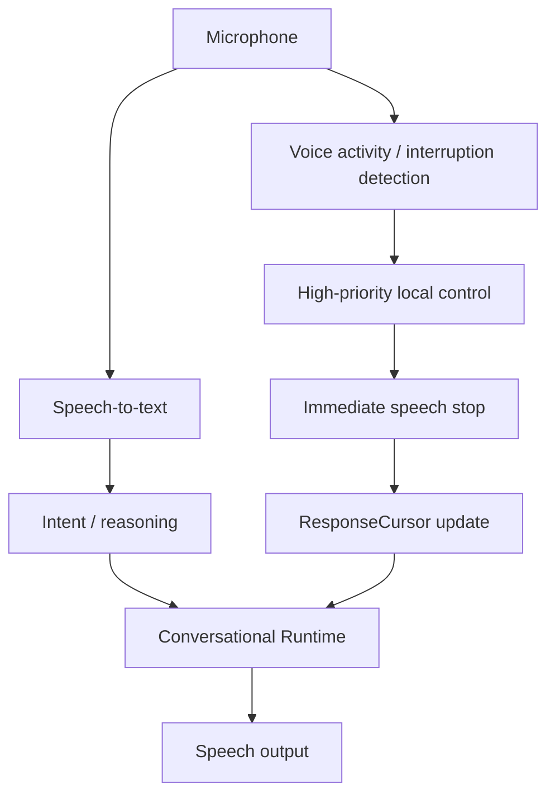

# ZORQ Barge-In and Interruption Architecture v1

**Status label:** DESIGNED. Voice implementation is DEFERRED/NOT VERIFIED.
**Purpose:** make ZORQ interruptible without losing conversational continuity or bypassing action authority.

## 1. Normal path vs barge-in path

The barge-in path must not require a full LLM reasoning cycle for STOP/PAUSE. It is a high-priority local control path.

## 2. Interaction control commands

Modeled commands include:

- STOP;
- PAUSE;
- CONTINUE;
- CANCEL;
- REPEAT;
- GO BACK;
- SKIP;
- CHANGE TOPIC.

These commands operate on the active context: speech, response generation, task planning, or active action. They must be disambiguated before destructive or externally meaningful effects.

## 3. Speech stop vs action stop

| Active context | User says “stop” | Required behavior |
|---|---|---|
| Speaking only | stop speech immediately | update cursor, state = INTERRUPTED |
| Thinking/generating only | cancel or pause generation per policy | no Action Plane effect |
| Executing action only | invoke Action Kernel/Device Agent cancellation protocol | report CANCELED/COMPLETED/UNKNOWN/PARTIAL as evidence supports |
| Speaking + executing | stop speech immediately; then handle action-cancel intent | Action Plane still controls action cancellation |

Conversational interruption must never bypass Phase 2.6 control-plane semantics.

## 4. Response cursor preservation

On interruption, store:

- response_id;
- branch ID;
- text offset;
- semantic unit;
- last spoken token/phrase;
- referenced evidence and memory IDs;
- interruption reason;
- resume policy.

This lets “what were you saying?” resume rather than hallucinate a new answer.

## 5. Voice authorization limitation

Voice convenience must not replace high-assurance authorization. Speaker/owner verification may help session assurance in future, but sensitive actions still require policy-defined authentication, grants, confirmation, and the Phase 2.6 Action Plane.
