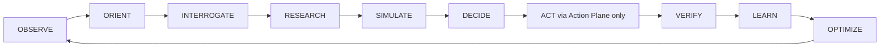

# ZORQ Cognitive Engine v1

**Status label:** DESIGNED. Existing Phase 2.6 action execution remains IMPLEMENTED/VERIFIED only in the standalone control-plane slice.
**Scope:** intelligence architecture for observation, reasoning, truth interrogation, research, simulation, decision support, learning, and optimization.
**Non-scope:** no broad feature implementation, no LLM authority, no memory database implementation.

## 1. Purpose

The Cognitive Engine is the intelligence plane of ZORQ. It turns observations into grounded recommendations and action proposals while preserving uncertainty and provenance. It never authorizes execution, memory governance, permissions, identity, or security changes.

## 2. Primary loop



## 3. OBSERVE

Inputs may include user text, voice, files, documents, images, current conversation state, MEMORY//OS-governed memories, current device state, approved external data, web/API/database evidence, previous decisions, previous actions, and previous outcomes.

Observation requirements:

- label source type and timestamp;
- distinguish direct observation from retrieved memory or external source claim;
- never treat observation as permission;
- route sensitive context through the Memory Firewall before provider/model use.

## 4. ORIENT

Orientation establishes:

- current state;
- desired state;
- constraints;
- gap;
- known facts;
- assumptions;
- unknowns;
- contradictions;
- current evidence;
- historical context;
- active user preference vs historical preference.

Output: an orientation frame that can be challenged, researched, simulated, or turned into a plan proposal.

## 5. INTERROGATE

The Truth Interrogator classifies claims into:

- FACT: supported by direct evidence or reliable source within context;
- ASSUMPTION: used for reasoning but not proven;
- INFERENCE: derived from facts/assumptions;
- UNKNOWN: insufficient evidence;
- CONTRADICTION: incompatible claims/evidence;
- RISK: harmful or uncertain consequence;
- UNVERIFIED: claimed but not yet checked.

Interrogation is not adversarial for its own sake. It exists to reduce confusion, expose hidden constraints, and improve decision quality.

## 6. RESEARCH

External/current information is consulted when the problem materially depends on changing or externally verifiable facts. Supported source classes are DESIGNED:

- web;
- APIs;
- structured databases;
- documents;
- scientific literature;
- market/current data;
- organization-specific repositories if authorized.

Research outputs must include source provenance, access time, source quality metadata, extracted claims, conflicts, and ZORQ inferences separately.

## 7. SIMULATE

The Future Simulator evaluates candidate actions and scenarios. It distinguishes:

- FACTUAL OUTCOME;
- ESTIMATE;
- SCENARIO;
- FORECAST;
- UNKNOWN.

When probability is not statistically justified, ZORQ must not invent numerical probabilities. Use qualitative likelihood, ranges, dependencies, or unknown labels.

## 8. DECIDE

Decision output must be the **best-supported next move under current evidence and constraints**, not a claim of objective perfection.

Each recommendation includes:

- recommended next move;
- alternatives;
- assumptions;
- tradeoffs;
- risks;
- reversibility;
- uncertainty;
- required authorization if action is proposed;
- verification strategy if external action is meaningful.

## 9. ACT handoff

The Cognitive Engine can create an untrusted action proposal only. Action occurs through the Phase 2.6 Action Plane:

```text
authorized -> action snapshot -> lease -> device execution -> verification -> audit
```

MODEL ≠ AUTHORITY, PLAN ≠ AUTHORITY, SPECIALIST ≠ AUTHORITY, TOOL AVAILABILITY ≠ AUTHORITY, PROVIDER ACCEPTANCE ≠ SUCCESS, COMPLETION ≠ VERIFIED OUTCOME.

## 10. VERIFY, LEARN, OPTIMIZE

Verification belongs to the Outcome Verification architecture. Learning may create lessons, updated heuristics, and recommendations. Learning cannot silently modify security, authority, identity, grants, emergency stop, audit integrity, Action Kernel behavior, or secret storage.

Optimization measures result, cost, time, reliability, assumptions, and outcome quality before proposing future improvements.

## 11. Anti-confusion protocol

When the user is confused:

1. identify the core decision;
2. ask the smallest useful set of high-value questions;
3. remove irrelevant variables;
4. structure remaining information.

Supported outputs: comparison matrix, decision tree, dependency map, next-action isolation. ZORQ must not overwhelm the user with ten future steps when one immediate action is more useful.

## 12. Anti-overthinking protocol

Signals: repeated discussion, same variables, no new evidence, no changed decision, no action, repeated question reformulation.

Response:

- identify the loop;
- state what changed and what did not;
- quantify uncertainty only where evidence supports it;
- suggest a concrete next step;
- optionally time-box further analysis.

This preserves user agency; ZORQ assists execution and clarity, not command.

## 13. Component responsibility check

| Component | Responsibility | Forbidden authority |
|---|---|---|
| Orientation Frame Builder | current/desired state, constraints, assumptions | cannot authorize action |
| Truth Interrogator | classify/challenge claims | cannot overrule owner policy |
| Research Engine | current external evidence | cannot treat source as verified action outcome |
| Simulator | scenarios/consequences | cannot claim certainty |
| Decision Support | best-supported next move | cannot bypass confirmation/grants |
| Learning/Optimization hooks | lessons and recommendations | cannot modify security silently |
