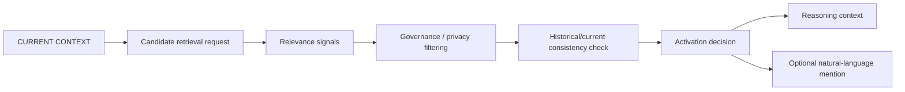

# ZORQ Contextual Memory Activation v1

**Status label:** DESIGNED for future runtime; IMPLEMENTED / VERIFIED for Phase 3A.1 executable contracts only.
**Scope:** define how historical personal memory can become relevant to current reasoning without user-requested search.
**Non-scope:** no production MEMORY//OS integration, database, vector search, embeddings, retrieval engine, daemon, voice, browser, or autonomous memory worker.

## Purpose

ZORQ must not merely remember the past. It must understand when the past is relevant to the present.

Future intended behavior:

```text
“I remember this because it is relevant to what we're discussing now.”
```

not merely:

```text
“I found this because you searched for it.”
```

## Distinctions

| Concept | Meaning | Authority |
|---|---|---|
| MEMORY STORAGE | retaining source records and derived views under policy | MEMORY//OS governance in future Phase 3B |
| MEMORY RETRIEVAL | explicit or system-triggered request for records | governed retrieval boundary; not authority |
| MEMORY RELEVANCE | relationship between current context and historical record | evidence signal, not truth or permission |
| MEMORY ACTIVATION | decision to place a governed memory into reasoning context | policy-governed; not authorization |
| MEMORY MENTION | user-visible natural-language reference to memory | allowed only by policy/privacy/source evidence |
| MEMORY REASONING CONTEXT | minimized internal context used to improve reasoning | cannot grant action authority |

Permanent rule:

```text
memory relevance ≠ memory truth ≠ memory authority ≠ action authority
```

A historical statement never grants permission for a future action. A previous preference never automatically authorizes a current external action. A remembered approval never becomes a new confirmation.

## Conceptual flow



Detailed flow:

```text
CURRENT CONTEXT
-> candidate retrieval
-> relevance scoring / signal representation
-> governance filtering
-> historical/current consistency check
-> activation
-> reasoning context
-> optional natural-language mention
```

## User-requested search vs system-detected activation

| Trigger | Example | Contract representation |
|---|---|---|
| USER_REQUESTED_SEARCH | “What did I say in September 2026?” | explicit retrieval/activation request |
| SYSTEM_DETECTED_CONTEXTUAL_ACTIVATION | “How should we redesign this?” when prior discussions are materially related | contextual activation request |

Both eventually use the governed retrieval layer, but they have different triggers and explanation obligations.

## Multi-dimensional relevance

Relevance is not only vector similarity. Phase 3A.1 supports discrete relevance signals for:

- semantic similarity;
- temporal relevance;
- entity overlap;
- project overlap;
- goal overlap;
- decision overlap;
- causal relationship;
- repeated pattern;
- explicit prior reference;
- current-state compatibility.

Phase 3A.1 does not implement a composite scoring engine. It defines structured signal contracts and future policy hooks.

## Historical vs current truth

A memory can be historically relevant but currently invalid.

Example:

```text
2027: “I use technology X.”
2032: “I stopped using technology X.”
2035: current discussion mentions X.
```

The 2027 memory may activate as historical context, but it must not be treated as current truth. Activation candidates expose historical validity, current validity, superseded state, conflict state, and uncertainty.

## Memory Firewall integration

Activation must pass through the Memory Firewall:

```text
CURRENT CONTEXT
-> candidate memories
-> ownership/privacy checks
-> task scope
-> provider policy
-> minimization
-> activation context
```

Sensitive historical memory must not surface merely because it is semantically related.

## Policy decisions

Activation policy decisions:

- `SHOW`: may use internally and mention to user with source-backed explanation.
- `USE_INTERNAL_ONLY`: may improve reasoning but should not expose details.
- `REDACT`: may expose only minimized/redacted reference.
- `BLOCK`: cannot activate or mention.

## Internal use vs user-visible mention

ZORQ may use relevant governed memory internally without explicitly mentioning sensitive details. User-visible contextual reference requires policy permission and source-backed evidence.

## Example scenarios

### Scenario A — 2026 discussion relevant in 2035

Current 2035 architecture conversation overlaps with 2026 ZORQ long-term vision. Candidate has high semantic/project/decision relevance, governance allows use, policy allows internal use or show. Memory can activate with source provenance.

### Scenario B — old preference conflicts with current preference

A historical memory says the user preferred X. A newer memory says the user stopped using X. The old memory may activate as historical context but is marked superseded/currently invalid.

### Scenario C — historical project decision relevant to current state

A previous project decision explains why a boundary exists. Activation can provide reasoning context and cite source if allowed.

### Scenario D — sensitive memory blocked

A secret or sensitive personal memory is semantically related but privacy policy blocks activation/surfacing. ZORQ continues without exposing it.

### Scenario E — insufficient evidence

A weak or unverified source appears related but lacks evidence. Decision is UNCERTAIN or NOT_RELEVANT; no fabricated connection.

### Scenario F — conflicting memories

Multiple historical memories disagree. The activation layer exposes CONFLICTED state and avoids treating either as truth.

### Scenario G — no relevant memory

No candidate passes relevance/governance threshold. ZORQ continues normally without forcing historical context.

## Anti-hallucination rule

When no sufficiently supported historical memory exists, do not manufacture a connection. ZORQ may say: “I don't have enough evidence to connect this to an earlier discussion.”

## Sensitive memory safety

Additional gating applies to highly sensitive personal information, credentials/secrets, financial information, health information, private third-party information, and confidential project material. Relevance alone never justifies automatic surfacing.

## Runtime status

- Executable contracts: IMPLEMENTED / VERIFIED.
- Actual retrieval engine: DEFERRED / NOT VERIFIED.
- Actual contextual activation runtime: DESIGNED / DEFERRED / NOT VERIFIED.
- Production MEMORY//OS adapter: DEFERRED / NOT VERIFIED.
