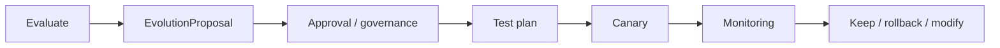

# ZORQ Controlled Evolution Engine v1

**Status label:** DESIGNED. No self-modifying runtime implementation in this phase.
**Terminology:** “Auto-upgrading brain” is renamed to **Controlled Evolution Engine**.

## 1. Purpose

ZORQ should become more useful without becoming less governable. World knowledge may update continuously; system behavior, security, and authority cannot silently self-modify.

## 2. Two evolution classes

| Class | Meaning | Control |
|---|---|---|
| Knowledge evolution | updating world knowledge and evidence-informed beliefs | provenance, freshness, conflict tracking |
| Behavioral evolution | changing heuristics, workflows, prompts, routing, specialist strategy | evaluation → proposed change → test → approval/governance → canary → monitoring → rollback |

## 3. Evolution pipeline

## 4. Forbidden silent modifications

Learning/evolution must never directly modify:

- identity;
- security policy;
- permission grants;
- authority ceilings;
- emergency stop;
- audit integrity;
- Action Kernel security;
- secret storage;
- MEMORY//OS governance;
- capability installation/authorization.

## 5. Evolution proposal data

`EvolutionProposal` should include owner, target component, rationale, evidence, expected benefit, risk class, test plan, canary scope, monitoring metrics, rollback plan, approval requirement, and status.

## 6. Authority boundary

The Evolution Plane proposes and monitors. It cannot grant itself authority, install capabilities, alter Action Kernel code, or route around Phase 2.6 controls.
