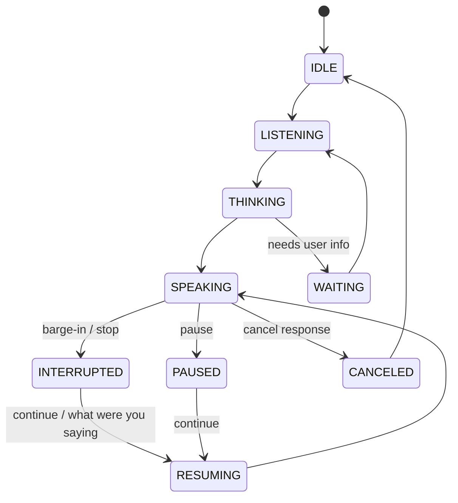

# ZORQ Conversational Runtime v1

**Status label:** DESIGNED. Voice and barge-in implementation are DEFERRED/NOT VERIFIED.
**Scope:** conversation state, response generation state, speech state, interruption, pause/resume, cancellation, branches, topic changes, and checkpoints.

## 1. Runtime states

Minimum states:

- IDLE;
- LISTENING;
- THINKING;
- SPEAKING;
- INTERRUPTED;
- PAUSED;
- WAITING;
- RESUMING;
- CANCELED.

State transitions must preserve enough checkpoint data for continuity and must not imply Action Plane authority.

## 2. Runtime model



## 3. Response cursor

A `ResponseCursor` tracks:

- response_id;
- conversation_id;
- generation state;
- speech state;
- text position;
- semantic position;
- interruption point;
- resume policy;
- referenced memories/evidence;
- branch/topic ID.

Example:

```text
ZORQ: “The main reason is that—”
User: “Stop.”
ZORQ: immediate silence.
Later user: “What were you saying?”
ZORQ resumes: “The main reason is that...”
```

The runtime should not regenerate the entire answer unnecessarily when a cursor can resume faithfully.

## 4. Branching

Conversations support branches:

- Topic A: Kubernetes;
- Topic B: Docker;
- later return to Topic A.

Branching preserves conversation history instead of flattening all turns into one stream. Branches include parent branch, topic label, active task, unresolved questions, decisions, referenced memories, and response cursor state.

## 5. Checkpoints

Long sessions need checkpoint state:

- current topics;
- unresolved questions;
- decisions;
- active plan;
- current response;
- interrupted response position;
- referenced memories;
- active task;
- pending authorizations;
- active or recently completed actions.

Checkpoints may be stored durably only under the user's memory/retention policy.

## 6. Speech stop vs action stop

“Stop speaking” and “stop the action” are distinct. If ZORQ is speaking, STOP stops speech. If an action is executing, STOP triggers the Action Plane cancellation protocol. If both are active, the runtime should stop speech immediately and ask/route cancellation according to active execution context and policy.

## 7. Authority boundary

Conversational control commands can control interaction state. They cannot bypass the Action Kernel, override grants, silently authorize actions, or delete memory without MEMORY//OS-governed deletion semantics.
