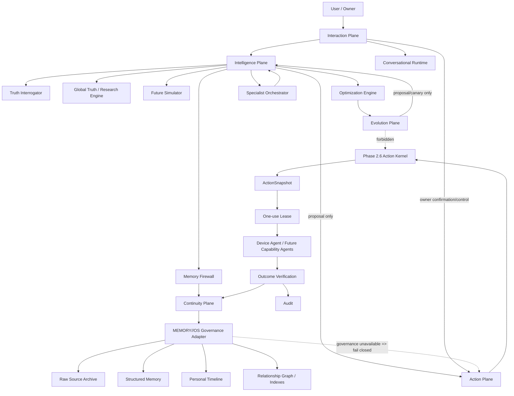
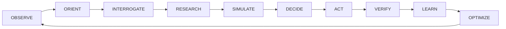
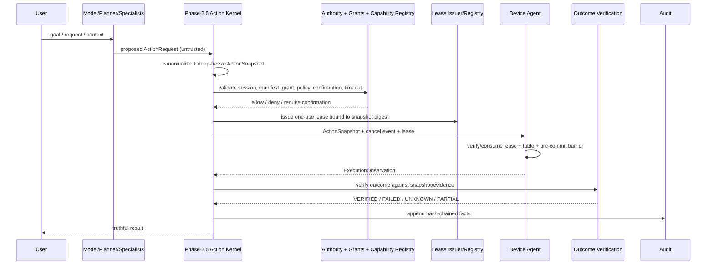
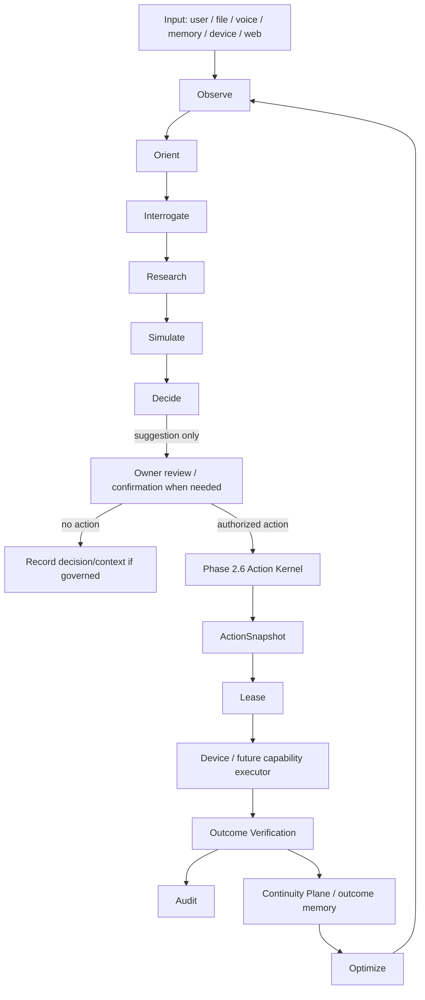

# ZORQ Master Architecture v1

**Phase:** Master Architecture Revision after Phase 2.6 control-plane hardening
**Date:** 2026-09-27
**Status label:** DESIGNED, with Phase 2.6 action-control references marked IMPLEMENTED/VERIFIED where existing tests prove the standalone slice.
**Production status:** NOT VERIFIED for production; not production-ready.
**Stop condition:** architecture only; no Phase 3 implementation, memory code, voice code, browser code, daemon behavior, or MEMORY//OS modification.

## 1. Core definition

ZORQ is:

> A persistent personal intelligence and action operating system that continuously observes reality, understands the user's goals and context, remembers the user's authorized personal history over the long term, challenges assumptions, researches current evidence, simulates consequences, proposes and evaluates actions, coordinates specialized intelligence, executes only authorized actions, verifies real-world outcomes, learns from those outcomes, and continuously improves its recommendations under explicit governance.

ZORQ is not reducible to a chatbot, voice assistant, browser agent, memory database, automation tool, or loose collection of agents. It is an integrated system composed of separable planes whose authorities do not collapse into one another.

## 2. Global status terminology

| Status | Meaning |
|---|---|
| DESIGNED | Architecture is specified; implementation may not exist. |
| IMPLEMENTED | Code exists in the standalone ZORQ project. |
| AVAILABLE | Feature exists and can be invoked in the current runtime. |
| AUTHORIZED | Owner/session/policy/grant/confirmation checks permit the operation. |
| EXECUTING | An authorized action attempt is currently in progress. |
| COMPLETED | Execution attempt finished; outcome may still be unverified. |
| VERIFIED | Defined verification strategy established outcome evidence. |
| FAILED | Evidence indicates failure or policy denied safely. |
| UNKNOWN | ZORQ cannot safely determine reality/outcome. |
| DEFERRED | Intentional future work, not in the current slice. |
| FORBIDDEN | Not allowed by architecture/policy. |
| NOT VERIFIED | Not independently proven in this environment. |
| DEGRADED | Available with reduced guarantees, explicitly stated. |
| UNAVAILABLE | Not present or unavailable; must not be implied. |
| PLATFORM-SPECIFIC | Depends on OS/device/browser/provider semantics. |

## 3. Permanent architectural invariants

- MODEL CONFIDENCE ≠ AUTHORIZATION.
- INTENT ≠ AUTHORIZATION.
- PLAN ≠ AUTHORIZATION.
- SPECIALIST OUTPUT ≠ AUTHORIZATION.
- CAPABILITY DISCOVERY ≠ PERMISSION.
- PAST SUCCESS ≠ AUTHORIZATION.
- USER HISTORY ≠ CURRENT AUTHORIZATION.
- TOOL AVAILABILITY ≠ AUTHORITY.
- PROVIDER ACCEPTANCE ≠ SUCCESS.
- EXECUTION ≠ VERIFIED OUTCOME.
- MEMORY RETRIEVAL ≠ MEMORY GOVERNANCE.
- PROACTIVE SUGGESTION ≠ AUTHORIZED ACTION.
- VOICE CONVENIENCE ≠ HIGH-ASSURANCE IDENTITY.
- EVOLUTION PROPOSAL ≠ SELF-MODIFIED SECURITY.

The Phase 2.6 control plane remains the lower-level action authority: authorized session/grant/capability/confirmation → immutable action snapshot → one-use lease → device execution → verification → audit.

Permanent Phase 2.6 execution-integrity invariant:

```text
UNTRUSTED ActionRequest -> canonicalize + deep-freeze -> ActionSnapshot -> all authorization/execution uses snapshot
```

Once an action crosses the authorization boundary, ZORQ executes an immutable snapshot of the authorized action. Caller-owned mutable objects are never authoritative for execution.

## 4. Planes of ZORQ

| Plane | Status | Responsibility | Authority boundary |
|---|---|---|---|
| Intelligence Plane | DESIGNED | Observe, orient, interrogate, research, simulate, decide, plan, optimize, propose. | Cannot authorize execution or memory governance. |
| Continuity Plane | DESIGNED | Store, retrieve, track, connect, version, delete, and govern personal history through MEMORY//OS boundary. | Cannot execute real-world actions. Memory retrieval is not authority. |
| Interaction Plane | DESIGNED | Text/voice/file interaction, response generation, speech, interruption, pause/resume, branches, checkpoints. | Cannot bypass Action Kernel; control commands only affect active contexts. |
| Action Plane | IMPLEMENTED/VERIFIED for Phase 2.6 slice; DESIGNED for future capabilities | Authorize, snapshot, lease, execute, cancel, verify, audit. | Deterministic authority; LLMs/specialists cannot bypass it. |
| Evolution Plane | DESIGNED | Evaluate, propose experiments, canary behavioral changes, monitor and roll back. | Cannot silently alter identity, security policy, grants, emergency stop, audit, Action Kernel, or secrets. |

No plane may silently inherit authority from another plane.

## 5. Master architecture diagram



## 6. Cognitive loop



| Stage | Meaning | Authority |
|---|---|---|
| OBSERVE | Gather user text, voice, files, documents, images, conversation state, MEMORY//OS-governed memory, device state, approved external data, web/API evidence, prior decisions/actions/outcomes. | Observation does not authorize. |
| ORIENT | Establish current state, desired state, constraints, gap, known facts, assumptions, unknowns, contradictions, current evidence, historical context. | Orientation may recommend questions, not actions. |
| INTERROGATE | Truth Interrogator classifies claims as FACT, ASSUMPTION, INFERENCE, UNKNOWN, CONTRADICTION, RISK, or UNVERIFIED. | Interrogation improves reasoning, not policy. |
| RESEARCH | Query current/external sources when material facts change or are externally verifiable. | External source claims require provenance; source does not authorize. |
| SIMULATE | Evaluate scenarios, consequences, risks, reversibility, dependencies, sensitivity. | Simulation is not certainty. |
| DECIDE | Recommend the best-supported next move under current evidence and constraints. | Decision recommends required authorization; it is not authorization. |
| ACT | Submit only authorized actions to the Phase 2.6 Action Plane. | Authority exists only in the Action Plane. |
| VERIFY | Determine outcome state where technically possible. | Provider/tool completion is not verification. |
| LEARN | Record lessons, measurements, heuristics, outcome memory. | Learning cannot silently modify security or authority. |
| OPTIMIZE | Propose measurable future improvements. | Optimization proposes; owner/system governance decides. |

## 7. Security/control-plane diagram



## 8. Full end-to-end ZORQ lifecycle diagram



## 9. Master data model summary

Detailed identifiers and provenance are defined in `ZORQ-WORLD-MODEL-v1.md`. Core entity families:

- Identity/control: `User`, `OwnerIdentity`, `Session`, `Confirmation`, `Grant`, `Capability`, `Lease`, `Device`, `Provider`.
- Interaction: `Conversation`, `Message`, `Response`, `ResponseCursor`.
- Continuity: `MemorySource`, `Memory`, `TimelineEvent`, `Entity`, `Relationship`.
- Intelligence: `Goal`, `Project`, `Decision`, `Plan`, `Observation`, `Evidence`.
- Action/outcome: `Action`, `ActionSnapshot`, `Outcome`, `AuditEvent`.
- Evolution: `Experiment`, `EvolutionProposal`.

Every durable item needs owner identity, timestamps (`created_at`, `observed_at`, `valid_from`, `valid_until` where applicable), provenance, privacy class, retention policy, and verification state.

## 10. Interface contracts between major planes

| Contract | Inputs | Outputs | Required guardrail |
|---|---|---|---|
| Interaction → Intelligence | user utterance/message, active conversation state, control intent if any | normalized task or interaction control command | control command does not imply action authorization. |
| Intelligence → Continuity | task, required context, reason for retrieval | minimized governed context, provenance, denials/holds | Memory Firewall applies policy and egress minimization. |
| Intelligence → Research | research question, freshness need, source policy | source claims, citations, quality metadata, conflicts | separate USER CLAIM, SOURCE CLAIM, ZORQ INFERENCE. |
| Intelligence → Action | proposed `ActionRequest`, assumptions, required confirmation | accepted for authority evaluation or denied | proposal is untrusted input. |
| Action → Continuity | verified/failed/unknown outcomes, audit references | outcome memory/update proposals | learning cannot modify security/grants. |
| Evolution → All planes | evolution proposal, experiment plan, rollback criteria | approved canary or rejection | cannot silently change identity/security/authority/audit. |

## 11. Architectural data flows and authority location

### Flow A — user asks a normal question
1. Interaction Plane records message and active conversation state.
2. Intelligence Plane orients, retrieves only task-relevant governed context through Memory Firewall if needed.
3. It answers with evidence/uncertainty labels.
**Authority:** none beyond response generation. No action authority exists.

### Flow B — 2035 historical memory question about 2026
1. User asks: “What did we talk about on 27 September 2026?”
2. Continuity Plane parses temporal query, applies owner/session/memory governance.
3. Exact retrieval searches raw source archive by date/conversation/message IDs; semantic retrieval may help locate but cannot replace source.
4. Answer cites source records and distinguishes original text, derived memory, current interpretation.
**Authority:** MEMORY//OS governance controls retrieval; answer is evidence-backed recall, not authorization.

### Flow C — user says “remember this”
1. Interaction Plane detects explicit memory request.
2. Continuity Plane stores raw source, derived memory proposal, provenance, privacy class, retention policy.
3. MEMORY//OS adapter governs storage/retention/sensitivity.
**Authority:** user ownership plus MEMORY//OS governance; not Action Plane authority.

### Flow D — user asks to forget something
1. Request is authenticated and scoped.
2. Continuity Plane creates deletion plan for raw archive, structured memory, indexes, embeddings, derived summaries, relationship graph, caches, and retention-controlled backups.
3. Reports completed, partial, unknown, or legally/technically retained states.
**Authority:** owner memory control under retention/governance; deletion complete only when all representations are addressed.

### Flow E — ZORQ is speaking and user says “stop”
1. Barge-in path detects STOP locally.
2. Speech output stops immediately.
3. ResponseCursor records interruption point.
**Authority:** Interaction Plane controls speech only. No Action Kernel bypass.

### Flow F — user asks “what were you saying?”
1. Conversational Runtime loads ResponseCursor.
2. Resumes from text/semantic interruption point or summarizes if policy says so.
**Authority:** response-state continuity only.

### Flow G — topic changes and later returns
1. Runtime creates/updates conversation branch.
2. Checkpoint preserves unresolved questions, decisions, referenced memories, active task.
3. Returning to a branch restores relevant state through governed retrieval.
**Authority:** conversation state only.

### Flow H — user asks to investigate a real-world claim
1. Truth Engine separates USER CLAIM from research question.
2. Research Engine collects current sources with provenance/timestamps.
3. Claim is classified FACT/ASSUMPTION/INFERENCE/UNKNOWN/CONTRADICTION/RISK/UNVERIFIED.
**Authority:** evidence supports claims; sources do not authorize actions.

### Flow I — user asks for decision support
1. Orient current/desired state and constraints.
2. Truth Interrogator identifies assumptions and missing variables.
3. Simulator evaluates scenarios and reversibility.
4. ZORQ recommends best-supported next move and alternatives.
**Authority:** recommendation only; owner decides.

### Flow J — user authorizes an external action
1. Intelligence proposes an untrusted `ActionRequest`.
2. Action Plane validates session/capability/grant/confirmation/policy.
3. Kernel snapshots, leases, dispatches, verifies, audits.
**Authority:** Phase 2.6 Action Plane only.

### Flow K — user interrupts an in-progress action
1. Interaction Plane distinguishes speech stop from action stop.
2. If an action is active, cancellation protocol goes to Action Kernel/Device Agent.
3. Result is CANCELED, COMPLETED, VERIFIED, FAILED, UNKNOWN, or PARTIAL based on evidence.
**Authority:** cancellation follows Action Plane; conversation command cannot bypass kernel.

### Flow L — action succeeds but verification cannot establish state
1. Device reports execution observation.
2. Verification lacks enough evidence.
3. Outcome is UNKNOWN or PARTIAL, never fabricated VERIFIED.
**Authority:** verifier controls outcome status.

### Flow M — MEMORY//OS governance unavailable
1. Continuity request/action requiring governance receives unavailable/hold result.
2. Governed storage/retrieval/action fails closed or asks for recovery.
**Authority:** MEMORY//OS governance; ZORQ cannot invent it.

### Flow N — provider compromised or returns malicious instructions
1. Provider output enters as untrusted proposal/content.
2. Truth/Policy/Action Plane reject policy claims, secrets requests, capability escalation, prompt-injection instructions.
3. Only safe answer/proposal proceeds.
**Authority:** provider has none.

### Flow O — model proposes dangerous action
1. Orchestrator labels proposal and required risk/authorization.
2. Authority Engine denies or requires confirmation based on capability/grant/policy.
3. If forbidden capability, no dispatch path exists.
**Authority:** Action Plane denial/confirmation only.

## 12. Failure philosophy

When ZORQ cannot safely determine reality: fail closed for authority, report UNKNOWN for uncertain outcomes, request information when ambiguity blocks reasoning, never fabricate, never equate provider/tool completion with verified outcome, and never claim research facts without evidence.

## 13. First implementation slice summary

The first post-architecture implementation slice is defined in `ZORQ-PHASE3-IMPLEMENTATION-BOUNDARY.md`: persistent conversation storage, MEMORY//OS-governed storage/retrieval boundary, temporal retrieval, exact historical conversation recall, structured extraction, provenance, deletion semantics, and conversation-state continuity. It explicitly excludes browser automation, broad Windows control, voice, arbitrary PowerShell, and autonomous background actions.
