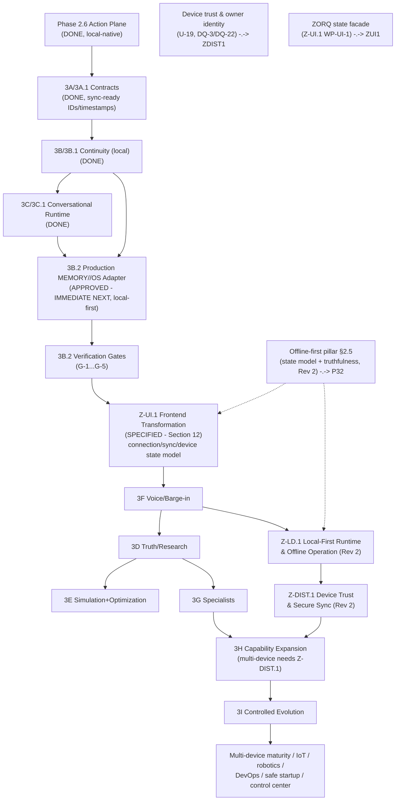

# ZORQ MASTER IMPLEMENTATION SPECIFICATION v1

**Status label:** CONSOLIDATED SPECIFICATION — RECONCILIATION COMPLETE; IMPLEMENTATION STOPPED FOR PHASE APPROVAL.
**Date:** 2026-09-28
**Revision:** Rev 1 (2026-09-28) — owner architectural correction accepted: Phase 3B.2 confirmed as the immediate backend-integrity prerequisite; **Z-UI.1 (ZORQ UI/UX + Frontend Transformation) added as the dedicated post-3B.2 frontend phase**; roadmap sequence set to G-0 → 3B.2 → 3B.2 verification → Z-UI.1 → 3F/voice → subsequent capability phases; frontend UI-authority invariants added (Section 2); preserve/transform/retire analysis added (Section 12.4, Appendix E). Rev 0 = initial reconciliation as delivered.
**Revision:** Rev 2 (2026-09-28) — two mandatory architectural additions: **(1) OFFLINE-FIRST / HYBRID / MULTI-DEVICE ZORQ established as a first-class architectural pillar** (§1.2 Pillar 5, §2.5 operating model, five new invariants in §2, boundaries B-28…B-32, dedicated future phases **Z-LD.1 (local-first runtime & offline operation)** and **Z-DIST.1 (device trust & secure synchronization)** in §9.2, Z-UI.1 extended with the connection/execution/sync/device state model and the VISIBLE/AVAILABLE/AUTHORIZED/EXECUTABLE/VERIFIED-OUTCOME distinction); **(2) ZORQ internal identity definition (restricted) vs public product identity ("ZORQ" alone) formally separated** (§1.3, B-31, DQ-20) — the repository is publicly readable, so the internal expansion is recorded only in a git-ignored internal record and must never appear in any committed artifact. Approved implementation sequence unchanged. No code implemented.
**Canonical branch:** `zroq/canonical-migration`
**Canonical commit inspected:** `262159d9a3b13dda499f0bf01aafa848aae6dea9` ("feat: integrate ZORQ core into canonical MEMORY//OS")
**Purpose:** consolidate ALL existing ZORQ architecture, security principles, memory architecture, conversational runtime, interruption model, action plane, capability model, future roadmap, and previously defined capability domains into one authoritative implementation specification; identify implemented / partially implemented / documented-but-unimplemented capabilities; define phase dependencies, security-critical boundaries, risks, unresolved design questions, and the exact next implementation phase with acceptance criteria.
**Method:** full inspection of the canonical repository at the commit above — all 22 `src/zroq/` modules, all 16 ZORQ test modules, all 82 `docs/zorq/` documents (95 files including package history), the MEMORY//OS backend (`backend/`, FastAPI, 238 HTTP routes, 80 test files, 45 cognition modules), the frontend (`frontend/`, Next.js, 18 components), root `pyproject.toml`, `.gitignore`, `.env.example`, `scripts/`, `ZORQ-CANONICAL-HANDOFF.md`, `PROJECT_STATUS.md`, `README.md`, and the full git history of the migration branch.
**Independent verification performed during this reconciliation (this session, Linux sandbox):**

```text
PYTHONDONTWRITEBYTECODE=1 python -m unittest discover -s tests

Ran 256 tests in 3.108s
OK (skipped=8)
```

Result matches the Phase 3C.1 Linux verification baseline exactly (256 collected / 248 executed / 8 skipped / 0 failed). The 8 Linux skips are the `WindowsValidationTests` class in `tests/test_phase22_trust_boundary.py`, which is `skipUnless(platform.system() == "Windows")`.

**Owner's Windows 11 verification of the same tree (reported, trusted as the canonical platform run):**

```text
256 tests collected
249 passed
7 skipped  (Windows symlink/reparse fixtures require unavailable privilege — WinError 1314)
0 failed
```

The Windows–Linux skip delta is expected and fully explained: on Windows the 8-test `WindowsValidationTests` class executes (7 pass, the symlink/reparse fixture test skips on `WinError 1314`), while several platform-neutral symlink-fixture tests in `test_phase22`, `test_phase25`, and `test_security` skip for the same privilege reason; on Linux the Windows class is skipped entirely. Enabling Windows Developer Mode (or granting `SeCreateSymbolicLinkPrivilege`) would allow all 256 to execute on the owner machine. This is an environment configuration item, not a code defect. **Decision required from owner: DQ-13.**

---

## 0. Non-negotiable architectural rules honored by this specification

These rules are restated verbatim from the canonical handoff and are binding on every phase defined in this document. This specification does not violate, weaken, or reinterpret any of them.

1. **No nested ZORQ project, separate repository, replacement memory system, or parallel architecture.** ZORQ lives inside this canonical repository, above and around MEMORY//OS.
2. **MEMORY//OS remains the canonical memory and governance subsystem.**
3. **ZORQ is the larger operating architecture built around and above MEMORY//OS.**
4. MEMORY//OS backend, frontend, docs, and tests remain intact (verified: commit `262159d` adds only `src/zroq/`, `tests/test_*.py`, `docs/zorq/`, root `pyproject.toml`, and two `.gitignore` lines — zero changes to `backend/` or `frontend/`).
5. No working security contract is redesigned anywhere in this specification. Every proposed change to an existing contract is explicitly identified with its exact reason (Section 11.3).
6. No fake capabilities, no placeholder functionality presented as real, no demos standing in for verification.
7. Core correctness before UI polish. The frontend transformation phase (Z-UI.1, Section 12) is scheduled **after** backend integrity (3B.2 verified) precisely so that UI work is a real representation of a real system, not polish over an unfinished core.
8. **The frontend is a representation surface, never an authority.** UI visibility != authorization; UI intent != authorization; a displayed capability != permission to execute it; frontend state is never a second source of truth over backend/security state. Z-UI.1 (Section 12) transforms the existing MEMORY//OS frontend into the ZORQ control and interaction surface **without replacing or weakening the underlying MEMORY//OS governance architecture** — it is not a cosmetic redesign.
9. **Offline-first / hybrid / multi-device operation is a first-class architectural pillar, not a future feature** (§1.2 Pillar 5, §2.5). Connectivity expands ZORQ's capabilities; it never determines whether ZORQ exists. Distributed operation never weakens authorization. No arbitrary offline capability claims: offline capability equals what is actually available and verified on that device. All architecture from 3B.2 and Z-UI.1 onward is local-first/hybrid-aware so later voice, identity, capability, synchronization, and distributed phases extend rather than redesign.
10. **ZORQ identity is split into a restricted INTERNAL IDENTITY DEFINITION and a PUBLIC PRODUCT IDENTITY** (§1.3). The public identity is the single word **ZORQ**. The internal expansion and its conceptual meaning are intentionally hidden from the public and must never appear in public landing-page copy, public UI, public README, marketing copy, visible product descriptions, visible navigation, public screenshots, or default metadata. Branding secrecy never justifies degrading engineering correctness, security, or developer-required documentation (§1.3 carve-out).

---

## 1. System definition

> ZORQ is a persistent personal intelligence and action operating system that continuously observes reality, understands the user's goals and context, remembers the user's authorized personal history over the long term, challenges assumptions, researches current evidence, simulates consequences, proposes and evaluates actions, coordinates specialized intelligence, executes only authorized actions, verifies real-world outcomes, learns from those outcomes, and continuously improves its recommendations under explicit governance.

ZORQ is not reducible to a chatbot, voice assistant, browser agent, memory database, automation tool, or loose collection of agents. It is an integrated system composed of separable planes whose authorities do not collapse into one another.

**MEMORY//OS relationship:** MEMORY//OS (backend `app/` FastAPI service + Next.js frontend, currently V10.2.0 "Evidence-Governed Adaptive Cognitive Policy", release-ready on `main` at commit `2c73c37`) is the canonical memory and cognitive-governance subsystem *inside* ZORQ. ZORQ is the operating architecture built around and above it. ZORQ must not create a competing memory authority or a competing cognitive policy authority.

### 1.1 Planes of ZORQ (status per plane)

| Plane | Status | Responsibility | Authority boundary |
|---|---|---|---|
| Intelligence Plane | DESIGNED (deterministic proposal path IMPLEMENTED in Phase 2.6 slice) | Observe, orient, interrogate, research, simulate, decide, plan, optimize, propose | Cannot authorize execution or memory governance |
| Continuity Plane | PARTIALLY IMPLEMENTED (Phase 3B/3B.1 local slice; production MEMORY//OS wiring NOT VERIFIED) | Store, retrieve, track, connect, version, delete, govern personal history through the MEMORY//OS boundary | Cannot execute real-world actions; memory retrieval is not authority |
| Interaction Plane | PARTIALLY IMPLEMENTED (Phase 3C/3C.1 text runtime; voice DEFERRED) | Text/voice/file interaction, response generation, speech, interruption, pause/resume, branches, checkpoints | Cannot bypass Action Kernel; control commands affect active contexts only |
| Action Plane | IMPLEMENTED / VERIFIED for the Phase 2.6 slice; DESIGNED for future capabilities | Authorize, snapshot, lease, execute, cancel, verify, audit | Deterministic authority; LLMs/specialists cannot bypass it |
| Evolution Plane | DESIGNED | Evaluate, propose experiments, canary behavioral changes, monitor, roll back | Cannot silently alter identity, security policy, grants, emergency stop, audit, Action Kernel, or secrets |

No plane may silently inherit authority from another plane.

### 1.2 Architectural pillars (Rev 2 — explicit)

ZORQ rests on five first-class architectural pillars. Each is permanent; none may be demoted to a "future feature":

| # | Pillar | Meaning | Where specified |
|---|---|---|---|
| 1 | Separated authority planes | Intelligence, Continuity, Interaction, Action, Evolution — authorities never collapse into one another | §1.1; `ZORQ-MASTER-ARCHITECTURE-v1.md` |
| 2 | Canonical memory governance | MEMORY//OS is the canonical memory/governance subsystem; ZORQ never creates a competing memory authority | §1, §3.3, §11 (3B.2) |
| 3 | Deterministic Action Plane | Models propose; the deterministic control plane (authorization → snapshot → lease → execution → verification → audit) alone executes | §2.1, §4.1, §7 |
| 4 | Truthful capability representation | No fake capabilities, no fabricated outcomes, truthful DESIGNED/IMPLEMENTED/AVAILABLE/AUTHORIZED/… status labels everywhere | §2, §8; global status terminology |
| 5 | **Offline-first / hybrid / multi-device operation** | ZORQ operates across the owner's authorized devices (phone, laptop, desktop, future authorized devices) and remains usable when internet connectivity is unavailable. Connectivity EXPANDS capabilities; it never determines whether ZORQ exists. Distributed operation NEVER weakens authorization. | §2.5 (operating model), §9 (phases Z-LD.1/Z-DIST.1), §12 (Z-UI.1 state model), B-28…B-32 |

Pillar 5 consequences (binding on every phase from Rev 2 onward): every new contract, service, and UI surface is designed local-first/hybrid-aware (device-scoped capability truthfulness, sync-ready identifiers/timestamps, connection-state-aware behavior) so that later voice, identity, capability, synchronization, and distributed phases **extend the architecture rather than redesign it**.

### 1.3 ZORQ identity — INTERNAL IDENTITY DEFINITION vs PUBLIC PRODUCT IDENTITY (Rev 2)

ZORQ has two identity layers that MUST remain distinct:

| Layer | Content | Visibility |
|---|---|---|
| **INTERNAL IDENTITY DEFINITION** | The canonical internal name expansion, its conceptual meaning, and its word-level semantics. **Not reproduced anywhere in this specification** — this document is itself a public artifact of a publicly readable repository. | **RESTRICTED.** Recorded ONLY in the git-ignored internal record `docs/zorq/internal/ZORQ-INTERNAL-IDENTITY.md` (never committed to this repository) and in owner-private records. **This repository is publicly readable** (verified: anonymous clone/`ls-remote` succeeds), so the internal expansion — including any wording from which it could be reconstructed — must never appear in ANY committed file. |
| **PUBLIC PRODUCT IDENTITY** | The single word **ZORQ** (plus the truthful architecture description: ZORQ is the operating architecture built around MEMORY//OS, which remains visible as the canonical memory/governance subsystem — DQ-17). | Public: landing page, UI, README, marketing, product descriptions, navigation, screenshots, default metadata. |

**Exposure prohibition (enforced):** the internal expansion and its deeper meaning must NOT be exposed in public landing-page copy, public UI strings, public README, public marketing copy, visible product descriptions, visible navigation, public screenshots, or default metadata, unless the owner explicitly authorizes it later. Enforcement points: B-31, Z-UI.1 acceptance test `ZUI-27` (static bundle/strings check), repository hygiene check (git grep of tracked files must return nothing — verified clean at Rev 2).

**Engineering-correctness carve-out (binding):** branding secrecy must NOT interfere with engineering correctness, security, documentation required for developers, or internal implementation. Rules: (a) implementation code, identifiers, tests, and public engineering documentation never depend on, encode, or reproduce the hidden expansion — the public name "ZORQ" is the only product string; (b) internal engineering documents that require the identity definition reference the protected identity record rather than duplicating it; (c) no security, logging, or audit behavior may be weakened to serve secrecy — e.g., audit records continue to use canonical IDs, never branding.

---

## 2. Permanent security invariants (consolidated, binding)

All fourteen invariants are implemented as enforceable control-plane behavior in the Phase 2.6 slice (each has adversarial regression tests; see Section 7) and remain binding on every future phase:

```text
MODEL CONFIDENCE          != AUTHORIZATION
INTENT                    != AUTHORIZATION
PLAN                      != AUTHORIZATION
SPECIALIST OUTPUT         != AUTHORIZATION
CAPABILITY DISCOVERY      != PERMISSION
PAST SUCCESS              != AUTHORIZATION
USER HISTORY              != CURRENT AUTHORIZATION
TOOL AVAILABILITY         != AUTHORITY
PROVIDER ACCEPTANCE       != SUCCESS
EXECUTION                 != VERIFIED OUTCOME
MEMORY RETRIEVAL          != MEMORY GOVERNANCE
PROACTIVE SUGGESTION      != AUTHORIZED ACTION
VOICE CONVENIENCE         != HIGH-ASSURANCE IDENTITY
EVOLUTION PROPOSAL        != SELF-MODIFIED SECURITY
```

Additional canonical rules from the handoff (equally binding):

```text
WAKE WORD                 != AUTHENTICATION
EXTERNAL DATA             != TRUSTED INSTRUCTION
COMPLETED EXECUTION       != VERIFIED OUTCOME
MEMORY RELEVANCE          != MEMORY TRUTH != MEMORY AUTHORITY != ACTION AUTHORITY
SOURCE RECORD             != DERIVED MEMORY != CURRENT INTERPRETATION != HISTORICAL VIEW
HISTORICAL TRUTH          != CURRENT TRUTH   (must remain distinguishable, always)
```

UI-plane authority invariants (added by owner directive, binding from Z-UI.1 onward):

```text
UI VISIBILITY             != AUTHORIZATION
UI INTENT                 != AUTHORIZATION
DISPLAYED CAPABILITY      != PERMISSION TO EXECUTE
FRONTEND STATE            != AUTHORITATIVE BACKEND/SECURITY STATE
```

Offline/hybrid/multi-device authority invariants (added by owner directive Rev 2, binding from Rev 2 onward):

```text
DEVICE TRUST              != USER AUTHORIZATION
SYNC                      != AUTHORIZATION
DEVICE CAPABILITY         != USER PERMISSION
LOCAL MODEL CONFIDENCE    != AUTHORIZATION
ONLINE AVAILABILITY       != AUTHORITY
```

The frontend consumes authoritative backend state; it never originates it. Every action affordance presents the backend's authorization requirement and the Action Plane's status/verification/audit evidence — the UI itself can never grant, imply, or substitute authorization (see boundaries B-24…B-27, Section 7).

### 2.1 The real action flow (Action Plane — permanent)

```text
authorization/session/grant/capability/confirmation
  -> immutable ActionSnapshot
  -> one-use lease
  -> device execution
  -> verification
  -> audit
```

Phase 2.6 execution-integrity invariant (implemented, verified, and not to be redesigned):

```text
UNTRUSTED ActionRequest -> canonicalize + deep-freeze -> ActionSnapshot -> all authorization/execution uses snapshot
```

Once an action crosses the authorization boundary, ZORQ executes an immutable snapshot of the authorized action. Caller-owned mutable objects are never authoritative for execution.

### 2.2 The cognitive loop (Intelligence Plane — permanent)

```text
OBSERVE -> ORIENT -> INTERROGATE -> RESEARCH -> SIMULATE -> DECIDE -> ACT -> VERIFY -> LEARN -> OPTIMIZE -> OBSERVE
```

| Stage | Meaning | Authority |
|---|---|---|
| OBSERVE | Gather user text, voice, files, documents, images, conversation state, MEMORY//OS-governed memory, device state, approved external data, web/API evidence, prior decisions/actions/outcomes | Observation does not authorize |
| ORIENT | Establish current state, desired state, constraints, gap, known facts, assumptions, unknowns, contradictions, evidence, historical context | Orientation may recommend questions, not actions |
| INTERROGATE | Truth Interrogator classifies claims: FACT, ASSUMPTION, INFERENCE, UNKNOWN, CONTRADICTION, RISK, UNVERIFIED | Improves reasoning, not policy |
| RESEARCH | Query current/external sources when material facts change or are externally verifiable | External claims require provenance; sources do not authorize |
| SIMULATE | Evaluate scenarios, consequences, risks, reversibility, dependencies, sensitivity | Simulation is not certainty |
| DECIDE | Recommend the best-supported next move under current evidence and constraints | Decision recommends required authorization; it is not authorization |
| ACT | Submit only authorized actions to the Action Plane | Authority exists only in the Action Plane |
| VERIFY | Determine outcome state where technically possible | Provider/tool completion is not verification |
| LEARN | Record lessons, measurements, heuristics, outcome memory | Learning cannot silently modify security or authority |
| OPTIMIZE | Propose measurable future improvements | Optimization proposes; owner/system governance decides |

### 2.3 The memory model (Continuity Plane — permanent)

```text
persistent source memory
+ contextual activation
+ temporal reasoning
+ relationship discovery
```

- Historical truth and current truth must remain distinct.
- Source, derived, and inferred information must remain distinguishable.
- Relevance must never become authority.
- Memory states: `CURRENT`, `HISTORICAL`, `SUPERSEDED`, `CONFLICTED`, `UNVERIFIED`, `RETAINED_BY_POLICY`, `DELETED`, `DELETION_PARTIAL`, `DELETION_UNKNOWN`.
- Deletion is complete only when all representations are addressed (raw archive, structured memory, indexes, embeddings, derived summaries, relationship graph, caches, retention-controlled backups); report `COMPLETED` / `PARTIAL` / `UNKNOWN` / `FAILED` / `RETAINED_BY_POLICY` truthfully.

### 2.4 Long-term vision constraint (no arbitrary capability ceiling)

The architecture must not impose an arbitrary capability ceiling. Actual capabilities are bounded only by hardware, software, interfaces, permissions, resources, and technical/physical reality. Expansion follows the permanent capability path (Section 8) — never a universal "do anything" tool.

### 2.5 Offline-first / hybrid / multi-device operating model (permanent — Rev 2)

**Three operating states (canonical vocabulary):**

| State | Meaning |
|---|---|
| **LOCAL / OFFLINE** | The device operates without internet/remote connectivity. ZORQ remains usable with whatever capabilities are **actually available on that device**. Offline capability is the intersection of: installed local models, local memory, local tools, local device interfaces, local permissions, local resources, security policy, and hardware constraints. **Arbitrary offline capabilities must NOT be claimed.** An online-only capability must never be presented as available offline unless an actual verified local implementation exists. |
| **CONNECTED / ONLINE** | Local operation continues; connectivity **expands** the capability set (remote providers, research sources, external APIs) strictly subject to the same authorization/governance path. Connectivity never grants authority by itself (ONLINE AVAILABILITY != AUTHORITY). |
| **DISTRIBUTED / MULTI-DEVICE** | Multiple authorized devices (phone, laptop, desktop, future authorized devices) operate as one ZORQ across the owner's trust boundary: secure synchronization, selective replication, conflict resolution, temporal reconciliation, device trust, capability discovery, authorized delegation. **Distributed operation NEVER weakens authorization** (DEVICE TRUST != USER AUTHORIZATION; SYNC != AUTHORIZATION; DEVICE CAPABILITY != USER PERMISSION). |

**The local ZORQ stack (the architecture must eventually support the full chain on-device):**

```text
local ZORQ runtime
→ local intelligence/model
→ local memory
→ local tools
→ local authorization
→ local action execution
→ local verification
→ local audit
```

The existing implementation is already local-native at its core: the Phase 2.6 Action Plane is in-process and offline (no network requirement); the Phase 3B continuity store is local SQLite; MEMORY//OS runs local-first (local SQLite + ChromaDB, optional local Ollama, deterministic demo mode with no network). What does not exist yet is the **first-class operating-state model, the synchronization layer, and device trust** — specified here and implemented in phases Z-LD.1 and Z-DIST.1 (§9.2).

**The synchronization layer (Z-DIST.1 scope, designed now):**

- secure synchronization (authenticated, integrity-protected, owner-scoped);
- selective replication (per-device, per-data-class policy — never bulk replication by default);
- conflict resolution (preserve source evidence; conflicts surface, never silently overwrite — same states as §2.3);
- temporal reconciliation (UTC-canonical timestamps, event/ingest-time distinction, sequence-based ordering — the sync-ready foundations already exist in the 3A/3B contracts);
- device trust (enrollment, revocation, trust state — never inferred from conversation history);
- capability discovery (what each authorized device can actually do — discovery is not permission);
- authorized delegation (explicit, scoped, expirable, auditable — never inferred from device capability or sync state);
- connectivity recovery (reconnect, replay governed queued operations, truthful reconciliation of what happened while offline).

**Frontend representation (implemented in Z-UI.1 as state model only — no fake offline functionality):** the UI state vocabulary in §12.1.1 (Connection: LOCAL / ONLINE / OFFLINE / DEGRADED / UNKNOWN; Sync: SYNCED / SYNCING / PENDING / CONFLICT / FAILED / NOT-CONFIGURED; Execution: LOCAL / REMOTE / DELEGATED; Device: current / authorized / available / trust state / capability state).

---

## 3. Canonical repository map and integration boundaries

### 3.1 Repository layout (verified at `262159d`)

```text
/                                 # canonical ZORQ repository (was MEMORY//OS repo)
├── ZORQ-CANONICAL-HANDOFF.md     # migration handoff: rules, baseline, next milestone
├── PROJECT_STATUS.md             # MEMORY//OS release history (V10.2.0 current)
├── README.md                     # MEMORY//OS readme (still MEMORY//OS-titled; see DQ-14)
├── pyproject.toml                # zroq-core 0.2.6 (src layout, unittest runner)
├── src/zroq/                     # ZORQ core: 22 modules (Appendix B)
├── tests/                        # 16 ZORQ unittest modules (256 tests)
│   ├── test_*.py                 #   ZORQ suites (Phase 2.x, 3A, 3B, 3C, 3C.1)
│   ├── browser_qa.py, v*_browser_qa.py, observatory_qa.py   # MEMORY//OS cross-stack QA scripts (not unittest)
│   └── README.md                 # describes the browser QA suites only (see DQ-14)
├── docs/zorq/                    # 82 ZORQ documents + package-history (transfer manifests)
│   └── internal/                 # GIT-IGNORED restricted records — never committed (§1.3):
│       └── ZORQ-INTERNAL-IDENTITY.md   #   internal identity definition (public repo — see DQ-20)
├── backend/                      # MEMORY//OS v10.2.0 backend — UNTOUCHED by migration
│   ├── app/                      #   FastAPI: api, agent, cognition (45 modules), memory,
│   │                             #   persistence, portability, providers, schemas, security, voice
│   ├── tests/                    #   80 test files, ~1007 test functions
│   └── requirements*.txt, pytest.ini
├── frontend/                     # MEMORY//OS Next.js frontend — UNTOUCHED by migration
├── scripts/make_release_zip.py   # release packaging
└── .env.example                  # MEMORY//OS environment template
```

### 3.2 Git state

- `main` = MEMORY//OS V10.2.0 baseline (`2c73c37`) — **not modified**.
- `zroq/canonical-migration` = `main` + 2 commits: `8a0159c` (handoff doc) + `262159d` (ZORQ core integration, 135 files, +24,523 lines, all additive).
- Working tree clean; no commits, pushes, merges, or branch renames performed during this reconciliation.
- Migration commit touched **zero** MEMORY//OS files (verified by `git diff --stat 2c73c37..262159d -- backend frontend` → empty).

### 3.3 Integration boundary (current)

- ZORQ core (`src/zroq/`) is a self-contained package with one runtime dependency (`tzdata`). It does not import `backend/` or `frontend/`.
- MEMORY//OS backend and frontend are fully independent of ZORQ core.
- The **only** declared bridge is the versioned `MemoryOSAdapter` protocol (`src/zroq/memory.py` + `MemoryOSAdapterContract` in `src/zroq/domain_contracts.py`), currently satisfied by:
  - `UnavailableMemoryOSAdapter` (fail-closed default),
  - `TestMemoryOSAdapter` (test double),
  - `DocumentedMemoryOSAdapter` (Phase 3B documented-contract harness over the local `PersonalContinuityStore` — explicitly labeled `DOCUMENTED_CONTRACT_HARNESS_NOT_REAL_MEMORYOS`, `real_memoryos_verified=False`).
- **This boundary is where the canonical MEMORY//OS backend must be wired in.** It is the single most important open integration item (Section 10 R-1; Section 11).

---

## 4. Current implemented capabilities (IMPLEMENTED / VERIFIED)

Everything in this section exists as code in `src/zroq/`, has regression tests in `tests/`, and passed both the owner's Windows 11 run and this session's Linux re-run (see Section 0 for exact numbers).

### 4.1 Action Plane — Phase 2.x control plane (the execution authority)

Implemented and hardened through the sequence Phase 2 → 2.1 → 2.2 → 2.3 → 2.4 → 2.5 → 2.6 (each phase closed a reproduced gap with pre-hardening baseline, closure doc, verification report, and regression suite — see `docs/zorq/ZORQ-PHASE2*.md`):

| Component | Module | Implemented behavior |
|---|---|---|
| Typed contracts & digests | `contracts.py` | `ActionRequest`, `ActionSnapshot`, `ActionResult`, `PermissionGrant`, `CapabilityManifest`, `Session`, `Confirmation`, canonical digests, risk/assurance levels, status enums |
| Trust-boundary snapshotting | `contracts.py`, `action_kernel.py` | Untrusted `ActionRequest` → canonicalize + recursive deep-freeze → immutable-by-value `ActionSnapshot`; mappings→mappingproxy, lists/tuples→tuples, sets→frozensets; unsupported values fail closed |
| Local owner identity & sessions | `identity.py` | `LocalOwnerAuthenticator` (owner secret factor), `SessionManager` with TTL, revocation, device binding, security-epoch binding; voice/model cannot create sessions |
| Capability registry | `capabilities.py` | Trusted startup manifests only; sealed after composition; recursively frozen manifest-owned structures; manifest digest; runtime registration denied after seal; availability is not permission |
| Grant authority | `grants.py` | Sealed after startup; grants bind capability ID/version, manifest digest, policy version, roots/scope, purpose, risk ceiling, confirmation mode, max calls, expiry, active state; caller-supplied grants ignored |
| Deterministic authority engine | `authority.py` | Policy/risk/grant/confirmation/field-integrity evaluation over snapshots only; no model policy; digest mismatch fails |
| Confirmation | `confirmation.py` | Digest-bound, policy-version-bound, security-epoch-bound consent records |
| One-use leases | `leases.py` | HMAC issuer-authenticated leases bound to snapshot digest, device, epoch, expiry; one-use consumption; registry revocation |
| Action Kernel | `action_kernel.py` | Only component allowed to dispatch side-effecting actions: snapshot at boundary, internal manifest/grant resolution, trusted timeout derivation (caller can only narrow), idempotency reservation with waiter wakeup, grant `max_calls` ledger (process-local, concurrency-safe), lifecycle failure containment, cancellation, global emergency stop, resume-after-stop with fresh authorization |
| Device Agent | `device_agent.py` | Least-privilege local executor: rejects caller-owned mutable `ActionRequest` directly; verifies/consumes lease; immutable trusted execution capability table; pre-commit execution barrier (stop/cancel/epoch recheck immediately before irreversible effect); non-following directory inspection; bounded directory enumeration (max+1, fail-closed); filesystem posture SUPPORTED/DEGRADED/UNAVAILABLE |
| Resource ceilings | `security.py`, `capabilities.py`, `action_kernel.py` | `max_file_bytes`, `max_output_bytes`, `max_directory_entries`, `max_path_length`, `max_operation_seconds`/`timeout_seconds` — trusted min(device policy, manifest); caller values cannot expand |
| Postcondition verification | `verification.py` | Verifies actual filesystem/device state against the executed snapshot; classifies VERIFIED/FAILED/UNKNOWN; provider claims cannot upgrade evidence |
| Audit | `audit.py` | Append-only hash-chained events; tamper raises `AuditIntegrityError` |
| Observability | `observability.py` | Counters + structured security events |
| Orchestrator & planning | `orchestrator.py`, `planning.py`, `providers.py` | Deterministic propose-only provider/planner/specialist review; zero action authority |
| Composition root | `core.py` | `ZorqCore`: wires all components, installs owner grants (max_calls=1 per operation), seals registry/grants, boots audit with posture/epoch/capability count |

**Implemented capability surface (the complete list — nothing else has an execution path):**

```text
local.time/read_current_time
device.metadata/inspect_device_metadata
filesystem.approved/inspect_directory
filesystem.approved/create_directory
filesystem.approved/create_text_file
filesystem.approved/read_text_file
```

Generic command execution, generic application launch, shell/PowerShell, browser automation, network calls, and credentials are **removed/forbidden/deferred** — verified by removal tests (`command.allowlist` and `application.allowlist` resolve to unavailable).

### 4.2 Domain contracts — Phase 3A / 3A.1 (the executable schema layer)

`src/zroq/domain_contracts.py` (2,004 lines) implements versioned (`zorq.phase3a.v1`), frozen, serializable (`to_dict/from_dict/to_json/from_json`, unknown fields rejected) contracts for the entire master data model:

- Identity/control: `User`, `OwnerIdentity`, `Session`, `Device`.
- Interaction: `Conversation`, `ConversationBranch`, `Message`, `Response`, `ResponseCursor`, `ConversationCheckpoint`, `InteractionControlCommand` (STOP requires explicit non-UNKNOWN target; speech-stop vs action-stop encoded).
- Continuity: `MemorySource`, `Memory`, `TimelineEvent`, `Entity`, `Relationship`.
- Intelligence/world: `Goal`, `Project`, `Decision`, `Plan`, `Observation`, `Evidence`, `Recommendation`.
- Action/outcome refs: `Action`, `ActionSnapshotRef`, `Outcome`.
- Governance refs: `Capability`, `Grant`, `Confirmation`, `Lease`.
- Memory policy: `MemoryCapturePolicy`, `MemoryRetrievalRequest/Hit/Result`, `DeletionRequest/Result`, `MemoryGovernanceRequest/Decision`, `MemoryStorageRequest`, `DerivedViewReference`, `MemoryFirewallRequest/Result`, `MemoryOSAdapterContract` (protocol: `govern`, `retrieve`, `store`, `delete`).
- Contextual activation (3A.1): `CurrentContextFrame`, `MemoryRelevanceSignal` (10 signal types), `MemoryActivationThresholdPolicy`, `MemoryActivationRequest`, `MemoryActivationCandidate`, `MemoryActivationDecision` (states incl. `BLOCKED_BY_POLICY`, `BLOCKED_BY_PRIVACY`, `CONFLICTED`, `STALE`), `MemoryContextSelection`; policy decisions `SHOW` / `USE_INTERNAL_ONLY` / `REDACT` / `BLOCK`.
- Evolution: `Experiment`, `EvolutionProposal`.
- Temporal: `TemporalExtent` (UTC-canonical, local display fields, `is_current_at`, fail-closed ranges).
- `DomainIndex` cross-entity validator; `ContractValidationError`; recursive freeze on construction.

**Checkpoint authority safety (implemented in the contract itself):** `ConversationCheckpoint` raises `ContractValidationError` if any *active* authority field is populated (`active_session_id`, `active_confirmation_id`, `active_grant_id`, `active_lease_id`, `pending_authorization_id`). Historical references are allowed; authority restoration is impossible.

### 4.3 Personal Continuity Engine — Phase 3B / 3B.1 (the local continuity slice)

`src/zroq/personal_continuity.py` (2,613 lines):

- **Durable source archive** (SQLite): original messages with conversation/branch/message/source IDs, owner, role, content, sequence (ordering never depends on wall-clock alone), event/ingest time, privacy class, retention mode, provenance, lifecycle state, project/branch/entity/goal/decision references, timezone/local-display metadata.
- **Retrieval modes (all implemented):** `EXACT` (source/message/conversation IDs, exact dates), `LEXICAL` (SQLite FTS5 with fallback), `SEMANTIC` (truthful local deterministic concept-vector provider `local-concept-vector-v1` — explicitly not a hosted/neural embedding provider), `TEMPORAL` (date/year/range/timestamp; owner/query-timezone calendar-day interpretation via `zoneinfo`, UTC-canonical), `RELATIONAL` (project/entity/goal/decision overlap), `CAUSAL` (decision/event/outcome evidence for why/what-changed queries).
- **Staged retrieval pipeline:** context → indexed candidates → bounded semantic scoring → governed expansion → source evidence → minimized context. Exact historical recall retrieves source messages first; summaries/inferences are secondary and labeled.
- **Memory Capture Policy Engine:** default retain / do-not-retain, explicit remember / do-not-remember, temporary, sensitive, project-scoped, per-conversation/per-message override; retention never silently forced.
- **Derived memory** (always source-backed, never replaces source): `PERSONAL_FACT`, `PREFERENCE`, `GOAL`, `PROJECT_FACT`, `DECISION`, `EVENT`, `RELATIONSHIP`, `LESSON`, `OUTCOME`; supersession preserves old records; conflicts marked `CONFLICTED`.
- **Timeline**, relationship graph, derived indexes, deletion propagation across all implemented local representations (source content, derived content, FTS index, concept index, timeline descriptions, relationship rows, deletion audit metadata), owner export, restart/idempotency.
- **Memory Firewall:** owner isolation, task purpose/scope, privacy class, sensitivity, provider trust class, egress policy, minimization, redaction, blocked-memory exclusion; `LOCAL_ONLY` + `NO_EGRESS` implemented and tested; blocked candidates can never leak as redacted-usable context; no personal memory egress to external providers in this phase.
- **`DocumentedMemoryOSAdapter`:** implements the documented MEMORY//OS boundary over the local store with truthful `integration_status = DOCUMENTED_CONTRACT_HARNESS_NOT_REAL_MEMORYOS`; `ALLOW/DENY/HOLD/UNAVAILABLE/CONTRADICTORY/NOT_APPLICABLE`; governed operations fail closed on `UNAVAILABLE`/`CONTRADICTORY`; constructing decision objects grants no authority.
- **Temporal correctness (3B.1):** UTC canonical storage, calendar-day interpretation in explicit query timezone → owner calendar timezone → documented UTC fallback, DST-correct via `zoneinfo`.
- **Action-authority separation:** `memory_cannot_authorize_action` — remembered instructions never authorize (USER HISTORY != CURRENT AUTHORIZATION).

### 4.4 Conversational Runtime — Phase 3C / 3C.1 (text-first interaction plane)

`src/zroq/conversation_runtime.py` (1,748 lines):

- `ConversationRuntime` + `ConversationRuntimeStore` (SQLite tables: `conversation_runtime`, `conversation_branches`, `conversation_responses`, `conversation_checkpoints`, `conversation_runtime_events`).
- Provider-neutral streaming protocol (`ConversationModelProvider`): `RESPONSE_STARTED`, `TEXT_DELTA`, `MEMORY_REFERENCE`, `EVIDENCE_REFERENCE`, terminal `RESPONSE_COMPLETED/PAUSED/INTERRUPTED/FAILED/CANCELED`. Implemented providers: `DeterministicConversationProvider` (test double, never represented as intelligent) and `UnavailableConversationProvider` (truthful degradation, no fabricated answers). **No hosted/cloud provider.**
- Conversation state machine: `IDLE, LISTENING, THINKING, SPEAKING, INTERRUPTED, PAUSED, WAITING, RESUMING, CANCELED, COMPLETED` (text-first; `SPEAKING` = response generation, no audio claim).
- Controls: `STOP`, `PAUSE`, `CONTINUE`, `RESUME` (+ "What were you saying?"), `CANCEL`, `REPEAT`, `GO_BACK`, `SKIP`, `CHANGE_TOPIC`, plus memory commands `REMEMBER_THIS`, `DO_NOT_REMEMBER`, `FORGET_THIS`, `FORGET_CONVERSATION`, `SHOW_MEMORY`, `EXPLICIT_RECALL`.
- **ResponseCursor**: response/branch/conversation IDs, generation/speech state, text position, semantic position, last spoken boundary (`text-only:no-audio-boundary`), interruption reason, resume policy, referenced memory/evidence IDs.
- **Resume strategy:** `prefix-preserved-provider-continuation` — exact already-streamed prefix + resume position passed to provider; no claim of hidden model-state continuation; combined response row stores full text while the source archive stores interrupted prefix and continuation delta separately (no duplicated prefix source).
- **Branching:** persistent branches with parent/topic/sequence; topic change creates child branch + checkpoint; `GO_BACK` restores via latest checkpoint.
- **Checkpoints:** created after conversation start, completion, STOP/PAUSE/CANCEL/SKIP/REPEAT, command completion, branch/topic change, explicit command; restart recovery via `reopen_conversation` with owner isolation.
- **Phase 3C.1 concurrent interrupt control (the race fix):** out-of-band control API (`interrupt_response`, `pause_response`, `cancel_response`, `skip_response`, `resume_response`, `continue_response`); persistent control state (`ACTIVE`, `STOP_REQUESTED`, `PAUSE_REQUESTED`, `CANCEL_REQUESTED`, `RESUME_REQUESTED`, `TERMINAL`); **monotonic control epoch**; stale-producer rejection (late `TEXT_DELTA`/references/terminal events from an old epoch can never overwrite a newer durable control decision); deterministic terminal precedence `CANCEL > STOP > PAUSE > provider completion`; SQLite `BEGIN IMMEDIATE` atomic control transitions; restart-aware persisted control state; out-of-band interruption creates no fake user message. Verified with real-thread concurrency tests including the reproduced pre-fix STOP→late-COMPLETED overwrite race.
- **Action-plane separation (verified statically and by regression):** `action_plane_available_from_conversation == False`; runtime never imports/instantiates `ActionKernel`, `DeviceAgent`, `LeaseIssuer`; conversational STOP/CANCEL never cancel unrelated real-world actions.
- Memory grounding: all retained text routes through `PersonalContinuityEngine.record_message` (no second canonical memory API); automatic contextual activation on normal turns (before storing the incoming message, avoiding self-activation); explicit historical recall via `answer_historical_query`; response records store referenced memory/evidence IDs only from actual activation/retrieval/provider reference events — **the runtime does not invent citations**.

### 4.5 MEMORY//OS subsystem (canonical, intact, release-ready)

- Backend: FastAPI, 238 routes — auth/sessions/admin, chat, conversations, memories CRUD + graph + timeline + search + consolidate, events, export/import, full portability v1 system, voice transcription status/path, cognition status/events/turn/why/changes/resume/self, world/intents/predictions/causality/decisions, autonomy, learning/experiences/skills/principles (V8.4.x), V9 surface/meaning/cognitive-objects/personal-state, V10.x governance namespaces.
- Cognitive subsystems (`backend/app/cognition/`, 45 modules): orchestrator, policy engine, autonomy governor, attention, prediction, causality, simulation, research, explanation, trust, learning, maintenance + V10.1 maintenance runtime + V10.2 evidence-governed adaptive cognitive policy (confirmation-gated, canary-style, re-audit bounded).
- Memory subsystem: `MemoryService` (single source of truth: SQLite metadata/versions/relationships/audit + ChromaDB vectors), policy, vector store, langmem adapter.
- Security: identity, principals, authz, rate limiting, observability, security events.
- Providers: demo (deterministic), Ollama (local), OpenAI (optional) — real model gates verified locally with `llama3.2:3b` at V10.2 release.
- Frontend: Next.js 15 showcase — chat, memory explorer/inspector/timeline/graph, observatory, architecture, workspace, voice demo.
- Release evidence (per `PROJECT_STATUS.md`): full backend non-slow 1080 passed / 10 env skips / 0 failed; frontend typecheck+build PASS; browser QA PASS; clean-room PASS.
- **Status on the merged tree:** unchanged by the migration commit; however the handoff's required migration sequence steps 5–6 (MEMORY//OS regression suite + frontend/backend build checks on the *merged* tree) have not yet been reported as executed by the owner (see R-12, gate G-0 in Section 11.7).

---

## 5. Partially implemented capabilities (IMPLEMENTED with explicit limitations)

| # | Capability | What exists | Exact limitation (truthful label) |
|---|---|---|---|
| P-1 | MEMORY//OS adapter | `DocumentedMemoryOSAdapter` implementing the full documented boundary over the local store | **Production integration NOT VERIFIED** — previously BLOCKED BY ENVIRONMENT (real MEMORY//OS not accessible in the standalone workspace). **The blocker is now removed**: the real MEMORY//OS v10.2.0 backend is in this repository. Wiring is the recommended next phase (Section 11). |
| P-2 | Memory governance | Governance decision states, fail-closed semantics, capture policy, firewall, deletion propagation — all real *within the local harness* | Governance decisions are computed by the local harness, not by canonical MEMORY//OS policy engine; no production claim may be made until P-1 closes |
| P-3 | Semantic retrieval | `local-concept-vector-v1` deterministic concept vectors | Not a neural embedding provider, not a vector database; truthful but low-recall; real embeddings (MEMORY//OS ChromaDB + ONNX MiniLM exist in `backend/`) arrive only with P-1 |
| P-4 | Response resume | Prefix-preserved provider continuation | No claim of exact hidden model-state/token continuation; providers that cannot align must continue truthfully from the prefix |
| P-5 | Owner identity | `LocalOwnerAuthenticator` + `SessionManager` (secret factor, TTL, revocation, device binding, epoch) | Local test/developer identity abstraction, explicitly not canonical production identity; MEMORY//OS auth (register/login/sessions/users) is the production identity system; mapping undefined (DQ-3) |
| P-6 | Lease authentication | HMAC issuer-authenticated one-use leases | In-process hardening only — not asymmetric issuer-only authentication across a process boundary, not hardware attestation |
| P-7 | Grant call accounting | Process-local `GrantCallLedger`, concurrency-safe | Not durable/distributed; restart resets counters; distributed replay accounting deferred |
| P-8 | Conversational model provider | Provider-neutral protocol + deterministic + unavailable providers | **No real model is wired into the ZORQ runtime** (MEMORY//OS has real providers; ZORQ does not yet call them) |
| P-9 | Windows validation | Owner-verified on Windows 11 (249/7/0); Windows 11 (249/7/0); Windows-specific test class present | 7 symlink/reparse tests skip without `SeCreateSymbolicLinkPrivilege` (WinError 1314); Windows junction/reparse behavior beyond tested paths remains NOT VERIFIED (DQ-13) |
| P-10 | Action cancellation | Kernel `cancel()`, `emergency_stop()`, pre-commit barrier | Cannot cancel an OS syscall that already committed; post-commit effects reported truthfully (VERIFIED/FAILED/UNKNOWN); no compensation/rollback engine yet (DESIGNED in Outcome Verification v2) |
| P-11 | Deletion | Full propagation across implemented local representations | Backups not implemented; backup deletion requests must report PARTIAL/UNKNOWN, never COMPLETED |
| P-12 | Echo/barge-in groundwork | Response-control protocol with epochs, out-of-band control, stale rejection — the exact substrate barge-in needs | Voice path (microphone, VAD, STT, TTS, wake word, echo handling) entirely DEFERRED |
| P-13 | Offline/local operation | Both subsystems already run **local-native**: the Action Plane is in-process with no network requirement; the continuity store is local SQLite; MEMORY//OS runs local-first (local SQLite+Chroma, optional local Ollama, offline demo mode). Single-device only. | The first-class three-state operating model (LOCAL/ONLINE/DISTRIBUTED), connectivity state machine, synchronization layer, device trust, and multi-device operation are **SPECIFIED (Rev 2, §2.5) but NOT IMPLEMENTED** — phases Z-LD.1 and Z-DIST.1 (§9.2). No offline capability beyond the verified local implementations may be claimed. |

---

## 6. Documented-but-unimplemented capabilities (DESIGNED / DEFERRED / FORBIDDEN)

Nothing in this section exists as runtime code. All are documented in `docs/zorq/` with contracts, authority boundaries, and threat coverage. **None may be claimed as working.**

| # | Capability domain (from the long-term vision) | Design doc | Phase (reconciled, Section 9) | Status |
|---|---|---|---|---|
| U-1 | Voice runtime; speech interruption / barge-in / echo handling; multilingual interaction | Interaction Model v1, Barge-In v1, Conversational Runtime v1, Roadmap v1 | 3F (voice-**ready** UI architecture in Z-UI.1) | DESIGNED / DEFERRED. Barge-in STOP/PAUSE must use a high-priority local path (ADR-008), never a full LLM cycle. Wake word != authentication. Voice != high-assurance identity. Z-UI.1 delivers the truthful voice-readiness interaction architecture; the voice runtime itself remains 3F. |
| U-2 | Truth / research engine (web/APIs/docs/literature; claim ledger; evidence registry) | Truth Engine v1, Cognitive Engine v1 | 3D | DESIGNED / DEFERRED. USER CLAIM / SOURCE CLAIM / ZORQ INFERENCE separation; provenance mandatory. |
| U-3 | Simulation engine (scenarios, reversibility, outcome ranges) | Simulation Engine v1 | 3E | DESIGNED / DEFERRED. No invented numerical probabilities. |
| U-4 | Optimization engine (measure → bottleneck → propose → act → compare) | Optimization Engine v1 | 3E | DESIGNED / DEFERRED. Suggestion != authorized action. |
| U-5 | Specialist agent fabric (research/truth/planning/simulation/... agents) | Specialist Orchestration v1 | 3G | DESIGNED / DEFERRED. `PROPOSE -> RESULT -> EVIDENCE -> NEVER SELF-AUTHORIZE`. (Phase 2.6 has a single deterministic plan-boundary reviewer, not a fabric.) |
| U-6 | Model/provider routing | Implementation Architecture, providers.py boundary | 3C+/3F | DESIGNED / DEFERRED for ZORQ (MEMORY//OS has real providers ZORQ does not yet call). |
| U-7 | Browser / GUI automation (structured API → DOM/accessibility → browser state → visual fallback → human confirmation) | Roadmap v1, Threat Model v2 | 3H | DESIGNED / DEFERRED. Page content is untrusted; arbitrary screen coordinates never the sole security boundary. |
| U-8 | Windows/apps/APIs/communications/calendar broader control | Roadmap v1 | 3H | DESIGNED / DEFERRED. Each a bounded capability with manifest/grant/scope/risk/confirmation/verification/audit. |
| U-9 | PowerShell/terminal where explicitly permitted | Roadmap v1 | 3H | DESIGNED / DEFERRED — currently FORBIDDEN in implementation (removed at Phase 2; no execution path exists). |
| U-10 | Universal capability layer / capability discovery & controlled acquisition | Roadmap v1, Core Contracts | 3H | DESIGNED / DEFERRED. **Forbidden shortcuts:** one generic shell tool, one unrestricted browser tool, one unrestricted app launcher, automatic capability installation, automatic policy changes, agent-direct execution, model-authorized grants, hidden background persistence. |
| U-11 | Intent → goal → plan → action compiler | Cognitive Engine v1, planning.py boundary | 3D/3G | DESIGNED / DEFERRED (deterministic proposal path exists; compiler does not). |
| U-12 | Multimodal perception (files, documents, images) | Cognitive Engine v1 OBSERVE, Interaction Model v1 | 3F+ | DESIGNED / DEFERRED. Malicious-document hardening required before any parsing. |
| U-13 | World model / digital twin runtime | World Model v1, Domain Model v1 | 3B+/3E | Contracts IMPLEMENTED (schemas); runtime/graph store DEFERRED. |
| U-14 | Compensation / rollback / reconciliation | Outcome Verification v2 | 3E+ | DESIGNED / DEFERRED. |
| U-15 | Proactive attention / memory-informed proactivity / proactive daemon | Interaction Model v1, Contextual Activation v1 | 3D+/post-3I | Contextual activation IMPLEMENTED locally (turn-scoped); background daemon/proactive runtime DEFERRED. Suggestion != authorized action. (MEMORY//OS V8.3 background attention exists in `backend/` — relationship to ZORQ proactivity must be reconciled, DQ-11.) |
| U-16 | Controlled skill acquisition | (MEMORY//OS V8.4.x skills/principles exist in backend) | 3H/3I | ZORQ-side controlled acquisition DESIGNED / DEFERRED. |
| U-17 | Controlled evolution / governance engine | Controlled Evolution v1 | 3I | DESIGNED / DEFERRED. Knowledge evolution vs behavioral evolution; proposal → approval → test → canary → monitor → rollback; forbidden silent modifications list (identity, security policy, grants, authority ceilings, emergency stop, audit, Action Kernel, secrets, MEMORY//OS governance, capability installation). |
| U-18 | Security guardian | Threat Model v2, Security Test Matrix, Threat Test Catalog | continuous | Threat model + test matrix IMPLEMENTED as documentation/tests; runtime guardian DEFERRED. |
| U-19 | Owner identity and device trust (multi-device enrollment, revocation, keys) | Privacy/Data Lifecycle v1, ADR register, §2.5 (Rev 2) | **Z-DIST.1** (dedicated phase, Rev 2) | DESIGNED / SPECIFIED in §2.5; implementation DEFERRED to Z-DIST.1. Cross-device trust must exist before any multi-device operation. DEVICE TRUST != USER AUTHORIZATION. Device trust never inferred from conversation history. |
| U-20 | Owner control center (UI) | Master Architecture (Interaction Plane); owner directive (Z-UI.1) | **Z-UI.1 (scheduled post-3B.2)** | **SPECIFIED — NOT IMPLEMENTED.** The existing MEMORY//OS frontend is transformed into the ZORQ control and interaction surface (Section 12): representation only, never authority; sequenced after 3B.2 verification per the core-before-UI rule. |
| U-21 | Distributed / multi-device operation, IoT, robotics / embodiment | Long-term vision, §2.5 (Rev 2) | **Z-DIST.1** (multi-device core) + post-3I (IoT/robotics maturity) | Multi-device operating state, sync layer, delegation: SPECIFIED in §2.5, implemented in Z-LD.1/Z-DIST.1. IoT/robotics/embodiment remain far-future vision. SYNC != AUTHORIZATION; DEVICE CAPABILITY != USER PERMISSION. |
| U-22 | DevOps / DevSecOps / incident response | Long-term vision | far-future | DESIGNED at vision level only. |
| U-23 | Safe startup / always-available architecture | Long-term vision | far-future | Partially reflected in restart/recovery behavior of runtime + store (implemented); full architecture DEFERRED. |
| U-24 | Self-diagnostics and recovery | Long-term vision | 3I+ | Restart recovery of runtime/store IMPLEMENTED; broader self-diagnostics DEFERRED. |

---

## 7. Security-critical boundaries (consolidated register)

Each boundary is enforced by a specific component and proven by specific tests. **These contracts are working and are not to be redesigned.**

| # | Boundary | Enforcement point | Proof (test suites) |
|---|---|---|---|
| B-1 | Cognition → execution | Only `ActionKernel.execute` dispatches side effects; provider/planner/specialist output is untrusted input | `test_core`, `test_integration`, `test_adversarial` |
| B-2 | Snapshot trust boundary | `UNTRUSTED ActionRequest -> deep-freeze -> ActionSnapshot`; all downstream uses snapshot | `test_phase26_action_snapshot` (immutability, nested alias, mutation after authorization/lease/verify, confirmation binding, idempotency binding) |
| B-3 | Capability availability != permission | Sealed `CapabilityRegistry`; runtime install denied; `command.allowlist`/`application.allowlist` removed | `test_phase21`, `test_phase24` |
| B-4 | Grant authority | Sealed `GrantAuthority`; caller grants ignored; version/digest/policy/purpose/risk/scope/expiry/max_calls binding | `test_phase23`, `test_phase22` |
| B-5 | Confirmation binding | Digest + policy-version + security-epoch bound; A-confirmation cannot approve B | `test_phase26`, `test_phase24` |
| B-6 | Lease authenticity & one-use | HMAC issuer verification; digest/device/epoch/expiry binding; forged/stale/wrong-device rejected | `test_phase22`, `test_phase25` |
| B-7 | Execution barrier | Pre-commit stop/cancel/epoch recheck; post-commit truthfulness | `test_phase25` |
| B-8 | Resource ceilings | Trusted min(manifest, device policy); caller cannot expand; bounded enumeration; fail-closed | `test_phase24`, `test_phase22` |
| B-9 | Filesystem boundary | Approved roots, traversal denial, non-following symlink classification, posture SUPPORTED/DEGRADED/UNAVAILABLE | `test_phase22` (incl. Windows class), `test_security` |
| B-10 | Identity/session | TTL, revocation, device binding, epoch; voice/model cannot create sessions; emergency stop revokes all | `test_security`, `test_core` |
| B-11 | Memory governance | Adapter boundary; UNAVAILABLE/CONTRADICTORY fail closed for governed ops; no fabricated governance | `test_core`, `test_phase3b` |
| B-12 | Memory ≠ authority | `memory_cannot_authorize_action`; retrieval cannot authorize/renew/bypass | `test_phase3b`, `test_phase3a1` |
| B-13 | Memory Firewall | Owner isolation, purpose/scope, privacy, trust class, egress, minimization, redaction, blocked-exclusion; LOCAL_ONLY+NO_EGRESS | `test_phase3b`, `test_phase3a1` |
| B-14 | Deletion truthfulness | Propagation across representations; PARTIAL/UNKNOWN for backups; no deleted content in audit | `test_phase3b` |
| B-15 | Checkpoint authority safety | Contract rejects active authority fields; historical references only | `test_phase3a`, `test_phase3c` |
| B-16 | Conversation → action separation | Runtime never touches ActionKernel/DeviceAgent/LeaseIssuer (static + behavioral) | `test_phase3c`, `test_phase3c1` |
| B-17 | Stale producer rejection | Control epoch; late events ignored before delta-commit/reference/finalize | `test_phase3c1` (15 real-thread tests) |
| B-18 | Terminal precedence | CANCEL > STOP > PAUSE > completion; deterministic under race | `test_phase3c1` |
| B-19 | Verification honesty | VERIFIED only with postcondition evidence; UNKNOWN/PARTIAL never fabricated | `test_core`, `test_adversarial` |
| B-20 | Audit integrity | Hash chain; tamper detection | `test_security` |
| B-21 | Source ≠ derived | Separate layers; supersession preserves; no silent overwrite | `test_phase3b`, `test_phase3a` |
| B-22 | External content untrusted | Threat model: prompt injection, malicious docs/webpages/providers; policy outside prompt | `test_adversarial` (provider injection), design docs |
| B-23 | Evolution ≠ security change | Forbidden silent modification list; proposal-only | `test_phase3a` (contract level), design docs |
| B-24 | Frontend authority subordination | The frontend consumes authoritative backend state only; client stores are subordinate read-models; no client-side state may be presented as system/security truth; all authorization server-side | Z-UI.1 acceptance tests + browser verification (Section 12.7–12.8); existing `browser_qa.py` discipline |
| B-25 | No fabricated API/data in UI | UI may only call endpoints that exist and are tested at integration time; unavailable data renders truthful UNAVAILABLE/NOT CONFIGURED states; no mock data presented as real | Z-UI.1 browser verification; existing honesty pattern (e.g., `/architecture` "Never faked" panel, provider NOT CONFIGURED states) extended |
| B-26 | Authorization-aware UI behavior | Action affordances display authorization requirements, confirmation surfaces, action status (ATTEMPTED/EXECUTING/COMPLETED/VERIFIED/FAILED/UNKNOWN/PARTIAL/CANCELED) and audit references from the backend; the UI cannot grant, bypass, or imply authorization | Z-UI.1 acceptance tests (Section 12.8) |
| B-27 | Capability visibility ≠ permission | Capability lists render availability + authorization requirement with explicit visibility-not-permission labeling; discovery/installation paths remain Action-Plane-governed | Z-UI.1 acceptance tests (Section 12.8) |
| B-28 | Distributed operation never weakens authorization | DEVICE TRUST ≠ USER AUTHORIZATION; SYNC ≠ AUTHORIZATION; DEVICE CAPABILITY ≠ USER PERMISSION; LOCAL MODEL CONFIDENCE ≠ AUTHORIZATION; ONLINE AVAILABILITY ≠ AUTHORITY. Device enrollment grants device *trust*, never user *permission*; sync propagates governed state, never creates authorization; a local model's confidence is still only proposal; a connected provider is still untrusted output. | §2 invariants; Z-DIST.1 design review + adversarial tests (sync-forged authorization, device-capability escalation, offline model-claims-authority scenarios) when implemented |
| B-29 | Offline capability truthfulness | Offline capability = the verified intersection of installed local models, local memory, local tools, local interfaces, local permissions, local resources, security policy, hardware constraints. Online-only capabilities render UNAVAILABLE while offline unless a verified local implementation exists. No arbitrary offline claims. | Z-UI.1 acceptance tests (ZUI-21…ZUI-26) for representation; Z-LD.1 runtime tests when implemented |
| B-30 | Sync is governed, not authoritative | Synchronization propagates governed state with provenance; conflict resolution preserves source evidence and surfaces conflicts (never silent overwrite); temporal reconciliation uses UTC/event-time/sequence semantics; sync conflicts never downgrade governance or authorization | Z-DIST.1 design + tests (conflict-injection, replay, partial-connectivity) when implemented; §2.3 states apply |
| B-31 | Public identity hygiene | The internal identity expansion (§1.3) — including any wording from which it could be reconstructed — must never appear in any committed file of this public repository, nor in public UI strings, landing copy, README, marketing, navigation, screenshots, or default metadata | `ZUI-27` static bundle/strings check; repository hygiene gate: a case-insensitive tracked-file scan for the internal expansion terms (exact scan pattern is recorded **only** in the protected identity record `docs/zorq/internal/`, never in tracked files) must return nothing — verified clean at Rev 2 |
| B-32 | Device-bound execution under multi-device | One-use leases remain device-bound; cross-device execution requires explicit authorized delegation contracts (scoped, expirable, auditable) — never inferred from sync state, device capability, or past success; remote/delegated execution is labeled as such in UI and audit | Action Plane lease tests (existing) + Z-DIST.1 delegation tests when implemented; Z-UI.1 execution-origin display |

**Explicit, documented security limitations (must be restated in every phase report — no overclaiming):**
- In-process Python prototype: private attributes, dataclass immutability, mapping proxies, and HMAC leases are **not a sandbox**; no protection claimed against arbitrary malicious code already running inside the same interpreter.
- No cryptographic immutability claimed for snapshots (in-process object-integrity hardening).
- No claim of race-free protection against adversarial kernels/filesystems or unverified Windows junction/reparse behavior.
- Windows security validation limited to what the owner's Windows 11 run executed (7 symlink-privilege skips).
- Tests can fail a build; tests can never authorize a production exception.

---

## 8. Capability model and permanent expansion path

**Capability lifecycle statuses:** `DESIGNED`, `IMPLEMENTED`, `AVAILABLE`, `AUTHORIZED`, `DEGRADED`, `UNAVAILABLE`, `DEFERRED`, `FORBIDDEN`, `NOT VERIFIED`, `PLATFORM-SPECIFIC` (plus global outcome statuses: `EXECUTING`, `COMPLETED`, `VERIFIED`, `FAILED`, `UNKNOWN`).

**Permanent expansion path (every future capability, no exceptions):**

```text
CAPABILITY -> PERMISSION -> POLICY -> AUTHORIZATION -> ACTION SNAPSHOT -> LEASE -> DEVICE EXECUTION -> VERIFICATION -> AUDIT
```

**Forbidden shortcuts (permanent):** one generic shell tool; one unrestricted browser tool; one unrestricted app launcher; automatic capability installation; automatic policy changes; agent-direct execution; model-authorized grants; hidden background persistence.

**Roadmap discipline:** capabilities expand only after independent design review, threat model update, tests, verification strategy, and Phase 2.6-compatible action-plane integration. The architecture must not impose an arbitrary capability ceiling — expansion is bounded by reality (hardware, software, interfaces, permissions, resources), not by an artificial "can't do that" rule; but every expansion walks the path above.

**Per-device / per-connection-state capability evaluation (Rev 2, binding):** a capability's state is always evaluated **for a specific device in a specific connection state**, because the same capability can be VISIBLE on one device, AVAILABLE on another, and UNAVAILABLE offline. The canonical five-way distinction (never interchangeable — enforced in UI, runtime, and audit):

```text
VISIBLE CAPABILITY      — rendered in the interface (visibility grants nothing)
AVAILABLE CAPABILITY   — a verified implementation exists and is operable in the
                          current device + connection context (offline ⇒ local
                          implementation must actually exist on that device)
AUTHORIZED CAPABILITY  — current backend authorization state (session/grant/
                          policy/confirmation) permits it for this principal now
EXECUTABLE CAPABILITY  — AVAILABLE + AUTHORIZED + preconditions satisfied
                          (resource ceilings, device posture) — dispatchable now
VERIFIED OUTCOME        — evidence-established result of an executed action
                          (≠ COMPLETED; not a capability state at all)
```

Offline capability inventories are **per-device and truthful** (B-29): the device reports what is actually installed/operable, and the UI never displays an online-only capability as available while offline without a verified local implementation.

---

## 9. Phase roadmap and dependency graph (reconciled)

### 9.1 Phase numbering conflict — flagged and resolved (DQ-1)

The handoff document names the next milestone "Phase 3D Voice Runtime", but `ZORQ-PHASE3-IMPLEMENTATION-BOUNDARY.md` defines Phase 3D = Truth Engine + research and Phase 3F = Voice + barge-in. **This specification adopts the boundary document's numbering as canonical** (3D Truth, 3E Simulation+Optimization, 3F Voice, 3G Specialists, 3H Capability expansion, 3I Evolution) because it is the numbering used by the phase-scoping document itself and by the phase-verification series. The handoff's intent — "reconcile requirements first, then let the dependency graph select the next phase" — is preserved: the dependency graph below (9.2) selects **Phase 3B.2** as the next implementation phase, before voice. **Owner confirmation of this resolution is required with phase approval.**

**Owner sequence directive (Rev 1, binding):** the owner has accepted 3B.2 as the immediate backend-integrity prerequisite and directed the exact implementation sequence:

```text
G-0 → 3B.2 MEMORY//OS production adapter → 3B.2 verification → Z-UI.1 frontend transformation → 3F/voice and subsequent ZORQ capability phases
```

Z-UI.1 (Section 12) is therefore a **scheduled, specified phase**, inserted between 3B.2 verification and 3F. 3D/3E/3G/3H/3I remain sequenced after 3F per the owner's directive ("subsequent ZORQ capability phases"); design work on later phases may proceed in parallel once Z-UI.1 is verified, but implementation order follows the owner sequence unless re-approved.

### 9.2 Reconciled phase table

| Phase | Scope | Status | Depends on |
|---|---|---|---|
| 2 → 2.6 | Action control plane hardening (snapshot, trust boundary, authority boundary, resource contracts, execution barrier, action snapshot) | **DONE / VERIFIED** | — |
| 3A / 3A.1 | Master architecture + executable domain contracts + contextual activation contracts | **DONE / VERIFIED** | 2.6 |
| 3B / 3B.1 | Personal Continuity (local slice): source archive, retrieval modes, firewall, deletion, capture policy, temporal recall | **DONE / VERIFIED (local harness)** | 3A/3A.1 |
| 3C / 3C.1 | Conversational runtime (text) + concurrent interrupt control | **DONE / VERIFIED** | 3B |
| **3B.2 (this spec)** | **Production MEMORY//OS adapter integration — canonical governance wiring** | **APPROVED — IMMEDIATE NEXT** | 3B, 3C (both done); real MEMORY//OS now in-repo |
| **Z-UI.1** | **ZORQ UI/UX + Frontend Transformation — the frontend becomes the real ZORQ control and interaction surface (Section 12)** | **SPECIFIED — NOT IMPLEMENTED; scheduled after 3B.2 verification** | 3B.2 verification gates G-0…G-5 passed; ZORQ state facade (WP-UI-1); UI reference reconciliation (DQ-15) |
| 3D | Truth Engine + research runtime | DESIGNED | 3B.2 (research memory must be governed canonically); real provider wiring; sequenced after 3F per owner directive |
| 3E | Simulation + optimization engines | DESIGNED | 3D (evidence inputs); 3B.2 (outcome memory) |
| 3F | Voice runtime: STT/TTS, wake word, barge-in, echo handling, multilingual | DESIGNED | 3C/3C.1 (control protocol — done), **3B.2** (voice conversations must persist under canonical governance, not the harness), **Z-UI.1** (voice-ready interaction architecture + truthful readiness states), real provider wiring |
| 3G | Specialist orchestration fabric | DESIGNED | 3D, 3E (specialists consume truth/simulation); 3B.2 |
| **Z-LD.1** | **Local-first runtime & offline operation (dedicated phase, Rev 2):** first-class LOCAL/OFFLINE operating state, local model integration (DQ-6/DQ-21), per-device offline capability inventory + truthfulness (B-29), connectivity state machine in the runtime, sync-ready contract validation | **SPECIFIED — NOT IMPLEMENTED** | 3B.2 (canonical local governance), Z-UI.1 (state model), 3F (voice local path); **no dependency on 3D/3E/3G — may run in parallel with them; earliest start after 3F** |
| **Z-DIST.1** | **Device trust & secure synchronization (dedicated phase, Rev 2):** device enrollment/revocation/keys (U-19), secure sync, selective replication, conflict resolution, temporal reconciliation, capability discovery across devices, authorized delegation, connectivity recovery | **SPECIFIED — NOT IMPLEMENTED** | Z-LD.1; device trust design (DQ-3/DQ-22); **precedes all multi-device 3H capabilities** |
| 3H | Controlled real-world capability expansion (browser, apps, shell-where-permitted, APIs, comms, calendar, IoT…) | DESIGNED | 3F or 3G (interaction/verification maturity), **Z-DIST.1 (device trust + sync) for any multi-device capability**; each capability individually reviewed |
| 3I | Controlled evolution engine | DESIGNED | 3E (measurement), full regression maturity; cannot touch security (permanent) |
| Post-3I | Distributed/multi-device **maturity**, robotics/embodiment, DevOps/DevSecOps, safe-startup architecture, owner control center maturation | VISION | 3H + Z-DIST.1 (device trust/sync core already delivered) + evolution governance (owner control center *begins* in Z-UI.1 and matures with each phase) |

### 9.3 Dependency graph

Owner-directed implementation sequence (binding, Rev 1; unchanged by Rev 2):

```text
G-0 → 3B.2 → 3B.2 verification (G-1…G-5) → Z-UI.1 → 3F/voice → subsequent capability phases
```

Rev 2 adds the offline/hybrid/multi-device pillar **architecturally now** (state model, contracts, boundaries, per-device capability truthfulness in 3B.2/Z-UI.1 onward) so that the dedicated phases Z-LD.1 and Z-DIST.1, and all later voice/identity/capability/synchronization/distributed work, **extend rather than redesign**. Z-LD.1 has no dependency on 3D/3E/3G and may run in parallel with them (earliest start: after 3F); Z-DIST.1 requires Z-LD.1 and precedes all multi-device 3H capabilities.

Dependency graph (edges = technical dependencies; the owner sequence above governs implementation order):



Critical-path rationale for 3B.2 before 3F (voice): every later phase that *persists anything* (voice transcripts, research evidence, outcome memory, specialist results) currently has exactly one durable store available — the ZORQ-local harness explicitly labeled `DOCUMENTED_CONTRACT_HARNESS_NOT_REAL_MEMORYOS`. Building voice on the harness would store voice conversations in a non-canonical memory system, directly deepening the one architectural rule this repository must never break: *ZORQ must not create a competing memory authority* (handoff rule 2; ADR-003). The blocker that justified the harness ("real MEMORY//OS v10.2.0 source/API: NOT FOUND in accessible environment", `ZORQ-MEMORYOS-ADAPTER-IMPLEMENTATION-v1.md`) **no longer exists** — the real backend is in this repository. Phase 3B.2 is therefore the smallest phase that removes the largest standing architectural debt, and it is a prerequisite for truthful memory-governance claims in every subsequent phase.

Critical-path rationale for Z-UI.1 between 3B.2 verification and 3F (owner directive): once canonical memory governance is real, the frontend can be transformed into a truthful ZORQ control surface over a real system — and doing so *before* voice means the voice runtime (3F) lands onto an interaction surface that already represents ZORQ identity, authorized actions, action status, verification, audit, capability visibility, and voice-readiness truthfully, instead of bolting voice onto a MEMORY//OS-only showcase. Z-UI.1 also supplies the voice-ready interaction architecture (mic permission flow, barge-in control affordances, truthful NOT-IMPLEMENTED states) that 3F will activate.

---

## 10. Technical risks and unresolved design questions (register)

**Risks (R) and Design Questions (DQ).** DQs require an owner decision before/at phase approval. Nothing here redesigns a working security contract; DQ-2/DQ-4/DQ-5 concern *how to wire* existing contracts to the real system without changing them.

| ID | Item | Type | Status / recommendation |
|---|---|---|---|
| R-1 | **Two durable stores exist.** ZORQ Phase 3B/3C persists conversations in its own SQLite store via the local harness while canonical MEMORY//OS has its own database. The longer integration is deferred, the more the harness resembles a competing memory authority (forbidden). | Risk — architectural debt | Resolve in Phase 3B.2 (recommended next phase) |
| R-2 | Governance decisions are currently computed by the local harness, not by canonical MEMORY//OS policy. All "governed" guarantees are harness-scoped until 3B.2. | Risk | Resolve in 3B.2 |
| R-3 | No real model provider is wired into the ZORQ conversational runtime (deterministic/unavailable only). Voice and truth phases need real inference. | Risk / dependency | Provider wiring decision: DQ-6 |
| R-4 | In-process prototype limitations (not a sandbox; no crypto immutability; HMAC lease is in-process only). | Accepted, documented | Restate in every phase report; process-boundary hardening is future work tied to 3H/device trust |
| R-5 | Windows symlink/reparse coverage partial (7 skips, WinError 1314). | Environment config | Enable Developer Mode on the owner machine and re-run (DQ-13) |
| R-6 | Deletion across backups undefined (no backup system implemented yet). | Known limitation | Keep truthful PARTIAL/UNKNOWN reporting; revisit when backups exist |
| R-7 | Grant accounting is process-local; not durable across restart. | Known limitation | Acceptable for local single-process slice; must become durable before 3H multi-invocation capabilities |
| R-8 | Root `tests/` mixes ZORQ unittest suites with MEMORY//OS browser-QA scripts; `tests/README.md` describes only the latter; root `README.md` still presents the repo as MEMORY//OS only. | Hygiene / documentation drift | Fix in 3B.2 documentation work package (DQ-14) |
| R-9 | ZORQ emergency stop / security epoch does not coordinate with the MEMORY//OS backend process. | Design gap for 3B.2+ | Define cross-subsystem stop semantics (DQ-8) |
| R-10 | Dual capture policies: ZORQ `MemoryCapturePolicyEngine` vs MEMORY//OS `backend/app/memory/policy.py`. Divergent retention semantics would fragment governance. | Design gap for 3B.2 | Mapping table required (DQ-5) |
| R-11 | MEMORY//OS V8.3 background attention & V10.2 governance already implement attention/adaptation behavior in the backend; ZORQ proactive attention (U-15) must build above it, not duplicate it. | Design question | Reconcile during 3D design; not blocking 3B.2 (DQ-11) |
| R-12 | Handoff migration sequence steps 5–6 (MEMORY//OS backend regression + frontend build on the merged tree) not yet reported as executed by the owner. | Verification gap | Gate G-0 before any 3B.2 code (Section 11.7) |
| R-15 | The existing frontend presents MEMORY//OS-only framing (showcase landing page, MEMORY//OS navigation, no ZORQ identity/action/verification/audit/capability surfaces). ZORQ currently has **no HTTP state surface at all** — `src/zroq` is a library, and the MEMORY//OS backend exposes no ZORQ kernel/audit/capability state. | Risk — UI represents the wrong system; direct Z-UI.1 motivation | Resolve in Z-UI.1 (Section 12): ZORQ state facade (real, tested endpoints) + frontend transformation |
| R-16 | Voice-readiness presentation could be mistaken for voice capability if rendered as active before 3F. | Risk — fake-capability presentation | Z-UI.1 renders truthful readiness flags only (B-25, DQ-19); voice controls remain disabled with explicit "voice runtime not implemented (Phase 3F)" states |
| R-17 | If offline/hybrid/multi-device were treated as a late feature, later voice/identity/capability/sync phases would force a redesign of contracts, IDs, UI states, and authorization semantics. | Risk — architectural (mitigated at specification level) | **Mitigated by Rev 2**: Pillar 5 (§1.2), operating model (§2.5), per-device capability truthfulness (§8, B-29), Z-UI.1 state model (§12.1.1), local-first constraints on 3B.2 (§11.2); sync-ready foundations already exist (UTC-canonical time, event/ingest-time split, sequence-based ordering, versioned contracts). Residual risk remains until Z-LD.1/Z-DIST.1 verify the model in practice. |
| R-18 | Cross-device synchronization + conflict resolution + temporal reconciliation is the hardest correctness problem in the roadmap (distributed deletion propagation, offline-queued governed actions, partial connectivity). | Risk — future phase difficulty | Designed constraints now (B-30: sync never creates authorization; §2.3 conflict states apply); Z-DIST.1 requires adversarial tests (conflict injection, replay, partial connectivity, forged-sync authorization attempts) before any multi-device capability ships. |
| R-19 | The repository is **publicly readable** while ZORQ's internal identity definition must stay hidden (§1.3). Any commit containing the expansion leaks it permanently (git history). | Risk — branding/OPSEC | Internal record is git-ignored (`docs/zorq/internal/`, never committed); B-31 hygiene gate (`git grep` over tracked files must stay empty — verified clean at Rev 2); `ZUI-27` static UI check; DQ-20 tracks the public/private repo decision. |
| DQ-1 | Phase numbering: handoff "3D Voice" vs boundary doc "3D Truth / 3F Voice". | Owner decision | This spec adopts boundary-doc numbering; **confirm** |
| DQ-2 | Adapter transport: in-process service-layer adapter vs HTTP-boundary adapter against the running backend. | Owner decision | Recommendation: implement the adapter **out-of-tree of `src/zroq` core** (e.g. `src/zroq/adapters/memoryos_v10.py` or a sibling integration package) so `src/zroq` keeps zero backend imports; call the backend **in-process through its service layer first** (single-machine slice, no HTTP trust questions, backend remains authority), with the HTTP boundary introduced when ZORQ becomes a separate process. The `MemoryOSAdapter` protocol and fail-closed contract stay **unchanged**. |
| DQ-3 | Identity mapping: ZORQ `LocalOwnerAuthenticator` (owner_id + secret) vs MEMORY//OS auth (register/login/users/sessions). | Owner decision | Recommendation: for 3B.2, define an explicit `OwnerIdentityMapping` (single owner: ZORQ owner_id ↔ MEMORY//OS user) established at startup composition; production-grade identity federation deferred to device-trust phase (U-19). ZORQ sessions never create MEMORY//OS users implicitly. |
| DQ-4 | Governance-decision mapping: ZORQ `AdapterDecision` (ALLOW/DENY/HOLD/UNAVAILABLE/CONTRADICTORY/NOT_APPLICABLE) vs MEMORY//OS policy outcomes. | Owner decision | Recommendation: build an explicit mapping table with fail-closed defaults (unknown → UNAVAILABLE → fail closed for governed ops). No weakening of either side. |
| DQ-5 | Retention/capture policy mapping (R-10) and conversation/thread ID mapping (ZORQ conversation_id/branch_id/sequence ↔ MEMORY//OS thread/message model). | Owner decision | Recommendation: ZORQ IDs remain authoritative for runtime state; MEMORY//OS becomes the canonical store for retained source records via the adapter's `store`/`retrieve`; ZORQ local tables demote to derived views + runtime state. |
| DQ-6 | Real model provider for the ZORQ runtime: reuse MEMORY//OS providers (demo/ollama/openai) through a `ConversationModelProvider` implementation, or defer. | Owner decision | Recommendation: wire a real provider **after** 3B.2 storage governance is canonical (either late 3B.2 or as 3F prerequisite). Never via the deterministic double. |
| DQ-7 | Fate of the ZORQ local source archive after 3B.2 (canonical store vs derived view). | Owner decision | Recommendation: local archive becomes a derived view/cache with inheritance of governance + deletion obligations; raw source authority moves to MEMORY//OS. Cutover via dual-write verification (Section 11.4, WP-5). |
| DQ-8 | Cross-subsystem emergency stop semantics (R-9). | Owner decision | Recommendation: 3B.2 scope includes documenting the truth: ZORQ emergency stop halts the ZORQ kernel; MEMORY//OS-side in-flight requests must be bounded by request scope; full coordinated stop is designed with device trust (U-19). |
| DQ-9 | Semantic retrieval upgrade path: adopt MEMORY//OS ChromaDB embeddings behind ZORQ retrieval, or keep local concept vectors. | Owner decision | Recommendation: adapter exposes MEMORY//OS retrieval; ZORQ keeps its exact/lexical/temporal/relational/causal modes; semantic mode upgrades to `AVAILABLE:memoryos-vector-v1` when verified. |
| DQ-10 | Voice phase platform requirements (Windows audio stack, wake word engine, echo cancellation hardware/software, latency budget). | Owner decision | Required at 3F design review; not blocking 3B.2. |
| DQ-11 | ZORQ proactivity vs MEMORY//OS attention/governance (R-11). | Owner decision | Resolve at 3D design; ZORQ builds above MEMORY//OS cognition per handoff rule 3. |
| DQ-12 | Whether `pyproject.toml` version stays `0.2.6` (Phase 2.6 label) through 3B.2 or moves to a phase-aware scheme (e.g. `0.3.2`). | Owner decision | Recommendation: move to `0.3.2` at 3B.2 completion to reflect the continuity+runtime+integration slice. |
| DQ-13 | Enable Windows Developer Mode / symlink privilege to run all 256 tests on the owner machine. | Owner action | Recommended; then re-run and record. |
| DQ-14 | Documentation drift: root `README.md`, `tests/README.md` do not describe the merged ZORQ+MEMORY//OS tree. | Owner decision | Recommendation: update both in 3B.2 documentation work package (no architecture change). |
| DQ-15 | **The UI/UX reference designs referenced by the owner directive ("previously supplied in the project conversation") are NOT present in this repository and NOT available in this reconciliation session.** Searched: repo-wide for design/mockup/wireframe/figma/reference files — only MEMORY//OS's own `docs/DESIGN.md` (system design) and the showcase scroll-sequence technique brief exist. Visual-direction reconciliation and conflict assessment (Section 12.9) are therefore **blocked until the owner re-supplies the references**. | Owner action — required before Z-UI.1 design review (WP-UI-0) | Re-supply references; Z-UI.1 proceeds structurally (IA, tokens, states, API mapping) and applies visual direction at design review. Real system semantics outrank visual direction where they conflict (Section 12.9). |
| DQ-16 | Scope of the **ZORQ state facade** — the real, tested backend API surface exposing authoritative ZORQ state (identity/session summary, capability registry visibility, action status + verification + audit tail, runtime status, voice-readiness flags) for UI consumption. This is *not* "inventing backend APIs" (forbidden): no endpoint is called by the frontend before it exists and passes tests; the facade is explicit, reviewed, real backend work inside Z-UI.1 (WP-UI-1), fail-closed, read-mostly, owner-approved contract first. | Owner decision — approve facade API contract before WP-UI-1 implementation | Recommendation: read-only first (GET-only) facade in the MEMORY//OS backend process wrapping `zroq-core` + production adapter state; action-initiating endpoints deferred until the action surfaces phase; every endpoint has backend tests + browser verification. |
| DQ-17 | Naming/co-branding in the UI: how ZORQ (the OS) and MEMORY//OS (the memory/governance subsystem) are presented — ZORQ as shell with MEMORY//OS visible as subsystem, per the canonical architecture (ZORQ is built *around* MEMORY//OS; MEMORY//OS is not erased). | Owner decision | Recommendation: ZORQ is the product identity; MEMORY//OS remains explicitly visible and credited as the memory/governance subsystem (e.g., in system status, memory surfaces, architecture view). Erasure of MEMORY//OS would misrepresent the architecture. |
| DQ-18 | Retirement criteria/timing for showcase-era components (ScrollSequence, Gallery, marketing sections, CustomCursor) — "eventually retired" per owner directive. | Owner decision | Recommendation: retirement pass = WP-UI-8, only after ZORQ-native equivalents pass browser verification; criteria in Section 12.4.3. Nothing removed while it still demonstrates real behavior needed by the governance window. |
| DQ-19 | Voice-ready UI truthful-state design: what the voice affordances show/do before 3F exists. | Owner decision | Recommendation: mic-permission flow + push-to-talk/barge-in affordances render disabled with explicit readiness status from the facade (`voice_runtime: NOT_IMPLEMENTED` → truthful label); no simulated voice, no fake waveform-as-listening. The `useSpeech` browser hook remains available for the existing real VoiceDemo pathway until 3F replaces it. |
| DQ-20 | **Repository visibility vs internal identity (R-19):** the repository is currently publicly readable (verified: anonymous clone succeeds). Options: (a) keep repo public — internal identity record stays git-ignored forever, spec references it without reproducing it (current Rev 2 handling); (b) make the repository private — the internal record could then be committed. | Owner decision | Recommendation: (a) unless the owner plans to privatize; the engineering value of the internal expansion is fully preserved in the git-ignored record either way. Branding secrecy must never degrade engineering correctness (§1.3 carve-out). |
| DQ-21 | Local model selection for offline intelligence (Z-LD.1): which local model(s) (e.g., Ollama-hosted models already supported by MEMORY//OS) constitute the verified offline intelligence per device, with per-device capability inventory reporting. | Owner decision (needed at Z-LD.1 design) | Recommendation: reuse the existing MEMORY//OS provider layer (demo/ollama/openai) with an explicit per-device availability check; offline intelligence claims limited to models verified installed and operable on that device (B-29). Ties to DQ-6. |
| DQ-22 | Sync topology for Z-DIST.1: hub-and-spoke (an owner-designated canonical MEMORY//OS instance as convergence authority) vs peer-to-peer mesh vs hybrid. | Owner decision (needed at Z-DIST.1 design) | Recommendation: hub-and-spoke with the owner-designated canonical MEMORY//OS instance as the governed convergence authority (consistent with "MEMORY//OS remains canonical"); devices selectively replicate governed subsets; conflicts resolve via temporal reconciliation + provenance and surface CONFLICTED states, never silent overwrite (B-30). |
| DQ-23 | Authorized delegation semantics (Z-DIST.1): how a device may execute on behalf of the owner/another device — scope, expiry, confirmation requirements, audit shape; leases remain device-bound (B-32). | Owner decision (needed at Z-DIST.1 design) | Recommendation: delegation = explicit, scoped, expirable, auditable contract established through the Action Plane's authorization path (never inferred from device capability, sync state, or past success); sensitive risk classes require fresh confirmation regardless of delegation. |

---

## 11. Immediate next implementation phase (owner-approved as backend-integrity prerequisite)

# PHASE 3B.2 — PRODUCTION MEMORY//OS ADAPTER INTEGRATION

**One-line scope:** wire the existing, unchanged ZORQ memory boundary to the real, in-repository MEMORY//OS v10.2.0 backend so that canonical memory governance is real — no new capabilities, no voice, no browser, no action-plane expansion, no security-contract changes.

### 11.1 Why this phase (and not voice) — the dependency argument

1. **It removes the only standing architecture violation risk.** Handoff rule 2 and ADR-003: MEMORY//OS is the canonical memory authority; ZORQ must not create a competing one. Today every ZORQ conversation persists in the local harness store. Each phase built on the harness (voice included) deepens the divergence.
2. **Its blocker is gone.** `ZORQ-MEMORYOS-ADAPTER-IMPLEMENTATION-v1.md` records `BLOCKED BY ENVIRONMENT: real MEMORY//OS v10.2.0 source/API NOT FOUND`. The canonical repository now contains the full real backend (238 routes, MemoryService, policy engine, portability, governance).
3. **Every subsequent phase consumes it.** Voice transcripts (3F), research evidence (3D), outcome memory (3E), specialist results (3G) are all governed-memory writes; building them on the harness would multiply non-canonical storage.
4. **It is the smallest, safest, most testable next step** — pure boundary wiring plus contract tests; zero new authority; zero new capability surface; exactly the "core before UI / no fake demos" discipline.
5. **It retires the largest NOT VERIFIED label** in the documentation set: "Production MEMORY//OS integration: BLOCKED BY ENVIRONMENT / NOT VERIFIED."

Voice (3F) follows after **Z-UI.1** (owner-directed sequence): once 3B.2 verification passes, the frontend is transformed into the real ZORQ control surface (Section 12), so the voice runtime lands on a surface that already represents ZORQ identity, actions, verification, audit, capabilities, and voice-readiness truthfully. The 3C.1 response-control protocol (out-of-band control, epochs, stale-producer rejection) is precisely the barge-in control substrate, and by then voice conversations will persist under canonical governance.

### 11.2 Scope

**In scope:**

1. `ProductionMemoryOSAdapter` implementing the existing `MemoryOSAdapter` / `MemoryOSAdapterContract` boundary (`govern`, `retrieve`, `store`, `delete` + the Phase 3B engine operations `store_conversation`, `store_source`, `derive`, `timeline`, `activate`, `export`) against the real MEMORY//OS backend service layer (per DQ-2 recommendation), located so that `src/zroq` core retains zero `backend/` imports.
2. Governance mapping table (DQ-4) with fail-closed defaults; retention/capture policy mapping (DQ-5); owner identity mapping (DQ-3).
3. Cutover plan for the local source archive → canonical MEMORY//OS storage with dual-write verification, then demotion of local tables to derived views/runtime state (DQ-7).
4. Cross-subsystem stop/truthfulness documentation (DQ-8).
5. Contract-test suite against the real backend (deterministic, offline; demo provider only where a model is not needed).
6. Documentation package: adapter implementation doc, verification report, updated `README.md` / `tests/README.md` (DQ-14), updated handoff next-milestone note.
7. **Local-first design constraints (Rev 2, binding):** the adapter targets the **local** in-repo MEMORY//OS instance — no network availability is assumed or required anywhere in 3B.2; all new mappings and records reuse the sync-ready foundations (UTC-canonical timestamps, event/ingest-time distinction, sequence-based ordering, versioned contracts with unknown-field rejection) so Z-LD.1/Z-DIST.1 extend rather than redesign; identity mapping (DQ-3) is device-scopable for future multi-device use without changing the 3B.2 contract.

**Explicitly out of scope (not claimed, not built):**

- Voice, STT/TTS, wake word, barge-in, microphone (3F).
- Truth/research, simulation, optimization, specialists, evolution (3D/3E/3G/3I).
- Browser/GUI automation, shell, app launch, new action capabilities, any capability-registry additions, any grant changes (3H).
- Any change to the Action Kernel, ActionSnapshot semantics, leases, confirmation, authority engine, or any B-1…B-23 boundary.
- Any change to MEMORY//OS backend behavior (the backend is consumed, not modified — if a genuine backend gap is found, it is reported, not patched around).
- Real model provider wiring (DQ-6 — separate decision, expected late 3B.2 or 3F prerequisite).
- Distributed/process-boundary security hardening, synchronization, device enrollment (Z-DIST.1) — 3B.2 only keeps the contracts sync-ready; no sync behavior is implemented.

### 11.3 Working security contracts touched — and the exact reason

| Contract | Change | Exact reason |
|---|---|---|
| `MemoryOSAdapter` protocol (`src/zroq/memory.py`) | **None.** New implementation of the existing protocol. | The protocol was designed for exactly this integration; no reason exists to change it. |
| `MemoryOSAdapterContract` (domain contracts) | **None.** | Same. |
| `DocumentedMemoryOSAdapter` | Retained, explicitly relabeled in composition as the fallback/local-harness mode. | Backward compatibility for tests and offline operation; truthful labels preserved. |
| `PersonalContinuityEngine` store routing | Configurable adapter backend behind the existing engine operations (composition-level). | This is the declared purpose of the adapter boundary; engine logic and guarantees unchanged. |
| Action Plane (all modules) | **None.** | No reason; no action capability changes. |

If implementation discovers a *reason* to change any contract not listed here, the phase stops and the reason is reported before any change — per the master rule.

### 11.4 Implementation work packages

1. **WP-1 Identity & composition:** `OwnerIdentityMapping` (DQ-3); composition root accepts a real adapter; audit records adapter contract version + integration status truthfully (`real_memoryos_verified` transitions to `True` only after verification gates pass).
2. **WP-2 Governance & policy mapping:** explicit tables (DQ-4, DQ-5); every unmapped case fails closed; contradictory governance never becomes ALLOW.
3. **WP-3 Storage & retrieval routing:** `store`/`store_conversation`/`store_source`/`retrieve`/`derive`/`timeline`/`activate`/`export` routed to the backend; ZORQ exact/lexical/temporal/relational/causal retrieval modes preserved; semantic mode upgrade path per DQ-9.
4. **WP-4 Deletion propagation:** ZORQ deletion scopes → MEMORY//OS deletion + local derived-view/tombstone propagation; truthful PARTIAL/UNKNOWN for anything unverifiable (including backups, R-6).
5. **WP-5 Cutover & dual-write verification:** harness and production adapter run side-by-side in verification mode; divergences fail tests; then local store demotes to derived view (DQ-7).
6. **WP-6 Contract tests against the real backend:** new suite `tests/test_phase3b2_memoryos_adapter.py` (Section 11.6).
7. **WP-7 Documentation & repo hygiene:** implementation doc + verification report; README/tests-README updates (DQ-14); version decision (DQ-12).

### 11.5 Acceptance criteria

All must be demonstrably true; none may be claimed without its test:

1. A ZORQ conversation turn stored through the production adapter is retrievable from the **real MEMORY//OS** store (not the local harness), with owner scoping, provenance, privacy class, and retention respected end-to-end.
2. Retrieval through the adapter returns governed records with provenance and denials/holds; exact historical recall ("What did we talk about on 27 September 2026?") works against canonical storage with source-backed evidence IDs.
3. Governance decisions for governed operations originate from (or are mapped with fail-closed defaults from) real MEMORY//OS policy; **no path exists where unmapped/unknown governance becomes ALLOW.**
4. If the real MEMORY//OS backend is unavailable at composition time, all governed operations fail closed exactly as the `UnavailableMemoryOSAdapter` does today (no partial degradation into the harness without explicit truthful labeling).
5. Deleting a conversation through ZORQ propagates to the canonical store and all ZORQ derived views/indexes; the deletion report is truthful about every representation including unverifiable ones.
6. The Memory Firewall behaves identically against production-adapter retrieval (owner isolation, minimization, redaction, blocked exclusion, NO_EGRESS).
7. Zero changes to Action Plane modules; `python -m compileall` clean; static scans (`memory-to-action tokens`, forbidden imports) clean.
8. Full ZORQ suite green (256+ tests incl. new 3B.2 suite); MEMORY//OS backend suite green on the merged tree (gate G-0); frontend typecheck+build green.
9. `real_memoryos_verified = True` is reported **only** after all gates pass, with the verification matrix recorded in `docs/zorq/ZORQ-PHASE3B2-VERIFICATION.md`.
10. Every capability claim in docs/READMEs matches reality; no placeholder presented as real.

### 11.6 Test plan (new suite: `tests/test_phase3b2_memoryos_adapter.py`)

Deterministic, offline (backend demo provider; no network, no hosted model):

- `test_production_adapter_store_and_retrieve_roundtrip` — canonical round-trip.
- `test_exact_historical_recall_from_canonical_store` — date query → source-backed answer with evidence IDs.
- `test_owner_isolation_across_subsystems` — ZORQ owner A cannot retrieve owner B records via adapter.
- `test_governance_allow_deny_hold_mapping` — each `AdapterDecision` maps correctly; unmapped → UNAVAILABLE.
- `test_unmapped_governance_fails_closed` — unknown backend outcome never becomes ALLOW.
- `test_backend_unavailable_fails_closed` — governed ops fail closed; labels truthful.
- `test_contradictory_governance_never_allows` — CONTRADICTORY preserved.
- `test_capture_policy_mapping_all_modes` — retain/do-not-remember/temporary/sensitive/project-scoped honored canonically.
- `test_deletion_propagates_to_canonical_and_derived_views` — conversation + message + project + date-range scopes.
- `test_deletion_report_truthful_for_unverifiable_targets` — backups → PARTIAL/UNKNOWN, never COMPLETED.
- `test_memory_firewall_against_production_retrieval` — minimization/redaction/blocked/NO_EGRESS.
- `test_memory_cannot_authorize_action_via_production_adapter` — remembered instruction ≠ authorization (regression).
- `test_dual_write_parity_harness_vs_production` — WP-5 parity gate.
- `test_local_store_demoted_to_derived_view` — after cutover, local tables contain only derived/runtime state.
- `test_restart_recovery_against_canonical_store` — runtime reopen + continuity across restart.
- `test_emergency_stop_scope_documented_and_enforced` — ZORQ stop halts kernel; adapter in-flight behavior bounded and truthful (DQ-8).
- `test_no_action_plane_changes_regression` — static import/authority scan.
- `test_audit_records_adapter_contract_version_and_status` — truthful integration labels.

Target: ≥18 new tests; expected total ≥274.

### 11.7 Verification gates

- **G-0 (pre-phase, owner machine):** MEMORY//OS backend regression (non-slow: expect ~1080 passed / 10 env skips), frontend `npm ci && typecheck && build`, ZORQ 256-test suite — all on the merged tree at `262159d` or its 3B.2 working branch. (Closes R-12.)
- **G-1:** Focused 3B.2 suite green.
- **G-2:** Full ZORQ suite green (Windows owner run + one Linux run).
- **G-3:** Backend + frontend suites still green (no MEMORY//OS modification).
- **G-4:** Static security scans clean; no `backend` imports inside `src/zroq` core modules (adapter module excepted per DQ-2 placement).
- **G-5:** Verification report `ZORQ-PHASE3B2-VERIFICATION.md` with the standard reporting matrix (total/passed/skipped/failed, Windows executed YES, real MEMORY//OS tests executed count, clean extraction).
- **G-6:** Owner review and approval of this specification's DQ resolutions before merge/commit of 3B.2 (per the stop-condition protocol).

### 11.8 Phase 3F (voice) preview — so the dependency is explicit

Prerequisites after 3B.2 and Z-UI.1 (owner-directed sequence): real model provider (DQ-6); voice platform decisions (DQ-10); Z-UI.1 delivered voice-ready interaction architecture (mic permission flow, barge-in affordances wired to response-control semantics, truthful readiness states) with the frontend already representing ZORQ identity/actions/verification/audit/capabilities. Core of 3F: microphone capture with explicit authorization; local VAD/barge-in high-priority path (ADR-008) wired to the existing response-control protocol; STT; TTS; wake word (never authentication); echo handling; interruption of speech output (immediate, local); multilingual; every voice conversation persisted under canonical governance via the production adapter; `VOICE CONVENIENCE != HIGH-ASSURANCE IDENTITY` enforced by routing sensitive actions to the normal Action Plane confirmation path. Latency budget and test strategy to be fixed at 3F design review.

---

## 12. Phase Z-UI.1 — ZORQ UI/UX + Frontend Transformation

**Status:** SPECIFIED — **NOT IMPLEMENTED**. Z-UI.1 does not begin until Phase 3B.2 verification gates G-0…G-5 have passed. Nothing in this section exists as running code today; nothing in it may be claimed as working until its acceptance tests pass.

**Position (owner-directed sequence, binding):**

```text
G-0 → 3B.2 MEMORY//OS production adapter → 3B.2 verification → Z-UI.1 frontend transformation → 3F/voice and subsequent ZORQ capability phases
```

### 12.1 Purpose and representation targets

Transform the existing MEMORY//OS frontend (`frontend/`, Next.js 15 + React 19, production build verified at V10.2 release) into the **actual ZORQ control and interaction surface** — without replacing or weakening the underlying MEMORY//OS governance architecture.

**This is not a cosmetic redesign.** The frontend must become a real representation of:

| # | Representation target | Authoritative source (backend) — the UI only renders what these produce |
|---|---|---|
| 1 | ZORQ identity and system state | ZORQ state facade (§12.6 WP-UI-1) + MEMORY//OS `/api/health`, `/api/cognition/status`, `/api/provider` |
| 2 | Conversational workspace | MEMORY//OS `/api/chat`, `/api/v9/surface/turns`, `/api/conversations*`; ZORQ conversational runtime state via facade (branches, response cursors, control state) as it becomes exposed |
| 3 | Contextual memory (system-activated relevance) | 3B.2 production adapter retrieval + activation results via facade; provenance and activation explanations included |
| 4 | Active memory/context in the current turn | Memory Firewall minimized-context metadata via facade (what was allowed/redacted/blocked — egress posture `NO_EGRESS` visible) |
| 5 | Historical vs current information | ZORQ temporal validity states (CURRENT/HISTORICAL/SUPERSEDED/CONFLICTED/UNVERIFIED — 3A contracts, exposed via adapter/facade) + MEMORY//OS memory versions and conflict records (`/api/memories/{id}` versions, conflict responses) |
| 6 | Authorized actions | Action Plane authorization decisions via facade (read-only presentation of the authorization/session/grant/capability/confirmation flow) |
| 7 | Action status | `ActionStatus` states (ATTEMPTED/EXECUTING/COMPLETED/VERIFIED/FAILED/UNKNOWN/PARTIAL/CANCELED/DENIED/STOPPED) via facade |
| 8 | Execution verification | Verification evidence and VERIFIED/FAILED/UNKNOWN/PARTIAL classification via facade; COMPLETED and VERIFIED never conflated in the UI |
| 9 | Audit/history | ZORQ hash-chained audit tail via facade (read-only) + MEMORY//OS `/api/events`, audit timeline |
| 10 | Capability visibility | Sealed capability registry contents (capability, version, operations, risk, confirmation mode, availability posture) via facade — **visibility ≠ permission, labeled as such** |
| 11 | System/runtime status | Filesystem posture (SUPPORTED/DEGRADED/UNAVAILABLE), security epoch, session state, provider status, memory governance integration status (`real_memoryos_verified`) via facade + health endpoints |
| 12 | Voice interaction readiness | Truthful readiness flags via facade; voice runtime itself is Phase 3F — before that, controls render honest NOT-IMPLEMENTED states (DQ-19, R-16) |
| 13 | Future multimodal interaction | Reserved interaction architecture with truthful UNAVAILABLE states; no fake file/image understanding |

**Visual direction:** the UI/UX reference designs previously supplied in the project conversation are the intended visual direction. **However, those references are not present in this repository and were not available in this reconciliation session (DQ-15).** They must be re-supplied before the Z-UI.1 design review (WP-UI-0). Where visual direction and real system semantics conflict, **real system semantics and the security invariants win** (§12.9).

**Public identity constraint (Rev 2, binding):** the UI uses the public product identity — the single word **ZORQ** — everywhere. The internal identity expansion (§1.3) must never appear in any UI string, landing copy, navigation, screenshot, or default metadata. Enforcement: `ZUI-27`.

### 12.1.1 Offline/hybrid/multi-device state model (Rev 2 — architectural contracts only; no fake offline functionality)

The frontend is architected **now** for the future local-first/distributed ZORQ runtime (Pillar 5, §2.5) by establishing the correct state vocabulary and truthful rendering rules. Until the runtime phases (Z-LD.1/Z-DIST.1) exist, states render from what is actually true today (single local device, no sync): e.g., connection renders LOCAL when served locally; sync renders NOT-CONFIGURED; device panel shows CURRENT DEVICE only.

**Connection state** (per surface/session):

| State | Meaning |
|---|---|
| `LOCAL` | Operating against the local runtime/device — the default truthful state today |
| `ONLINE` | Connected; remote capabilities available subject to policy |
| `OFFLINE` | No connectivity; only verified local implementations may render available |
| `DEGRADED` | Partial connectivity/capability; explicitly labeled with what is degraded |
| `UNKNOWN` | Connection/capability state cannot be determined — never rendered as healthy |

Plus the existing first-class data/capability states **UNAVAILABLE** and **SYNCING** (sync family below) — together these cover the required LOCAL / ONLINE / SYNCING / OFFLINE / DEGRADED / UNAVAILABLE / UNKNOWN vocabulary.

**Execution origin** (per action): `LOCAL EXECUTION` (this device) · `REMOTE EXECUTION` (another system, labeled) · `DELEGATED EXECUTION` (explicit authorized delegation, labeled with delegation scope/expiry — B-32).

**Synchronization state** (per data class/device): `SYNCED` · `SYNCING` · `PENDING` (offline-queued governed operation awaiting sync) · `CONFLICT` (temporal/conflict reconciliation needed — never silently resolved in UI) · `FAILED` · `NOT-CONFIGURED` (truthful state until Z-DIST.1 exists).

**Device model:** `CURRENT DEVICE` · `AUTHORIZED DEVICES` (enrolled + trusted) · `AVAILABLE DEVICES` (discovered — discovery is not permission) · per-device `TRUST STATE` and `CAPABILITY STATE` (the truthful per-device capability inventory, §8).

**Capability-level distinction (UI must render these as distinct, never interchangeable):**

```text
VISIBLE      → rendered in the interface (grants nothing)
AVAILABLE    → verified implementation operable in the current device + connection context
AUTHORIZED   → current backend authorization state permits it for this principal now
EXECUTABLE   → AVAILABLE + AUTHORIZED + preconditions satisfied (dispatchable now)
VERIFIED OUTCOME → evidence-established result of an executed action (not a capability state)
```

**Offline truthfulness rule (B-29):** the UI must never display an online-only capability as available while offline unless an actual verified local implementation exists on that device. Until Z-LD.1 ships per-device capability inventories, offline-context claims default to UNAVAILABLE rather than to assumptions.

### 12.2 Critical constraints (binding, owner directive)

1. **Do not invent backend APIs.** The frontend may only consume endpoints that exist and are tested at integration time. ZORQ state that has no HTTP surface today is exposed by the **ZORQ state facade** (§12.6 WP-UI-1) — real, reviewed, tested backend work with an owner-approved contract — never by frontend stubs, mocks, or hardcoded shapes.
2. **Do not create fake data presented as real data.** No mock ZORQ state, no simulated action results, no decorative "audit" feeds, no fake capability lists. Unavailable data renders as truthful UNAVAILABLE/NOT CONFIGURED states. (The existing frontend already implements this honesty pattern — e.g., the `/architecture` "Never faked" panel and provider NOT CONFIGURED states — it is preserved and extended.)
3. **Frontend state is never authoritative** over backend/security state. The client store (`useMemoryStore` pattern) remains a subordinate read-model/cache; every mutation flows through the backend; the UI can never render a system state the backend did not produce.
4. **UI VISIBILITY ≠ AUTHORIZATION. UI INTENT ≠ AUTHORIZATION. A DISPLAYED CAPABILITY ≠ PERMISSION TO EXECUTE IT.** Action affordances present the backend's authorization requirement and the Action Plane's status/verification/audit evidence; execution flows only through authorization → snapshot → lease → execution → verification → audit. The UI never grants, implies, or substitutes authorization.
5. **Do not implement fake offline functionality now (Rev 2).** Z-UI.1 establishes only the correct architectural contracts and UI state model (§12.1.1). No simulated offline operation, no mock sync, no fabricated device lists — states render truthfully from what exists (today: local device, no sync).
6. **DEVICE TRUST ≠ USER AUTHORIZATION; SYNC ≠ AUTHORIZATION; DEVICE CAPABILITY ≠ USER PERMISSION; LOCAL MODEL CONFIDENCE ≠ AUTHORIZATION; ONLINE AVAILABILITY ≠ AUTHORITY** — the UI renders these distinctions explicitly (device trust states, sync states, and authorization states are separate displays; a device being trusted never renders as the owner being authorized; sync progress never renders as permission).

### 12.3 Required deliverables (owner's 19 items, mapped to work)

| # | Deliverable | Z-UI.1 content |
|---|---|---|
| 1 | Information architecture | ZORQ surface map: identity/system home, conversational workspace, memory & context surfaces, action/verification/audit surfaces, capability & runtime status, observatory (deep inspection), architecture truth view; each mapped to its authoritative data source and its truthful-degradation behavior |
| 2 | Route/page architecture | Evolution of the existing Next.js app-router routes (§12.4.1): `/` → ZORQ home; `/workspace` → ZORQ workspace; `/memory` → memory & context; `/observatory` → system status + inspection; `/architecture` → ZORQ planes truth view; new routes only where a real ZORQ surface exists (e.g., action/audit views) — each new route gated on facade endpoints existing |
| 3 | Workspace structure | Conversation-first workspace (extends `/workspace`): threads, inline cognitive surface, contextual-memory indicators with provenance, active-context disclosure, interruption/resume affordances reflecting Phase 3C semantics (STOP/PAUSE/CANCEL/RESUME/SKIP as response controls), action proposals shown as requiring authorization |
| 4 | Component hierarchy | Documented tree: primitives (Section/Panel/Row/StateBadge/Empty — extended to ZORQ states) → domain components (identity header, workspace, memory views, action status cards, verification badges, audit feed, capability list, readiness indicators) → surfaces (routes); observatory panel system preserved and extended |
| 5 | Design-token system | Tokens for color/type/spacing/elevation/motion/state (including ZORQ semantic state tokens: VERIFIED/FAILED/UNKNOWN/PARTIAL, authorization-required, unavailable, degraded); replace ad-hoc inline styles progressively; accessibility contrast floors built into tokens |
| 6 | Responsive behavior | Breakpoint system extending existing `useMediaQuery`/mobile-overflow QA coverage; layouts reflow without horizontal overflow (existing browser QA check preserved) |
| 7 | Desktop + mobile behavior | Explicit per-surface desktop and mobile behavior specs; touch targets, navigation collapse (existing mobile nav), and mobile-readable state badges; reduced frame/asset budgets on mobile retained |
| 8 | Interaction states | Every interactive element specified for default/hover/focus/active/disabled/loading/success/error; authorization-gated affordances render disabled+reason until backend authorization state allows |
| 9 | Loading/error/empty/success states | Standardized skeleton/loading, error-with-retry, empty, and success states; **UNKNOWN/UNAVAILABLE/DEGRADED/NOT CONFIGURED are first-class states** (never rendered as success or blank); streaming responses show progress with interruption affordances |
| 10 | Motion/transition rules | Motion spec honoring `useReducedMotion` (existing hook retained); motion never conveys authority or success that the backend did not report; canvas/RAF performance discipline of existing components (pause when off-screen/hidden, DPR caps) preserved |
| 11 | Accessibility requirements | WCAG 2.1 AA target: keyboard navigation for all controls including authorization/confirmation dialogs; focus management; ARIA live regions for streaming/status updates; screen-reader labels for state badges; contrast via tokens; reduced-motion respected everywhere |
| 12 | Real API/data integration points | Explicit endpoint map per surface (§12.1 table); `lib/api.ts` extended — never bypassed — with the facade client; typed responses in `lib/types.ts`; no direct fetches outside the typed client; every endpoint in the map must exist+pass backend tests before the surface ships |
| 13 | Frontend security boundaries | The browser client is untrusted: all authorization/authentication server-side (existing MEMORY//OS auth/session model); no secrets/keys in client code; same-origin API proxy pattern retained (`next.config.mjs` → BACKEND_URL); React-escaped rendering of all memory/user content (no `dangerouslySetInnerHTML` on untrusted content); browser QA enforces zero console/page errors |
| 14 | Authorization-aware UI behavior | UI derives authorization requirements and statuses from the backend only; confirmation surfaces render the backend confirmation flow; post-action UI updates only from real ActionResult/verification; no client-side "optimistic" authorization; capability items labeled visibility-not-permission |
| 15 | Audit and verification presentation | Audit timeline/feed from real audit records with actor/event/evidence and integrity status; action cards show status + verification state + evidence; COMPLETED vs VERIFIED visually and semantically distinct; UNKNOWN never styled as success |
| 16 | Voice-ready interaction architecture | Mic permission flow; push-to-talk + barge-in control affordances wired to response-control semantics (enabled only when 3F lands); truthful readiness states until then (DQ-19); `useSpeech` hook retained for the existing real VoiceDemo pathway until replaced by the 3F runtime |
| 17 | Removal/replacement plan for obsolete MEMORY//OS presentation-layer assumptions | §12.4.3: explicit preserve/transform/retire mapping + retirement criteria + sequencing (retirement only after ZORQ-native equivalents pass verification) |
| 18 | Browser verification criteria | §12.8.2: real-backend, production-build Playwright verification (no mocks), extending the established `browser_qa.py` discipline |
| 19 | Acceptance tests | §12.8.1: enumerated UI acceptance tests mapped to acceptance criteria |
| 20 | **(Rev 2) Connection-state architecture** | §12.1.1 Connection vocabulary (LOCAL/ONLINE/OFFLINE/DEGRADED/UNKNOWN) rendered per surface from authoritative runtime/facade state; offline rendering obeys B-29 |
| 21 | **(Rev 2) Execution-origin indication** | Per-action LOCAL/REMOTE/DELEGATED execution labeling (B-32) |
| 22 | **(Rev 2) Sync-state presentation** | §12.1.1 Sync vocabulary (SYNCED/SYNCING/PENDING/CONFLICT/FAILED/NOT-CONFIGURED) with truthful NOT-CONFIGURED until Z-DIST.1 |
| 23 | **(Rev 2) Device model presentation** | Current device, authorized devices, available devices, trust state, capability state — discovery never rendered as permission |
| 24 | **(Rev 2) Capability-level distinction UI** | VISIBLE/AVAILABLE/AUTHORIZED/EXECUTABLE/VERIFIED-OUTCOME rendered as distinct, non-interchangeable states on capability items and action results |
| 25 | **(Rev 2) Offline truthfulness contract** | No online-only capability rendered available offline without a verified local implementation; no fake offline functionality — contracts and state model only |

### 12.4 Existing frontend — preserve / transform / retire

Basis: inspection of `frontend/` at `262159d` (5 routes + layout; 18 top-level components + 23 observatory components; hooks `useMemoryStore`/`useSpeech`/`useMediaQuery`/`useReducedMotion`; `lib/api.ts` typed client; `public/frames` scroll-sequence assets). Inventory detail in Appendix E.

#### 12.4.1 Routes

| Route | Today (verified) | Disposition |
|---|---|---|
| `/` | Cinematic MEMORY//OS showcase: Hero (live health/stats), problem narrative, ScrollSequence, LayerSwitcher (real memory layers), Gallery, RetrievalDemo (real backend search), VoiceDemo (real speech→memory pathway) | **TRANSFORM** → ZORQ home: identity + system-state surface. Marketing framing retired (§12.4.3); real-data demos preserved until ZORQ-native equivalents exist |
| `/workspace` | V9 conversation-first control plane: Chat (real `/api/chat`), threads, inline cognitive surface; "the surface follows the thought" | **TRANSFORM** → the ZORQ conversational workspace (primary interaction surface): ZORQ identity/state header, contextual-memory indicators, active-context disclosure, response controls, authorization-aware action presentation |
| `/memory` | Memory explorer: live store, filters, network graph, audit timeline, memory inspector (versions/related), real consolidation action, ConflictDemo (real mutation + conflict resolution) | **PRESERVE + TRANSFORM**: remains the MEMORY//OS governance window; add ZORQ contextual-memory, historical-vs-current validity, source-vs-derived provenance, governance status as facade data becomes available |
| `/observatory` | 22-panel deep inspection with developer mode and honest Empty/error states | **PRESERVE + TRANSFORM**: remains the deep-inspection environment; add ZORQ panels (action plane status, capability registry visibility, audit/verification, security epoch/sessions, memory firewall egress status, voice readiness) |
| `/architecture` | Static layer explainer with live `/api/health`-driven states; "Never faked" honesty panel | **TRANSFORM**: extends to the ZORQ five-plane architecture with live, truthful states per plane |

#### 12.4.2 Components & infrastructure

**PRESERVE (unchanged or extended, never weakened):**

- `lib/api.ts` + `lib/types.ts` — typed API client discipline; extended with the facade client; never bypassed.
- `hooks/useMemoryStore.tsx` — client read-model/single-cache pattern (subordinate to backend; the UI "can never show stale memory after a mutation" behavior is exactly the right subordination semantics).
- `hooks/useMediaQuery.ts`, `hooks/useReducedMotion.ts` — responsive/a11y foundations.
- `hooks/useSpeech.ts` — browser speech hook (real pathway; reused by 3F preparation).
- `components/observatory/primitives.tsx` (Panel/Row/StateBadge/Empty) — the honest-state primitive system; becomes the basis of ZORQ state tokens.
- `components/Section.tsx`, `Footer.tsx` — layout primitives.
- The 22 observatory panels — preserved as the MEMORY//OS inspection surface; extended, not replaced.
- `components/MemoryGraph.tsx`, `MemoryTimeline.tsx`, `MemoryInspector.tsx`, `ConflictDemo.tsx` — real-data memory views (versions, conflicts, audit timeline); extended with ZORQ temporal-validity/provenance/governance layers.
- `components/RetrievalDemo.tsx`, `VoiceDemo.tsx` — real-pathway demos (real search; real speech→memory); preserved until ZORQ-native equivalents ship, then reframed/retired (§12.4.3).
- `components/LayerSwitcher.tsx` — real projections over live memory state; preserved within the memory surface.
- Build pipeline: `npm run build` / `typecheck` / `lint`; same-origin proxy config; Playwright browser-QA discipline and `docs/screenshots` conventions.

**TRANSFORM:**

- `components/Chat.tsx` + `components/CognitiveSurface.tsx` → ZORQ workspace conversation: authorization-aware action presentation (proposals labeled with required authorization; status/verification from real results), contextual-memory citations with provenance, response-control affordances (STOP/PAUSE/RESUME/CANCEL/SKIP) reflecting Phase 3C semantics when exposed via facade.
- `components/Navigation.tsx` → ZORQ information architecture (identity/system, workspace, memory, observatory) with truthful runtime-status indication; mobile nav retained.
- `components/Hero.tsx` → ZORQ identity/system-state header (live, from health/facade — not marketing copy).
- `components/Architecture.tsx` → ZORQ planes view with live per-plane status.
- `components/MemoryCore.tsx` (procedural canvas) → repurposed as ZORQ system-state visualization or retired (design decision at WP-UI-0 with references).
- `app/page.tsx` composition → ZORQ home (see routes table).

**RETIRE (eventually — owner directive; criteria in §12.4.3):**

- `components/ScrollSequence.tsx` + `public/frames/` — cinematic scroll-linked marketing sequence (technique per the original showcase reference brief; not a ZORQ control surface).
- `components/Gallery.tsx` — CSS/SVG product-gallery renditions of MEMORY//OS surfaces (showcase framing).
- `components/CustomCursor.tsx` — decorative cursor (conflicts with accessibility/a11y discipline unless the reference direction requires a simplified accessible variant — DQ-15/DQ-18).
- Marketing narrative sections of `/` (the "problem" storytelling) — replaced by truthful ZORQ identity content.
- `RetrievalDemo`, `ConflictDemo`, `VoiceDemo` — retired **only after** ZORQ-native equivalents pass browser verification (they are real-data components demonstrating real MEMORY//OS behavior).

#### 12.4.3 Retirement criteria (all must hold; enforced in WP-UI-8)

1. A real ZORQ-native equivalent surface exists and passes its acceptance tests + browser verification.
2. No route referenced by Navigation or browser QA is left broken; Navigation and QA suites updated in the same change.
3. The removal is a dedicated, reviewable change (no drive-by deletions mixed with feature work).
4. Nothing is removed that still demonstrates real MEMORY//OS behavior required by the governance window (memory explorer and observatory panels are not retirement candidates).

### 12.5 Dependencies and prerequisites

| Dependency | Status | Note |
|---|---|---|
| 3B.2 implemented + verification gates G-0…G-5 passed | PENDING (3B.2 is next) | Hard prerequisite: the UI must represent **canonical** memory governance, and the contextual-memory / active-context / historical-vs-current surfaces consume production-adapter data |
| ZORQ state facade endpoints (WP-UI-1) | Part of Z-UI.1 | Real, tested, owner-approved contract (DQ-16); until each endpoint exists, its surface renders truthful UNAVAILABLE |
| UI/UX reference designs re-supplied (DQ-15) | **BLOCKED — owner action** | Required for WP-UI-0 design baseline; structural work (IA, tokens, states, API map) proceeds without it |
| Design-token + accessibility baseline | Part of Z-UI.1 | Builds on existing primitives/hooks |
| Real model provider for conversational surfaces (DQ-6) | Deferred decision | Workspace can transform against existing real `/api/chat` (demo provider honest, Ollama optional); ZORQ-runtime conversation semantics render when the facade exposes them |
| Voice runtime (3F) | **NOT a dependency** | Z-UI.1 prepares voice-ready architecture; 3F activates it |
| Truth/research, simulation, specialists (3D/3E/3G) | NOT dependencies | Their surfaces arrive in their own phases; Z-UI.1 does not pre-render fake versions |

### 12.6 Implementation order (work packages)

```text
WP-UI-0  Design baseline: information architecture, route map, component hierarchy,
         design tokens, interaction/motion/a11y specs, reference reconciliation (DQ-15)
WP-UI-1  ZORQ state facade: real, tested, read-mostly backend endpoints exposing
         authoritative ZORQ state (contract approved first — DQ-16; GET-only first)
WP-UI-2  ZORQ identity/system home (transform `/`, Hero → identity header, truth view)
WP-UI-3  Conversational workspace transformation (extend `/workspace`, Chat,
         CognitiveSurface: contextual memory, active context, response controls,
         authorization-aware action presentation)
WP-UI-4  Memory & context surfaces (extend `/memory`: contextual memory, historical
         vs current, source vs derived provenance, governance status)
WP-UI-5  Action / verification / audit surfaces (read-only, authorization-aware;
         status, verification evidence, audit feed; capability visibility with
         visibility-not-permission labeling — observatory extension)
WP-UI-6  System/runtime status + voice-ready + multimodal-ready architecture
         (truthful readiness states only — DQ-19, R-16)
WP-UI-7  Responsive/mobile/a11y hardening pass (tokens, states, keyboard, ARIA,
         reduced motion; mobile viewport QA)
WP-UI-8  Retirement pass (§12.4.3 criteria) + full browser verification suite +
         acceptance test completion + documentation (Z-UI.1 verification report)
```

Each work package ships behind truthful states: a surface whose facade endpoint or phase capability does not exist yet renders UNAVAILABLE — it is not faked, and it is not blocked behind fake data.

### 12.7 Acceptance criteria

All must be demonstrably true; none may be claimed without its test (§12.8):

1. **Real representation:** the home surface renders live ZORQ identity/system state from authoritative endpoints; no component presents mock or hardcoded system state as real.
2. **Workspace truthfulness:** conversation turns flow through the real backend; recalled-memory citations show provenance; interruption/resume affordances reflect real runtime control state; assistant text is never fabricated client-side.
3. **Memory surfaces:** contextual activation results, active-context disclosure (allowed/redacted/blocked), and historical-vs-current validity states render from real adapter/facade data with source-vs-derived provenance visible.
4. **Authorization-aware behavior:** every action affordance displays the backend authorization requirement; action status, verification state (COMPLETED ≠ VERIFIED), and audit references render only from real Action Plane results; no client-side path can mark an action authorized, verified, or completed.
5. **Capability visibility ≠ permission:** capability listings show availability, risk, confirmation mode, and explicit visibility-not-permission labeling; no capability item is executable from the UI without the full Action Plane flow.
6. **No invented APIs:** every endpoint called by the frontend exists, is tested, and is listed in the §12.1/§12.3-12 integration map; the facade contract was approved before implementation (DQ-16).
7. **Truthful degradation:** voice and multimodal affordances render honest NOT-IMPLEMENTED/UNAVAILABLE states with phase attribution; unavailable data renders UNAVAILABLE — never blank, spinner-forever, or fake.
8. **Frontend subordination:** the client store remains a read-model; all mutations flow through the backend; no UI state is presented as system/security truth without a backend source.
9. **Responsive + accessible:** desktop and mobile behaviors per spec; WCAG 2.1 AA target met (keyboard, focus, ARIA, contrast, reduced motion); no horizontal overflow at spec breakpoints.
10. **Governance architecture intact:** MEMORY//OS memory explorer, observatory panels, and their real behaviors are preserved or extended — not removed or weakened; MEMORY//OS remains visible as the memory/governance subsystem (DQ-17).
11. **Retirement discipline:** any retired component satisfies all four §12.4.3 criteria; nothing removed still demonstrated required real behavior.
12. **Verification artifacts:** Z-UI.1 verification report with the standard reporting matrix; browser QA suite green against a production build + real backend; zero console/page errors.
13. **(Rev 2) Connection/execution/sync/device state model implemented as contracts:** all four state vocabularies (§12.1.1) exist as typed frontend contracts and render truthfully from authoritative state; today's truthful values (LOCAL connection, NOT-CONFIGURED sync, CURRENT DEVICE only) are displayed — never simulated values.
14. **(Rev 2) Offline truthfulness:** no online-only capability renders as available in an offline/degraded context without a verified local implementation; the capability-level distinction (VISIBLE/AVAILABLE/AUTHORIZED/EXECUTABLE/VERIFIED OUTCOME) is visibly non-interchangeable on capability items and action results.
15. **(Rev 2) Multi-device authority distinctions rendered:** device trust, sync state, and authorization are separate, distinct displays; nothing renders device trust as user authorization, sync as permission, or device capability as user permission.
16. **(Rev 2) Public identity hygiene:** the shipped UI bundle and all public copy/metadata contain no internal identity expansion; the public product identity is the single word ZORQ (`ZUI-27` static check passes; B-31 repo hygiene gate passes).

### 12.8 Acceptance tests and browser verification

#### 12.8.1 Acceptance tests (enumerated)

Frontend/unit-level (added under `frontend/` test discipline) and browser-level (§12.8.2), each mapped to a §12.7 criterion:

- `ZUI-01` identity/system home renders live health + ZORQ state truthfully (criterion 1)
- `ZUI-02` no mock-data path exists: static audit of the shipped bundle for fake state fixtures (1, 7)
- `ZUI-03` workspace turn end-to-end with memory citation + provenance (2)
- `ZUI-04` response-control affordances reflect real runtime state; disabled otherwise (2, 7)
- `ZUI-05` contextual-memory indicator shows activation explanation with source references (3)
- `ZUI-06` active-context disclosure renders allowed/redacted/blocked + egress posture (3)
- `ZUI-07` historical-vs-current states render (CURRENT/HISTORICAL/SUPERSEDED/CONFLICTED) with source-vs-derived labels (3)
- `ZUI-08` action affordance shows authorization requirement; disabled until backend-authorized (4)
- `ZUI-09` action card renders status + verification evidence; COMPLETED and VERIFIED visually distinct; UNKNOWN never styled as success (4, 15-deliverable)
- `ZUI-10` audit feed renders real audit records with integrity status (4)
- `ZUI-11` capability list renders availability + visibility-not-permission labeling; no direct execution path (5)
- `ZUI-12` integration map conformance: every called endpoint exists in the tested map (6)
- `ZUI-13` voice/multimodal affordances show truthful NOT-IMPLEMENTED states with phase attribution (7)
- `ZUI-14` unavailable backend → truthful UNAVAILABLE states, no fabricated fallback (7)
- `ZUI-15` mutation flows re-fetch authoritative state; no optimistic authorization/verification (8)
- `ZUI-16` keyboard navigation incl. confirmation dialogs; ARIA live regions; reduced-motion respected (9)
- `ZUI-17` mobile viewport: no horizontal overflow; touch targets; readable states (9)
- `ZUI-18` MEMORY//OS governance window preserved: memory explorer + observatory behaviors still pass their existing checks (10)
- `ZUI-19` retirement pass verified: removed components absent from bundle; routes intact; QA updated (11)
- `ZUI-20` verification report matrix complete and truthful (12)
- `ZUI-21` connection-state contract renders LOCAL truthfully today; OFFLINE/DEGRADED/UNKNOWN states exist and never render as healthy (13, criterion 12.7-13)
- `ZUI-22` execution-origin labels (LOCAL/REMOTE/DELEGATED) on action surfaces; delegated shows scope/expiry when real (13)
- `ZUI-23` sync states render NOT-CONFIGURED truthfully (no sync exists); SYNCING/PENDING/CONFLICT/FAILED contracts present but not fake-active (13)
- `ZUI-24` device panel shows CURRENT DEVICE only (truthful); authorized/available device lists render empty-state truthfully; trust/capability states distinct from authorization (13, 15)
- `ZUI-25` capability items carry distinct VISIBLE/AVAILABLE/AUTHORIZED/EXECUTABLE labels; action results carry VERIFIED OUTCOME distinct from COMPLETED (14)
- `ZUI-26` offline-context truthfulness: online-only capability renders UNAVAILABLE in offline/degraded context unless a verified local implementation exists; no fake offline functionality anywhere (14)
- `ZUI-27` public identity hygiene: static check of shipped bundle, strings, and metadata contains no internal identity expansion; public identity is "ZORQ" alone (16, B-31)

#### 12.8.2 Browser verification criteria (real browser, production build, real backend — no mocks)

Extends the established `browser_qa.py` discipline (same-origin HTTP boundary, no API mocking, no direct DB writes, honest console/page-error recording, screenshots to `docs/screenshots/`):

1. Home: live health/state render; truthful NOT CONFIGURED/UNAVAILABLE where applicable; zero page errors.
2. Workspace: real chat turn; memory citation visible; interruption affordance state truthful.
3. Memory: explorer, graph, timeline, inspector render real data; historical-vs-current states visible when present.
4. Observatory: existing panels + new ZORQ panels render real statuses; developer mode shows raw IDs truthfully.
5. Action/verification/audit surface: authorization-required labeling; status/verification/audit from real results only.
6. Capability visibility: labeled visibility-not-permission; no execution path without authorization flow.
7. Voice readiness: honest NOT-IMPLEMENTED state; mic permission flow present but runtime-attributed to 3F.
8. Responsive: mobile viewport checks (no overflow); reduced-motion pass.
9. Degrade honestly: with optional providers absent, states report NOT CONFIGURED (never simulated).
10. Console/page-error budget: zero errors across the suite.

### 12.9 Conflicts with the supplied UI reference direction

**Honest status (anti-fabrication rule):** the UI/UX reference designs referenced by the owner directive are **not present in this repository and were not available in this reconciliation session** (verified by repo-wide search — see DQ-15). Therefore no claim is made that the reference direction has been reviewed, and conflict assessment against it is **deferred** until the owner re-supplies it at WP-UI-0.

Until then, the following **structural conflict classes are pre-declared** — any reference element falling into one conflicts with binding ZORQ semantics and will be documented as a deviation with the architecture winning:

1. One-click action execution affordances that bypass or visually erase the authorization/confirmation flow (UI INTENT ≠ AUTHORIZATION).
2. Voice/mic controls presented as active capability before Phase 3F exists (would be fake capability).
3. Memory editing/visualization that hides provenance, governance, or the historical-vs-current distinction.
4. Dashboards implying capabilities, integrations, or automations that do not exist (no fake functionality).
5. Missing UNKNOWN/UNAVAILABLE/DEGRADED/NOT CONFIGURED states, or any styling that renders UNKNOWN as success (COMPLETED ≠ VERIFIED).
6. Any pattern that makes client-side state authoritative over backend state (frontend is not a second source of truth).
7. Branding that erases MEMORY//OS as the canonical memory/governance subsystem (DQ-17).
8. Motion/visual effects that violate reduced-motion or accessibility requirements, or that imply authority/success the backend did not report.
9. Any reference element implying an online-only capability is available offline without a verified local implementation, or conflating VISIBLE/AVAILABLE/AUTHORIZED/EXECUTABLE/VERIFIED-OUTCOME into a single "enabled" state, or rendering device trust/sync/authorization as interchangeable (Rev 2 — §12.1.1, B-28/B-29).
10. Any reference element that exposes the internal identity expansion or its deeper meaning in public UI copy, navigation, screenshots, or metadata (Rev 2 — §1.3, B-31).

Resolution rule: at WP-UI-0, each reference screen is mapped against these classes; conflicts are recorded in the Z-UI.1 design record with the chosen resolution; real system semantics and security invariants outrank visual direction.

### 12.10 Explicitly out of scope (not claimed, not built)

- The voice runtime itself (STT/TTS/wake word/barge-in engine) — Phase 3F.
- Truth/research, simulation, optimization, specialist surfaces — Phases 3D/3E/3G (Z-UI.1 does not pre-render fake versions).
- Any new action capability, capability-registry addition, grant change, or Action Plane modification — none.
- Any MEMORY//OS backend behavioral change beyond the approved read-mostly facade endpoints (DQ-16).
- Multi-device/distributed UI, IoT/robotics surfaces — far-future phases.
- **Actual offline/local-first runtime, synchronization, device enrollment, or multi-device operation (Rev 2)** — phases Z-LD.1 and Z-DIST.1. Z-UI.1 establishes only the state model, contracts, and truthful rendering. **No fake offline functionality is implemented.**
- **Exposure of the internal identity expansion anywhere public** (Rev 2 — §1.3, B-31): not in UI, copy, metadata, or screenshots.
- Implementation itself: **Z-UI.1 is specified only; no code is written in this revision.**

---

## 13. Requirements traceability (nothing dropped)

Every requirement stated in the canonical handoff, the reconciliation mandate, and the owner's Rev 1 architectural correction (Z-UI.1 addition + sequence directive) is satisfied by this specification:

| Requirement (source) | Where satisfied |
|---|---|
| No nested zroq project / separate repo / replacement memory system / parallel architecture | §0 rules, §3 map, §11 (3B.2 wires *into* MEMORY//OS) |
| MEMORY//OS canonical; ZORQ above it | §1, §3.3, §9.2, §11 |
| 14 core security invariants | §2 (verbatim) + §7 boundaries |
| Real action flow | §2.1 |
| Cognitive loop | §2.2 |
| Memory model (source+activation+temporal+relationship; historical≠current; source/derived/inferred distinct; relevance≠authority) | §2.3, §4.2, §4.3, §7 (B-12, B-21) |
| No arbitrary capability ceiling; capability domains list | §2.4, §6 (U-1…U-24 full mapping), §8 |
| Current implemented capabilities | §4 |
| Partially implemented capabilities | §5 |
| Documented-but-unimplemented capabilities | §6 |
| Dependencies between future phases | §9 |
| Security-critical boundaries | §7 |
| Technical risks & unresolved design questions | §10 |
| Exact next implementation phase (owner-approved immediate next) | §11 (Phase 3B.2) |
| Acceptance criteria & tests for that phase | §11.5–§11.7 |
| No silent requirement drops | §13 (this matrix) |
| No invented capabilities | §5/§6 truthful labels throughout; §11.2 out-of-scope list |
| No MEMORY//OS replacement | §0 rule 4, §11.3 (backend consumed, not modified) |
| No security-contract redesign without exact reason | §11.3 table (contracts touched + reasons) |
| Core before UI; no fake demos; no placeholder-as-real | §11.2, §11.5 (criteria 9–10); UI scheduled only after backend integrity: Z-UI.1 §12 |
| **(Rev 1) Dedicated post-3B.2 frontend transformation phase (Z-UI.1) added** | §12 (full phase specification: purpose, 19 deliverables, constraints, preserve/transform/retire, dependencies, implementation order, acceptance criteria/tests, reference-conflict rules) |
| **(Rev 1) Frontend must represent ZORQ identity/system state, workspace, contextual memory, active context, historical vs current, authorized actions, action status, execution verification, audit/history, capability visibility, runtime status, voice readiness, future multimodal** | §12.1 (representation-target table with authoritative sources) |
| **(Rev 1) Not a cosmetic redesign; do not weaken MEMORY//OS governance architecture** | §12.1, §12.2, §12.4 (preserve set keeps governance window intact), §12.10 |
| **(Rev 1) Do not invent backend APIs; no fake data; frontend not a second source of truth; UI visibility/intent != authorization; displayed capability != permission** | §2 UI invariants, §7 B-24…B-27, §12.2, §12.6 (WP-UI-1 real facade only), §12.7–12.8 |
| **(Rev 1) Owner sequence G-0 → 3B.2 → 3B.2 verification → Z-UI.1 → 3F/voice → subsequent phases** | §9.1 (owner sequence directive), §9.2 table, §9.3 graph, §12 header |
| **(Rev 1) Preserve / transform / retire analysis of existing frontend routes & components** | §12.4 (+ Appendix E inventory) |
| **(Rev 1) Use supplied UI/UX reference designs as visual direction; report conflicts** | §12.1, §12.9, DQ-15 (references not present in repo/session — must be re-supplied; conflict assessment deferred with pre-declared conflict classes) |
| **(Rev 1) Do NOT implement Z-UI.1 yet; no commits/pushes** | §12 status (SPECIFIED — NOT IMPLEMENTED), §14, §3.2 |
| **(Rev 2) Offline-first/hybrid/multi-device as first-class pillar** | §0 rule 9, §1.2 Pillar 5, §2.5 operating model (three states, local stack chain, sync layer), §5 P-13, §8 per-device capability evaluation, §9.2 Z-LD.1/Z-DIST.1 rows, §9.3 graph, B-28…B-30/B-32 |
| **(Rev 2) Three operating states LOCAL/OFFLINE, CONNECTED/ONLINE, DISTRIBUTED/MULTI-DEVICE; connectivity expands, never determines existence** | §2.5 |
| **(Rev 2) Local capability truthfulness — no arbitrary offline claims; device-bounded by installed models/memory/tools/interfaces/permissions/resources/policy/hardware** | §2.5 (LOCAL/OFFLINE definition), §8, B-29, Z-UI.1 §12.2-5/§12.7-14 |
| **(Rev 2) Five new invariants: DEVICE TRUST≠USER AUTHORIZATION; SYNC≠AUTHORIZATION; DEVICE CAPABILITY≠USER PERMISSION; LOCAL MODEL CONFIDENCE≠AUTHORIZATION; ONLINE AVAILABILITY≠AUTHORITY** | §2 invariants block, B-28, Z-UI.1 §12.2-6 |
| **(Rev 2) Frontend states LOCAL/ONLINE/SYNCING/OFFLINE/DEGRADED/UNAVAILABLE/UNKNOWN; never display online-only capability as available offline without verified local implementation** | §12.1.1 (state model incl. UNAVAILABLE/SYNCING coverage), B-29, `ZUI-21`/`ZUI-26` |
| **(Rev 2) Z-UI.1 extended: connection/execution/sync/device state model; VISIBLE/AVAILABLE/AUTHORIZED/EXECUTABLE/VERIFIED-OUTCOME distinction; no fake offline functionality now** | §12.1.1, §12.2-5, §12.3 rows 20–25, §12.7 criteria 13–16, `ZUI-21`…`ZUI-26` |
| **(Rev 2) Dedicated future phases for local/distributed runtime** | §9.2 Z-LD.1 (local-first runtime & offline operation) and Z-DIST.1 (device trust & secure synchronization); U-19/U-21 updated; 3H multi-device gated on Z-DIST.1 |
| **(Rev 2) Internal identity definition hidden vs public product identity "ZORQ"** | §0 rule 10, §1.3 (two-layer identity table + exposure prohibition + engineering-correctness carve-out), B-31 + hygiene gate (verified clean at Rev 2), DQ-20 (public-repo handling), `ZUI-27`, git-ignored internal record `docs/zorq/internal/ZORQ-INTERNAL-IDENTITY.md` (never committed) |
| **(Rev 2) Approved sequence unchanged; architecture local-first/hybrid so later phases need no redesign** | §9.3 sequence (unchanged) + Rev 2 no-redesign constraints (§2.5, §8, §11.2-7, §12.1.1) |
| Stop after specification; report next phase for approval | §14 |
| No commit/push/merge/rename/main changes | §3.2 (verified; none performed) |

---

## 14. Stop condition and approval request

**Implementation is stopped.** No code has been written, no commits made, no pushes performed, no branches touched — including **no Z-UI.1 implementation** (specified only, per owner directive). The working tree contains only this document plus the git-ignored internal identity record and its `.gitignore` entry (all uncommitted; Revision 2).

**Locked by owner directive (Rev 1, sequence unchanged by Rev 2):** 3B.2 is the accepted immediate backend-integrity prerequisite; Z-UI.1 is the accepted dedicated frontend transformation phase; the sequence is G-0 → 3B.2 → 3B.2 verification → Z-UI.1 → 3F/voice → subsequent capability phases. **Rev 2 adds (pending confirmation below):** the offline-first/hybrid/multi-device pillar with dedicated phases Z-LD.1 and Z-DIST.1, and the internal-vs-public identity separation.

**For owner approval / locking, please confirm:**

1. **Approve Phase 3B.2 — Production MEMORY//OS Adapter Integration** as the immediate next implementation phase (§11), per the accepted sequence.
2. **Confirm the Z-UI.1 phase specification** (§12) — scope, constraints, preserve/transform/retire mapping, work-package order, acceptance criteria/tests — as the controlling definition for the frontend transformation that follows 3B.2 verification.
3. **Confirm DQ-1** phase-numbering resolution (boundary-document numbering: 3D Truth, 3E Sim+Opt, 3F Voice, 3G Specialists, 3H Expansion, 3I Evolution) and the owner sequence placing Z-UI.1 before 3F (§9.1).
4. **Decide DQ-2 … DQ-7** (adapter transport, identity mapping, governance mapping, policy/ID mapping, provider timing, local-store fate) — recommendations provided in §10.
5. **Authorize G-0** (MEMORY//OS backend regression + frontend build on the merged tree) as the first execution step.
6. **Re-supply the UI/UX reference designs (DQ-15)** — required before the Z-UI.1 design review (WP-UI-0); conflict assessment (§12.9) is deferred until then.
7. **Decide DQ-16 / DQ-17 / DQ-18 / DQ-19** (ZORQ state facade contract; ZORQ/MEMORY//OS co-branding; retirement criteria timing; voice-readiness truthful-state design) — recommendations provided in §10.
8. Optionally: **DQ-13** (enable Windows Developer Mode and re-run the full 256), **DQ-14/DQ-12** (doc/version hygiene in 3B.2).
9. **(Rev 2) Confirm the offline-first/hybrid/multi-device pillar** (§1.2 Pillar 5, §2.5) and the dedicated phases **Z-LD.1 / Z-DIST.1** (§9.2), with the no-redesign constraints on 3B.2 and Z-UI.1, as part of the locked architecture.
10. **(Rev 2) Confirm identity handling** (§1.3, DQ-20): public product identity is "ZORQ" alone; the internal expansion lives only in the git-ignored internal record (`docs/zorq/internal/ZORQ-INTERNAL-IDENTITY.md` — never committed to this public repository); B-31 hygiene gate and `ZUI-27` enforce non-exposure. Decide whether the repository stays public (recommended, per DQ-20) or becomes private.

Upon approval, Phase 3B.2 begins at WP-1 with gates G-0 → G-5; after G-5 passes, Z-UI.1 begins at WP-UI-0; and this specification (Rev 2) becomes the controlling implementation baseline.

---

## Appendix A — Verification evidence summary

| Run | Environment | Result | Source |
|---|---|---|---|
| Phase 2.6 slice | Linux (standalone) | 148 tests, OK (skipped=8) | `ZORQ-SECURITY-TEST-MATRIX.md` |
| Phase 3A | Linux (standalone) | 174 tests, OK (skipped=8) | `ZORQ-PHASE3A-VERIFICATION.md` |
| Phase 3B | Linux (standalone) | 212 tests, OK (skipped=8) | `ZORQ-PHASE3B-VERIFICATION.md` |
| Phase 3C | Linux (standalone) | 241 tests, OK (skipped=8) | `ZORQ-PHASE3C-VERIFICATION.md` |
| Phase 3C.1 | Linux (standalone) | 256 tests, 248 executed, 8 skipped, 0 failed | `ZORQ-PHASE3C.1-VERIFICATION.md` |
| **Canonical migration (owner)** | **Windows 11** | **256 collected / 249 passed / 7 skipped (WinError 1314) / 0 failed**; multi-root FS validation PASS; STOP/CANCEL race PASS (repeated); repository integrity PASS; migration commit pushed | Owner report (this task) |
| **Reconciliation re-run (this spec)** | Linux sandbox, canonical clone at `262159d` | **256 tests, OK (skipped=8), 0 failed**; working tree clean | This session |
| MEMORY//OS V10.2.0 release | Linux (backend repo) | 1080 passed / 10 env skips / 14 slow deselected; frontend PASS; browser QA PASS; clean-room PASS | `PROJECT_STATUS.md` |
| MEMORY//OS on merged tree | **NOT YET REPORTED** | — | Gate G-0 (§11.7) |

## Appendix B — `src/zroq` module map

| Module | Lines | Responsibility |
|---|---|---|
| `contracts.py` | 577 | Typed protocol objects, digests, ActionSnapshot, deep-freeze |
| `identity.py` | 144 | Local owner authenticator + session manager |
| `memory.py` | 155 | MemoryOSAdapter protocol + unavailable/test adapters |
| `providers.py` | 100 | Deterministic propose-only provider |
| `planning.py` | 83 | Deterministic planner + specialist review |
| `capabilities.py` | 187 | Manifests, freeze, sealed registry, digests, phase2 manifests |
| `grants.py` | 87 | Sealed grant authority |
| `authority.py` | 87 | Deterministic authority engine |
| `confirmation.py` | 41 | Digest/policy/epoch-bound confirmation |
| `leases.py` | 177 | Lease issuer/verifier/registry, security epoch |
| `action_kernel.py` | 461 | Action Kernel (dispatch gate, idempotency, stop) |
| `device_agent.py` | 557 | Local bounded executor with pre-commit barrier |
| `verification.py` | 48 | Postcondition verification |
| `audit.py` | 105 | Hash-chained append-only audit |
| `observability.py` | 42 | Counters + security events |
| `orchestrator.py` | 91 | Request sequencing (coordination only) |
| `security.py` | 567 | Device security policy, filesystem posture, ceilings |
| `core.py` | 218 | Composition root + developer API |
| `domain_contracts.py` | 2004 | Phase 3A/3A.1 domain schemas (versioned, frozen) |
| `personal_continuity.py` | 2613 | Phase 3B store, retrieval, firewall, deletion, adapter harness, engine |
| `conversation_runtime.py` | 1748 | Phase 3C/3C.1 runtime, control protocol, epochs, branches, checkpoints |
| `__init__.py` | 22 | Public exports |

## Appendix C — Test inventory (16 modules, 256 tests)

| Module | Tests | Covers |
|---|---|---|
| `test_core.py` | 6 | Composition, sessions, audit |
| `test_security.py` | 9 | Identity, audit integrity, symlink |
| `test_integration.py` | 5 | End-to-end slice |
| `test_adversarial.py` | 7 | Provider injection, fake success |
| `test_phase21_hardening.py` | 17 | Phase 2.1 regressions |
| `test_phase22_trust_boundary.py` | 32 | Trust boundary incl. 8-test Windows class |
| `test_phase23_authority_boundary.py` | 21 | Grant/authority binding |
| `test_phase24_contract_integrity.py` | 18 | Resource ceilings, manifests |
| `test_phase25_execution_barrier.py` | 20 | Pre-commit barrier, cancellation |
| `test_phase26_action_snapshot.py` | 13 | Snapshot immutability/aliasing |
| `test_phase3a_domain_contracts.py` | 26 | Domain schemas, checkpoint authority safety |
| `test_phase3a1_contextual_memory_activation.py` | 19 | Activation contracts, firewall hygiene |
| `test_phase3b_personal_continuity.py` | 19 | Store/retrieval/firewall/deletion/export/restart |
| `test_phase3b1_temporal_recall.py` | 9 | Timezone-correct temporal recall |
| `test_phase3c_conversation_runtime.py` | 20 | Runtime turns/controls/branches/checkpoints |
| `test_phase3c1_concurrent_interrupt.py` | 15 | Concurrent STOP/CANCEL races, epochs, restart |

*(Browser QA scripts `browser_qa.py`, `observatory_qa.py`, `v*_browser_qa.py` are MEMORY//OS cross-stack suites, not unittest cases; they require running servers and are not part of the 256.)*

## Appendix D — `docs/zorq/` index (82 documents)

- **Master:** MASTER-ARCHITECTURE-v1, MASTER-ARCHITECTURE-AUDIT-v1, MASTER-THREAT-MODEL-v2, IMPLEMENTATION-ARCHITECTURE, CORE-CONTRACTS, ARCHITECTURE-DECISIONS-v1, FUTURE-CAPABILITY-ROADMAP-v1, PHASE3-IMPLEMENTATION-BOUNDARY.
- **Action plane:** ACTION-KERNEL-IMPLEMENTATION, DEVICE-AGENT-IMPLEMENTATION, PHASE2-VERIFICATION, PHASE2.1–2.6 baselines/closures/verifications (22 docs), SECURITY-TEST-MATRIX, THREAT-TEST-CATALOG.
- **Domain/memory:** DOMAIN-MODEL-v1, SCHEMA-VERSIONING-v1, PROVENANCE-MODEL-v1, TEMPORAL-MODEL-v1, MEMORY-ARCHITECTURE-v1, MEMORY-CAPTURE-POLICY-v1, MEMORYOS-INTEGRATION-v1, MEMORYOS-ADAPTER-IMPLEMENTATION-v1, MEMORY-RETRIEVAL/DELETION/FIREWALL-IMPLEMENTATION-v1, PERSONAL-CONTINUITY-ARCHITECTURE/IMPLEMENTATION-v1, CONTEXTUAL-MEMORY-ACTIVATION-v1, MEMORY-ACTIVATION-CONTRACT-v1, CONTEXTUAL-ACTIVATION-IMPLEMENTATION-v1, PRIVACY-DATA-LIFECYCLE-v1.
- **Runtime/interaction:** CONVERSATIONAL-RUNTIME-v1 + IMPLEMENTATION-v1, CONVERSATION-STATE-MACHINE-v1, CONVERSATION-BRANCHING-v1, CONVERSATION-CHECKPOINT-CONTRACT/IMPLEMENTATION-v1, INTERRUPTION-IMPLEMENTATION-v1, RESPONSE-CURSOR-IMPLEMENTATION-v1, RESPONSE-CONTROL-PROTOCOL-v1, CONCURRENT-INTERRUPTION-v1, BARGE-IN-INTERRUPTION-v1, INTERACTION-MODEL-v1, INTERACTION-CONTROL-CONTRACT-v1, COGNITIVE-ENGINE-v1.
- **Future engines:** TRUTH-ENGINE-v1, SIMULATION-ENGINE-v1, OPTIMIZATION-ENGINE-v1, SPECIALIST-ORCHESTRATION-v1, CONTROLLED-EVOLUTION-v1, OUTCOME-VERIFICATION-v2, WORLD-MODEL-v1.
- **Phase 3 verifications:** PHASE3A, 3A.1, 3B, 3C, 3C.1 verification reports + package manifests.
- **Package history:** 8 transfer READMEs/manifests (Phase 2.6 → 3C.1 cumulative transfers).

---

## Appendix E — Frontend inventory and disposition (basis: inspection at `262159d`)

### E.1 Routes

| Route | File | Lines | Disposition (§12.4) |
|---|---|---|---|
| `/` | `app/page.tsx` | 101 | TRANSFORM → ZORQ identity/system home |
| `/workspace` | `app/workspace/page.tsx` | 70 | TRANSFORM → ZORQ conversational workspace |
| `/memory` | `app/memory/page.tsx` | 133 | PRESERVE + TRANSFORM (governance window + ZORQ memory/context layers) |
| `/observatory` | `app/observatory/page.tsx` | 184 | PRESERVE + TRANSFORM (inspection + ZORQ panels) |
| `/architecture` | `app/architecture/page.tsx` | 43 | TRANSFORM → ZORQ planes truth view |
| (shell) | `app/layout.tsx`, `globals.css` | — | PRESERVE (extend with design tokens) |

### E.2 Top-level components (18)

| Component | Real data? | Disposition |
|---|---|---|
| `Chat.tsx` (343) | Yes — `/api/chat`, recalled memories, activity | TRANSFORM (ZORQ workspace conversation) |
| `CognitiveSurface.tsx` | Yes — backend surface state | TRANSFORM (with Chat) |
| `Hero.tsx` (78) | Yes — live health/stats | TRANSFORM → ZORQ identity/state header |
| `Navigation.tsx` (125) | — | TRANSFORM (ZORQ IA; preserve mobile nav) |
| `Architecture.tsx` (110) | Yes — live `/api/health` states | TRANSFORM → ZORQ planes |
| `MemoryGraph.tsx` | Yes — `/api/memories/graph` | PRESERVE + TRANSFORM (temporal validity/provenance layers) |
| `MemoryTimeline.tsx` | Yes — `/api/memories/timeline` | PRESERVE + TRANSFORM |
| `MemoryInspector.tsx` | Yes — memory + versions + related | PRESERVE + TRANSFORM (historical-vs-current emphasis) |
| `ConflictDemo.tsx` (196) | Yes — real mutation + conflict resolution | PRESERVE (retire only per §12.4.3) |
| `RetrievalDemo.tsx` (196) | Yes — real backend search | PRESERVE (retire only per §12.4.3) |
| `VoiceDemo.tsx` (149) | Yes — real speech→memory pathway | PRESERVE (reframed by voice-readiness work; 3F replaces) |
| `LayerSwitcher.tsx` (97) | Yes — real projections over live store | PRESERVE (within memory surface) |
| `MemoryCore.tsx` (193) | Decorative canvas (perf-disciplined) | TRANSFORM or RETIRE (design decision WP-UI-0) |
| `ScrollSequence.tsx` (290) | Cinematic frames (`public/frames`) | RETIRE (after ZORQ home ships; §12.4.3) |
| `Gallery.tsx` (194) | CSS/SVG renditions (showcase) | RETIRE (after ZORQ home ships; §12.4.3) |
| `CustomCursor.tsx` | Decorative | RETIRE (a11y discipline; unless reference requires accessible variant — DQ-15/18) |
| `Section.tsx`, `Footer.tsx` | Layout primitives | PRESERVE |

### E.3 Observatory components (23)

`primitives.tsx` (Panel/Row/StateBadge/Empty) — PRESERVE (foundation of ZORQ state tokens). Panels (ActivityFeed, AutonomyPanel, BackgroundPanel, CapabilityPanel, CognitivePolicyPanel, ContinuityPanel, ContinuousStatePanel, ExperienceSkillPrinciplePanel, ExplanationInspector, InfluencePanel, LearningPanel, MemoryHealthPanel, MissionPanel, PortabilityPanel, ProviderPanel, ResearchPanel, SandboxPanel, SecurityPanel, SelfPanel, SemanticStatePanel, SystemHealthPanel, WhyInspector, WorldPanel) — PRESERVE all (real backend data, developer mode); Z-UI.1 ADDS ZORQ panels (action plane status, capability registry visibility, audit/verification, security epoch/sessions, memory firewall egress, voice readiness) rather than replacing these.

### E.4 Hooks & lib

| Item | Role | Disposition |
|---|---|---|
| `hooks/useMemoryStore.tsx` | Client read-model/single cache for memory state | PRESERVE (subordinate read-model semantics kept; never authoritative) |
| `hooks/useSpeech.ts` | Browser SpeechRecognition | PRESERVE (3F preparation) |
| `hooks/useMediaQuery.ts`, `hooks/useReducedMotion.ts` | Responsive/a11y | PRESERVE |
| `lib/api.ts` | Typed API client (full MEMORY//OS surface) | PRESERVE + EXTEND (facade client added; never bypassed) |
| `lib/types.ts` | Response types | PRESERVE + EXTEND |

### E.5 Build/QA infrastructure

`package.json` scripts (build/typecheck/lint), `next.config.mjs` same-origin proxy, `tsconfig.json`, Playwright browser-QA discipline (`tests/browser_qa.py` + versioned suites), `docs/screenshots` conventions — all PRESERVED and extended (Z-UI.1 browser suite per §12.8.2).

---

*End of ZORQ MASTER IMPLEMENTATION SPECIFICATION v1 (Revision 2 — final pre-implementation revision). Implementation stopped; no code implemented, nothing committed or pushed. Awaiting owner approval of: the phase structure (3B.2 → verification → Z-UI.1 → 3F → subsequent, now including Z-LD.1/Z-DIST.1), the offline-first/hybrid/multi-device pillar (§2.5), the Z-UI.1 specification (§12) with its offline state model, the internal-vs-public identity handling (§1.3), DQ resolutions, and re-supply of the UI/UX reference designs (DQ-15).*
