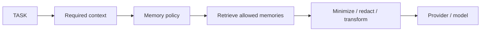

# ZORQ Memory Architecture v1

**Status label:** DESIGNED. Production MEMORY//OS integration is NOT VERIFIED.
**Scope:** durable memory categories, provenance, retrieval, firewall, ownership, deletion, conflict resolution, and governance boundaries.

## 1. Memory category model

| Category | Definition | Governance |
|---|---|---|
| Episodic memory | what happened: conversations, events, actions | MEMORY//OS-governed source + ZORQ-derived views |
| Semantic memory | what ZORQ knows as concepts/facts | MEMORY//OS-governed when personal; external world knowledge separately sourced |
| Procedural memory | how something is done | governed if user/project-specific; general procedures may be world/system knowledge |
| Personal memory | user-specific facts/preferences | MEMORY//OS-governed |
| Project memory | project state, decisions, tasks, files | MEMORY//OS-governed per project policy |
| Decision memory | why a decision was made | source + rationale + outcome, governed |
| Event memory | time-bound events | governed timeline entries |
| Relationship memory | links between people/projects/goals/files/events | ZORQ-derived view governed by source memories |
| World knowledge | external/general information | Global Truth Engine provenance; not silently merged into personal history |
| System memory | ZORQ architecture/state/history | system-governed; user-visible where appropriate |
| Outcome memory | what happened after an action | Action/audit/verifier evidence, governed retention |

## 2. Memory provenance model

Every durable memory item should record:

```text
memory_id
owner_id
source_type
source_id
conversation_id
message_id
created_at
observed_at
valid_from
valid_until
confidence
derivation
supersedes
superseded_by
privacy_class
retention_policy
verification_state
```

ZORQ must answer “Why do you remember this?” by tracing to source evidence and governance state.

## 3. Memory Firewall



The firewall considers privacy, task scope, provider trust, sensitivity, external egress, retention, and user authorization. It must not send the user's entire memory to every provider.

## 4. Ownership commands

The user owns personal memory. ZORQ and MEMORY//OS must preserve owner control over retention, retrieval, export, and deletion subject to explicit governance and legal/technical retention limits.

Supported command semantics:

- “Remember this.” → governed source and derived memory creation.
- “Don't remember this.” → do not persist beyond runtime unless required by policy.
- “Forget this.” → scoped deletion workflow.
- “Forget this conversation.” → delete or tombstone source/derived/index records according to policy.
- “Forget everything about this project.” → project-scoped deletion plan.
- “Show me what you remember about X.” → governed retrieval and provenance display.
- “Delete the conversation from 27 September 2026.” → temporal exact deletion workflow.

## 5. Deletion propagation

Deletion is not complete if only one representation is deleted. A deletion plan must address:

- raw archive;
- structured memories;
- indexes;
- embeddings;
- derived summaries;
- relationship graph;
- caches;
- retention-controlled backups;
- audit/legal hold records if applicable.

Report states: COMPLETED, PARTIAL, UNKNOWN, RETAINED_BY_POLICY, FAILED. Document exact guarantees and limitations.

## 6. Conflict resolution

When memories conflict:

1. preserve historical records;
2. detect contradiction;
3. determine temporal validity;
4. distinguish current from historical;
5. avoid silently overwriting evidence;
6. surface uncertainty when required.

Explicit states: CURRENT, HISTORICAL, SUPERSEDED, CONFLICTED, UNVERIFIED.

## 7. Retrieval is not authority

Retrieved memory may inform context, but it cannot authorize actions, renew grants, prove current identity, bypass confirmation, or become current truth without validation. User history can say what happened before; current authorization must still pass the Action Plane.

## 8. MEMORY//OS boundary

ZORQ does not create a competing memory authority. The adapter boundary must support retrieval, storage, provenance, policy, deletion, retention, sensitivity, conflict handling, memory lifecycle, and governance decisions. If MEMORY//OS governance is unavailable for a governed operation, fail closed.
