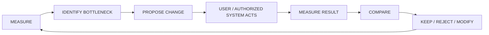

# ZORQ Optimization Engine v1

**Status label:** DESIGNED. No autonomous optimization implementation in this phase.
**Purpose:** measurable continuous improvement of workflows, habits, projects, learning, time/resource use, goals, and operational processes.

## 1. Optimization loop

## 2. What can be optimized

- workflows;
- habits;
- project execution;
- learning;
- time use;
- resource use;
- goals;
- operational processes.

## 3. Measurement dimensions

- result quality;
- cost;
- time;
- reliability;
- assumption accuracy;
- outcome quality;
- user satisfaction;
- reversibility;
- risk.

## 4. Proposal contract

An optimization proposal includes:

- target metric;
- current baseline;
- proposed change;
- expected measurable effect;
- assumptions;
- risks;
- duration/test plan;
- required authorization;
- rollback/stop criteria.

## 5. Authority boundary

Optimization is proactive intelligence, not silent action. It can suggest “what else can we do?” follow-ups but must separate SUGGESTION from AUTHORIZED ACTION. Any real-world change must pass the Action Plane or user/manual action.
