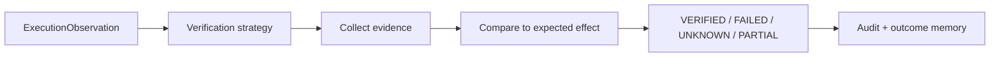

# ZORQ Outcome Verification Architecture v2

**Status label:** DESIGNED for future unified verification; Phase 2.6 filesystem/time verification is IMPLEMENTED/VERIFIED for the standalone slice.
**Purpose:** prevent provider/tool completion from being confused with verified real-world outcome.

## 1. Outcome states

| State | Meaning |
|---|---|
| ATTEMPTED | An action attempt was initiated or requested. |
| EXECUTING | Attempt is in progress. |
| COMPLETED | Executor reports completion, but verification may not yet establish outcome. |
| VERIFIED | Defined verification strategy established the expected outcome. |
| FAILED | Evidence establishes failure or policy denial. |
| UNKNOWN | ZORQ cannot safely determine outcome. |
| PARTIAL | Some expected effects verified; others failed/unknown. |
| CANCELED | Cancellation occurred before completion or at a safe barrier. |

COMPLETED and VERIFIED must remain separate.

## 2. Verification sources

Verification may use:

- filesystem state;
- API response plus follow-up read/check;
- provider receipt plus independent status where possible;
- application state;
- browser/DOM/accessibility state;
- external system evidence;
- human confirmation where policy allows/requires;
- audit logs and action observations.

## 3. Verification pipeline

## 4. Verification contract

Every externally meaningful action should define, where technically possible:

- expected effect;
- evidence source;
- freshness requirement;
- acceptable match criteria;
- failure criteria;
- uncertainty/unknown criteria;
- residual risk;
- audit payload.

If verification is impossible, the result must be UNKNOWN or human-confirmed per policy, not fabricated success.

## 5. Authority boundary

Verification classifies outcome evidence. It cannot authorize future actions, retroactively grant permission, or convert provider acceptance into success. Outcome memory can inform future recommendations but cannot bypass current authorization.
