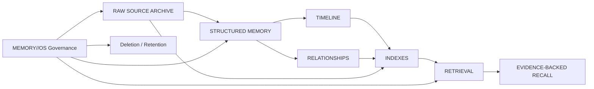

# ZORQ Personal Continuity Engine Architecture v1

**Status label:** DESIGNED. Production MEMORY//OS integration is NOT VERIFIED.
**Purpose:** durable longitudinal personal history with evidence-backed recall, temporal understanding, relationships, provenance, and owner-governed retention/deletion.

## 1. Core requirement

If the user talks to ZORQ on 27-09-2026 and asks on 30-07-2035, “What did we talk about on 27 September 2026?”, ZORQ must retrieve the historical record if retained under the user's memory/retention policy.

This is not ordinary chatbot memory. It is durable personal continuity.

## 2. Continuity architecture



## 3. Non-replacement rule

A derived summary must never silently replace the original source.

ZORQ keeps distinct layers:

| Layer | Meaning | Example |
|---|---|---|
| SOURCE RECORD | original evidence | actual conversation messages, uploaded file, action log |
| DERIVED MEMORY | extracted entities, summaries, topics, embeddings, relationships | “user requested architecture revision” |
| CURRENT INTERPRETATION | current understanding after later updates | “Phase 2.6 was complete before architecture revision” |
| HISTORICAL VIEW | what was true/said/believed at a particular time | “on 2026-09-27, user asked for master architecture” |

Historical truth remains distinguishable from current truth.

## 4. Personal timeline model

A `TimelineEvent` connects conversations, decisions, actions, projects, goals, files, people, outcomes, and changes.

Example:

```text
2026-09-27
  -> Conversation: Master Architecture Revision request
  -> Decision: preserve Phase 2.6 as action authority
  -> Requirement: durable lifetime memory and exact historical recall
  -> Outcome: architecture documents created
Future date
  -> Implementation slice
  -> Outcome
  -> Revision
```

## 5. Retrieval modes

The Personal Continuity Engine must support:

- exact retrieval: source records/messages;
- semantic retrieval: conceptually related memories;
- temporal retrieval: date/time period filters;
- relational retrieval: people/projects/goals/decisions/files/events;
- causal/historical retrieval: “why did we choose this?”, “what changed after that?”

Vector search is only one index type and cannot be the entire memory system.

## 6. Evidence-backed recall contract

A recall answer must include, when appropriate:

- retrieved source records or source IDs;
- timestamp/date range;
- whether content is exact quote, summary, or inference;
- retention/governance status;
- conflicts or missing records;
- confidence and verification state.

## 7. Temporal semantics

ZORQ must understand today, yesterday, last week, last year, in 2026, on 27 September 2026, before, after, first, latest, at that time, what changed, what was true then, and what is true now.

Example:

```text
2027: user says “I prefer X.”
2031: user says “I no longer use X.”
```

Both statements remain preserved with temporal validity. The current preference may be “not X,” while the historical fact remains “preferred X in 2027.”

## 8. Conflict states

Memory states:

- CURRENT;
- HISTORICAL;
- SUPERSEDED;
- CONFLICTED;
- UNVERIFIED;
- RETAINED_BY_POLICY;
- DELETED;
- DELETION_PARTIAL;
- DELETION_UNKNOWN.

Conflicts preserve evidence and surface uncertainty rather than silently overwriting.

## 9. Authority boundaries

MEMORY//OS is the canonical memory-governance subsystem. ZORQ-derived timelines, relationship graphs, and indexes are views over governed memory, not competing authorities. If governance is unavailable for a governed memory operation, the operation fails closed or returns a hold/unavailable state.
