# ZORQ Privacy and Data Lifecycle v1

**Status label:** DESIGNED. Production encryption/secret/cross-device implementation is DEFERRED/NOT VERIFIED.
**Purpose:** strong privacy, user ownership, data minimization, deletion, provenance, and provider egress controls.

## 1. Privacy principles

- user owns personal memory;
- local-first storage where practical;
- explicit retention policies;
- provider egress minimization;
- sensitive data boundaries;
- provenance/audit;
- deletion propagation;
- no hidden always-on recording;
- no covert capture of other people/environmental activity.

“Remember everything” means everything the user deliberately provides or authorizes under defined retention rules.

## 2. Memory/privacy classes

Designed classes:

- PUBLIC/LOW;
- PERSONAL;
- SENSITIVE;
- SECRET;
- REGULATED;
- THIRD_PARTY;
- SYSTEM_SECURITY;
- DELETION_REQUESTED;
- RETAINED_BY_POLICY.

Provider/model access is controlled by task need, owner authorization, trust tier, and egress policy.

## 3. Data lifecycle

```mermaid
flowchart LR
    Create[Create/observe] --> Classify[Classify sensitivity]
    Classify --> Govern[MEMORY//OS policy]
    Govern --> Store[Store source + derived views]
    Store --> Use[Retrieve through Memory Firewall]
    Use --> Update[Update / supersede / conflict]
    Update --> Retain[Retention review]
    Retain --> Delete[Deletion propagation]
    Delete --> Tombstone[Audit/tombstone if required]
```



## 4. Encryption and secrets architecture

Designed requirements:

- encryption at rest for personal archives/indexes/backups;
- encryption in transit across devices/providers;
- per-owner key hierarchy;
- separation of secret storage from memory content;
- no model/provider exposure of secrets unless explicitly authorized and technically necessary;
- audited secret access;
- recoverability without hidden backdoors.

## 5. Backup semantics

Backups must respect retention/deletion policy. Deletion claims must disclose backup propagation limits and time windows. Retention-controlled backups may require tombstones or delayed purge reports.

## 6. Cross-device trust

Future cross-device memory/action requires device enrollment, owner identity, session assurance, security epoch, remote wipe/revocation, and audit. Device trust is not inferred from conversation history.

## 7. Provider egress controls

Before external provider use:

```text
task -> required context -> policy -> allowed memory retrieval -> minimization/redaction -> provider
```

No bulk memory dump to generic models.
