# ZORQ Privacy and Data Lifecycle v1

**Status label:** DESIGNED. Production encryption/secret/cross-device implementation is DEFERRED/NOT VERIFIED.
**Purpose:** strong privacy, user ownership, data minimization, deletion, provenance, and provider egress controls.

## 1. Privacy principles

- user owns personal memory;
- local-first storage where practical;
- explicit retention policies;
- provider egress minimization;
- sensitive data boundaries;
- provenance/audit;
- deletion propagation;
- no hidden always-on recording;
- no covert capture of other people/environmental activity.

“Remember everything” means everything the user deliberately provides or authorizes under defined retention rules.

## 2. Memory/privacy classes

Designed classes:

- PUBLIC/LOW;
- PERSONAL;
- SENSITIVE;
- SECRET;
- REGULATED;
- THIRD_PARTY;
- SYSTEM_SECURITY;
- DELETION_REQUESTED;
- RETAINED_BY_POLICY.

Provider/model access is controlled by task need, owner authorization, trust tier, and egress policy.

## 3. Data lifecycle

```mermaid
flowchart LR
    Create[Create/observe] --> Classify[Classify sensitivity]
    Classify --> Govern[MEMORY//OS policy]
    Govern --> Store[Store source + derived views]
    Store --> Use[Retrieve through Memory Firewall]
    Use --> Update[Update / supersede / conflict]
    Update --> Retain[Retention review]
    Retain --> Delete[Deletion propagation]
    Delete --> Tombstone[Audit/tombstone if required]
```



## 4. Encryption and secrets architecture

Designed requirements:

- encryption at rest for personal archives/indexes/backups;
- encryption in transit across devices/providers;
- per-owner key hierarchy;
- separation of secret storage from memory content;
- no model/provider exposure of secrets unless explicitly authorized and technically necessary;
- audited secret access;
- recoverability without hidden backdoors.

## 5. Backup semantics

Backups must respect retention/deletion policy. Deletion claims must disclose backup propagation limits and time windows. Retention-controlled backups may require tombstones or delayed purge reports.

## 6. Cross-device trust

Future cross-device memory/action requires device enrollment, owner identity, session assurance, security epoch, remote wipe/revocation, and audit. Device trust is not inferred from conversation history.

## 7. Provider egress controls

Before external provider use:

```text
task -> required context -> policy -> allowed memory retrieval -> minimization/redaction -> provider
```

No bulk memory dump to generic models.

## 8. Voice data lifecycle (Phase 3F annex)

**Status label:** IMPLEMENTED for the 3F-min browser voice transport; every
statement below is backed by code or tests at the referenced locations.
This annex closes spec GAP-2 (`ZORQ-PHASE3F-VOICE-SPECIFICATION-v1.md` §15)
using only evidenced behavior. It invents no guarantee.

### 8.1 Microphone access

- The microphone is opened only by an explicit user action (mic control /
  keyboard activation). There is no wake word, no always-on capture, and no
  background listening (`frontend/hooks/useVoice.ts`).
- Permission is delegated entirely to the browser's permission prompt.
  Denial resolves to a truthful ERROR state with a text-mode reassurance;
  ZORQ never retry-loops the prompt.
- Tab visibility loss and component unmount abort any active recognition
  session (`VISIBILITY_LOST` handling; unmount teardown).

### 8.2 Audio retention

- ZORQ application code never records, stores, or transmits raw audio on the
  browser recognition path. No `MediaRecorder`/`getUserMedia` usage exists in
  the frontend.
- The optional server path (`/api/voice/transcribe`, local faster-whisper)
  writes uploaded audio to a temporary file that is deleted in a `finally`
  block on both success and failure — verified by
  `backend/tests/test_phase3f_voice_backend.py`
  (`test_transcriber_deletes_temp_file_on_success` / `_on_failure`).

### 8.3 Browser-vendor STT egress (GAP-1 — disclosed, not controlled)

Browser speech recognition (`SpeechRecognition`/`webkitSpeechRecognition`)
may transmit captured audio to the **browser vendor's** speech service —
this is a property of the browser, outside ZORQ's control. ZORQ does not
and cannot claim this path is local-only. The user-facing disclosure is
rendered wherever browser voice input is offered
(`BROWSER_STT_DISCLOSURE` in `frontend/hooks/useVoice.ts`). Users who
require local-only processing must use the local Whisper path (when
configured) or text input.

### 8.4 Transcript retention

- Interim recognition text is provisional display state only: it is never
  submittable, never persisted, and is discarded on cancel/error/finalize.
- A final transcript is a DRAFT in the ordinary input field. It persists
  only if the user submits it — at which point it is an ordinary message
  governed by exactly the standard conversation/memory contracts. Voice
  origin changes no retention, ranking, or governance property
  (`MemoryArbiter.AUTHORITY["voice"] == AUTHORITY["conversation"]`, tested).
- Deletion of a persisted transcript-derived message/memory follows the
  existing deletion/tombstone contracts unchanged.

### 8.5 Speech output

- Speech synthesis consumes only the final rendered response text — the same
  text already displayed in the UI. ZORQ does not send response text to any
  ZORQ-operated or ZORQ-selected external TTS service.
- Synthesis is delegated to the browser/platform `speechSynthesis` API. The
  underlying voices may be implemented locally or by the platform vendor's
  own services; that implementation and its data handling are controlled by
  the browser/OS vendor, are outside ZORQ's control, and are **not**
  guaranteed by ZORQ. ZORQ makes no "fully local TTS" or "offline TTS"
  claim.
- Output is optional and cancellable at all times; the cancellation call
  itself (`speechSynthesis.cancel()`) is a local, immediate operation and
  involves no ZORQ network request.

### 8.6 Authentication boundary

`/api/voice/status` and `/api/voice/transcribe` sit behind the same
authentication middleware as every other API route: in secured mode,
unauthenticated calls receive 401 (GAP-3 closed;
`test_transcribe_requires_authentication_in_secured_mode`).

### 8.7 What remains out of scope

- No offline-voice claim exists or is permitted: browser recognition may
  itself require the browser vendor's online service.
- Speaker identification/voice biometrics do not exist; voice grants no
  identity assurance (VOICE CONVENIENCE != HIGH-ASSURANCE IDENTITY).
