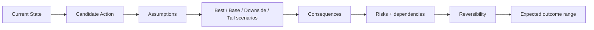

# ZORQ Simulation Engine v1

**Status label:** DESIGNED. No predictive model implementation is added in this phase.
**Purpose:** scenario analysis and consequence reasoning without presenting simulation as certainty.

## 1. Scenario representation

```text
CURRENT STATE
-> CANDIDATE ACTION
-> ASSUMPTIONS
-> SCENARIOS
-> CONSEQUENCES
-> RISKS
-> REVERSIBILITY
-> EXPECTED OUTCOME RANGE
```

## 2. Diagram



## 3. Outcome labels

- FACTUAL OUTCOME: already observed/proven.
- ESTIMATE: approximate value based on evidence.
- SCENARIO: conditional narrative.
- FORECAST: future expectation with evidence and uncertainty.
- UNKNOWN: insufficient basis.

Do not invent numerical probability when not statistically justified.

## 4. Analysis modes

- best case;
- base case;
- downside;
- tail risk;
- dependency analysis;
- sensitivity analysis;
- reversibility assessment;
- consequence map;
- decision tree.

## 5. Output contract

A simulation output includes:

- candidate action;
- assumptions and dependencies;
- scenario descriptions;
- consequences;
- reversible/irreversible elements;
- risks and mitigations;
- unknowns;
- evidence references;
- recommended next information/action if useful.

## 6. Authority boundary

Simulation does not decide for the user and cannot authorize action. If a scenario recommends real-world action, it must flow through owner review and Phase 2.6 Action Plane authorization.
