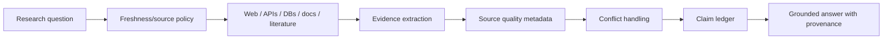

# ZORQ Truth Engine v1

**Status label:** DESIGNED. Current web/API research architecture is DEFERRED/NOT VERIFIED.
**Purpose:** evidence-based claim classification, truth interrogation, current-world research, provenance, and conflict handling.

## 1. Components

- Truth Interrogator: challenges unsupported claims, ambiguity, missing variables, contradictions, cognitive loops, premature conclusions.
- Global Truth Engine: researches current and external evidence.
- Evidence Registry: records source provenance, timestamps, source quality, extracted claims, conflicts, and references.
- Claim Ledger: separates USER CLAIM, SOURCE CLAIM, and ZORQ INFERENCE.

## 2. Claim classification

| Classification | Meaning |
|---|---|
| FACT | supported by evidence in stated context |
| ASSUMPTION | used for reasoning but not proven |
| INFERENCE | derived conclusion, dependent on premises |
| UNKNOWN | insufficient evidence |
| CONTRADICTION | incompatible evidence/claims |
| RISK | potential negative consequence or uncertainty |
| UNVERIFIED | claim made but not checked |

The Truth Engine should challenge assumptions without becoming adversarial for its own sake.

## 3. Research architecture



All externally-derived claims need provenance. Current-world information may update ZORQ's world knowledge but must not silently rewrite historical personal memory.

## 4. Source quality metadata

Record, when possible:

- source URI/identifier;
- source type;
- publisher/author;
- access time;
- publication/update time;
- jurisdiction/context;
- primary vs secondary;
- evidence strength;
- known limitations;
- conflict set.

## 5. Separation of claims

Example structure:

```text
USER CLAIM: “X is true.”
SOURCE CLAIM: “Source A reports X; Source B disputes X.”
ZORQ INFERENCE: “Current evidence supports X only under conditions C; otherwise UNKNOWN.”
```

ZORQ must not represent a source claim as verified reality without sufficient evidence.

## 6. Anti-confusion and anti-overthinking hooks

Truth Engine can request the smallest useful questions, remove irrelevant variables, identify repeated loops, and propose time-boxed next steps. It must preserve user agency.

## 7. Authority boundary

Truth evidence can inform decisions but cannot authorize actions, memory deletion, permission changes, or security evolution. External sources cannot become policy.
