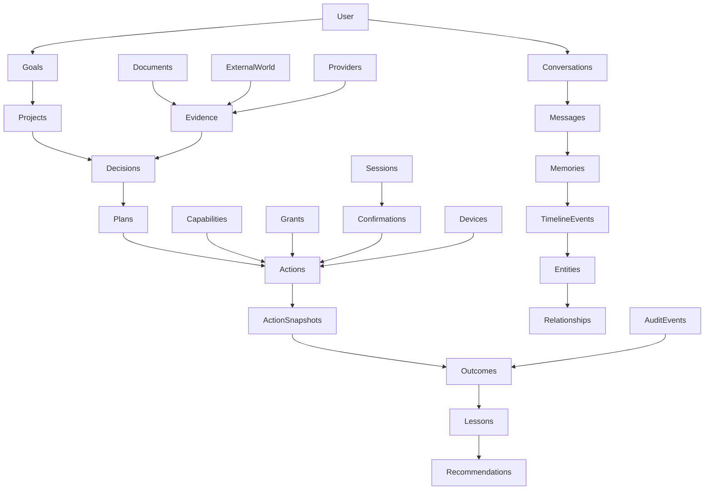

# ZORQ World Model v1

**Status label:** DESIGNED. Data schemas are architectural, not implemented in this phase.
**Purpose:** coherent model connecting user, goals, projects, people, tasks, decisions, documents, systems, events, outcomes, and external world.

## 1. World model graph

## 2. Master data model

| Entity | Identifier | Owner / tenancy | Temporal semantics | Provenance / notes |
|---|---|---|---|---|
| User | user_id | owner/user domain | created_at, status | human subject of continuity |
| OwnerIdentity | owner_id | user-controlled | valid_from/until | canonical identity boundary; not model-derived |
| Session | session_id | owner/principal/device | issued_at/expires_at/security_epoch | authenticated runtime claim |
| Conversation | conversation_id | owner | started_at/ended_at/branches | source record container |
| Message | message_id | conversation owner | sent_at/observed_at | exact source text/media reference |
| Response | response_id | conversation owner | generated_at/spoken_at | generated answer content |
| ResponseCursor | cursor_id | conversation owner | interruption/resume timestamps | text/semantic position |
| MemorySource | source_id | owner | observed_at/retention | raw evidence record |
| Memory | memory_id | owner | valid_from/valid_until/current state | derived item with provenance |
| TimelineEvent | event_id | owner | event_time/range | connects memory/actions/decisions |
| Entity | entity_id | owner/global scoped | valid_from/until | person/project/file/system/etc. |
| Relationship | relationship_id | owner/global scoped | valid_from/until | typed edge with provenance |
| Goal | goal_id | owner | created_at/status changes | desired state |
| Project | project_id | owner/team | lifecycle dates | groups goals/tasks/files |
| Decision | decision_id | owner/project | decided_at, superseded_by | rationale and alternatives |
| Action | action_id | owner/session | created_at/status | untrusted proposed request before snapshot |
| ActionSnapshot | action_snapshot_id or action_id+digest | owner/session | created_at | immutable authorized action state |
| Plan | plan_id | owner/project | created_at/revision | proposal only until authorized |
| Observation | observation_id | owner/source | observed_at | input/evidence event |
| Outcome | outcome_id | owner/action | completed_at/verified_at | VERIFIED/FAILED/UNKNOWN/PARTIAL |
| Capability | capability_id/version | system/owner enabled | lifecycle state | discovery is not permission |
| Grant | grant_id | owner/principal | valid_from/expires_at | permission boundary |
| Confirmation | confirmation_id | principal/session | issued_at/expires_at | consent within policy |
| Lease | lease_id | action/device | issued_at/expires_at | one-use execution lease |
| Device | device_id | owner | enrolled_at/status | local/future trusted device boundary |
| Provider | provider_id | system/user configured | availability/trust changes | never authority |
| Evidence | evidence_id | owner/source/global | observed_at/accessed_at | supports claims/outcomes |
| Experiment | experiment_id | owner/system | start/end | optimization/evolution test |
| EvolutionProposal | proposal_id | owner/system | proposed_at/status | controlled behavior change |
| AuditEvent | audit_event_id | owner/system | timestamp/sequence | hash-chained facts |

## 3. Temporal rules

Historical records are not overwritten by current interpretations. Entities and relationships may have validity windows. “Latest” means most recent valid/current record after governance and conflict resolution. “At that time” queries must use historical validity, not current assumptions.

## 4. ZORQ self-model

ZORQ should know and truthfully report:

- current capabilities and unavailable capabilities;
- current model/provider and confidence limits;
- memory availability/governance state;
- current permissions/grants;
- device state;
- active tasks/actions;
- limitations;
- recent failures;
- recent successful verified outcomes.

It must never claim a capability it does not possess.
